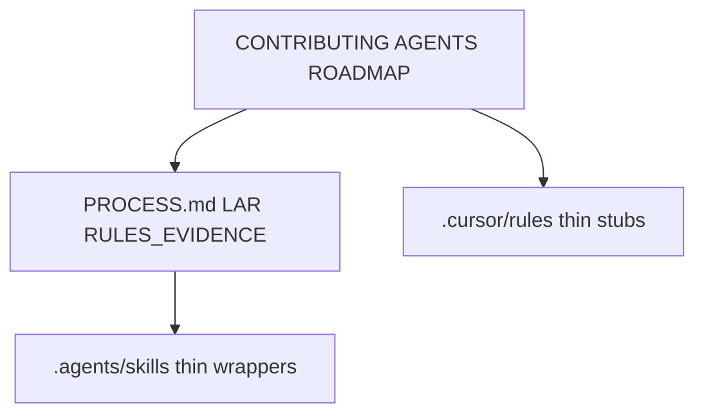

# .agents

## Purpose

Vendor-neutral project agent configuration. Shared skill wrappers live under `skills/`; authoritative process text lives in `docs/` (`PROCESS.md`, runbooks).

## Context

## What belongs here

- Thin skill discovery wrappers (`skills/*/SKILL.md`) that point at canonical docs
- This README

## What does not belong here

- Product rails or contributor policy (`AGENTS.md`, `CONTRIBUTING.md`)
- Full DDR/LAR/rules-evidence procedures (those stay in `docs/`)
- Broken symlinks into virtualenvs or package trees
