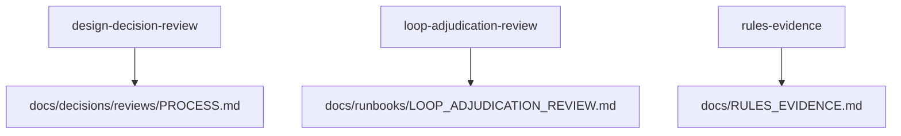

# skills

## Purpose

Thin, discoverable agent skill wrappers for this repository. Each skill points at a canonical process doc; it does not own procedure or task-stub text.

## Context

## What belongs here

- `design-decision-review/` → [`docs/decisions/reviews/PROCESS.md`](../../docs/decisions/reviews/PROCESS.md)
- `loop-adjudication-review/` → [`docs/runbooks/LOOP_ADJUDICATION_REVIEW.md`](../../docs/runbooks/LOOP_ADJUDICATION_REVIEW.md)
- `rules-evidence/` → [`docs/RULES_EVIDENCE.md`](../../docs/RULES_EVIDENCE.md)

## What does not belong here

- Full workflows, rubrics, or agent task stubs (keep those in the docs above)
- Third-party package skill symlinks into `.venv`
