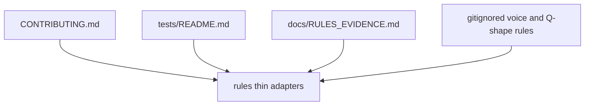

# .cursor

## Purpose

Local Cursor IDE adapters for this clone. Checked-in rules under `rules/` are thin alwaysApply summaries of [`CONTRIBUTING.md`](../CONTRIBUTING.md) and [`tests/README.md`](../tests/README.md).

## Context

## Checked-in adapters (examples)

- `rules/ci-merge-gate.mdc`, `rules/land-and-return.mdc`, … — CONTRIBUTING / test policy stubs
- `rules/rules-evidence.mdc` — routes physics edits to [`docs/RULES_EVIDENCE.md`](../docs/RULES_EVIDENCE.md) and `.agents/skills/rules-evidence/`

## Local (gitignored) rules

These files are **not** shared via git. Keep local copies so agents apply voice and decision-question shape:

- `rules/high-signal-communication.mdc`
- `rules/design-decision-questions.mdc`

If missing after clone, recreate from a teammate or prior local copy.

## What does not belong here

- Authoritative product or contributor policy (use root `CONTRIBUTING.md`, `AGENTS.md`, `docs/`)
- Shared process skills (use `.agents/skills/`)
- Comprehensive Rules text dumps