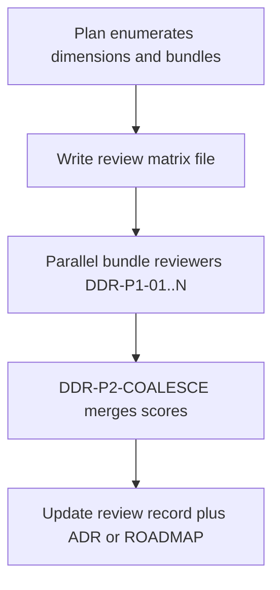

# Design decision review

Use this skill when implementation is blocked on **multi-dimensional design choices** and the team wants evidence-based resolution — not a single agent guessing.

## When to use

- A plan lists independent option dimensions (e.g. Q1 gate placement × Q2 bundling × Q3 observability).
- ADR-worthy trade-offs exist; chat memory is not durable.
- The change touches frozen boundaries (`AGENTS.md`, ADRs, `ROADMAP.md`).

## When not to use

- One obvious fix with no real forks.
- Product decisions that require explicit human override of Accepted ADRs (escalate instead).

## Workflow



### Step 1 — Frame the decision

1. Read preflight docs: root `README.md`, `ROADMAP.md`, relevant ADRs, package READMEs for touched code.
2. Write a **review matrix** under `docs/decisions/reviews/<slug>-review.md`:
   - Decision title, milestone link, blocking vs scoping dimensions
   - Each dimension: options, constraints (e.g. "typed UX requires verifier gate")
   - **Bundles**: named combinations to evaluate (prune infeasible cross-products; 6–10 bundles typical)
   - Scoring rubric (100 pts): Correctness/safety 25%, Architecture fit 25%, Rollout/blast radius 20%, Testability 15%, Roadmap alignment 15%
   - Success criteria for the winning bundle

### Step 2 — Parallel bundle reviewers

Launch **one Task subagent per bundle** in the same turn when possible.

Task line **must** begin with `[DDR-P1-XX]` where `XX` is the bundle id (e.g. `B1`).

Each reviewer:

1. Reads only repo evidence (ADRs, runbooks, code, tests) — no chat memory.
2. **Advocates honestly** for its assigned bundle; also lists disqualifying risks.
3. Answers: Does this bundle meet M4 runbook / frozen boundaries? What code paths change? What tests lock the contract?
4. Scores the rubric and outputs **ACCEPT**, **ACCEPT_WITH_RISKS**, or **REJECT** for the bundle as a whole.
5. Writes findings to the matrix file section `## Bundle Bx` (append-only during review).

**Do not** implement code in P1 reviewers.

### Step 3 — Coalesce

After all P1 legs terminal, run **one** coalescer:

Task line **must** begin with `[DDR-P2-COALESCE]`.

The coalescer:

1. Reconciles disagreements from repo evidence (re-read key files; do not invent).
2. Picks **one winning bundle** or a **hybrid** only when two bundles differ on non-blocking scoping only.
3. Records unresolved blockers requiring human `AskQuestion`.
4. Updates the review matrix **Verdict** section and recommends next action (implement, ADR draft, escalate).

### Step 4 — Land the decision

Same change (or immediate follow-up PR) should include:

- Accepted bundle recorded in review matrix **Verdict**
- New or updated ADR when architecture boundaries shift
- `ROADMAP.md` / runbook updates when milestone sequencing changes
- Implementation follows the matrix success criteria

## Bundle task stub

```
[DDR-P1-B1] Design decision review — participant enforcement bundle B1.
Repo: /home/fr333y3d3a/repos/mtg-loop-engine
Matrix: docs/decisions/reviews/<slug>-review.md
Bundle: Q1=A search-only, Q2=bundle regressions, Q3=silent continue, Q4=no baseline, Q5=single PR
Read ADRs 0001-0002, M4 runbook, search/explorer.py, eval/classify.py, tests/eval/test_classify_store.py.
Score rubric; ACCEPT/ACCEPT_WITH_RISKS/REJECT; append ## Bundle B1 to matrix. No code changes.
```

## Coalescer task stub

```
[DDR-P2-COALESCE] Merge DDR-P1 bundle reviews for <slug>.
Read all ## Bundle Bx sections plus repo evidence. One verdict, one recommended bundle, explicit merge notes. Update Verdict section in matrix. No code changes unless user asked to implement.
```

## Partial failure

- One P1 leg failed: coalesce from completed legs; mark **Unverified because leg Bx did not complete**.
- All P1 failed: retry or AskQuestion — do not coalesce from nothing.

## Relation to other processes

- **README gate** (`readme-gate-orchestration`): runs after code edits; this skill runs **before** implementation when design forks exist.
- **ADR policy** (`docs/decisions/README.md`): Accepted ADRs are not silently overridden; a winning bundle that conflicts requires ADR revision or human override.
