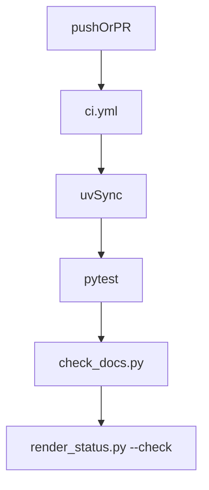

# .github

## Purpose

GitHub repository automation for MTG Loop Engine. CI must stay green on pytest plus documentation hygiene; it does not download Oracle or Spellbook snapshots.

## Role in pipeline

Push / PR → **THIS (Actions + templates)** → CI gate → merge readiness.

## Inputs

- Repository contents on push/PR events
- `uv.lock` / `pyproject.toml` for reproducible installs

## Outputs

- Pass/fail GitHub Actions status
- PR checklist via [`pull_request_template.md`](pull_request_template.md)

## Responsibilities

- Run the merge gate defined in `workflows/ci.yml`.
- Provide PR template governance checklist for contributors.

## Non-responsibilities

- Card snapshots, DuckDB evaluation databases, or secrets
- Deploying M7 explorer / hosting
- Regenerating `eval/baseline` (operators do that deliberately)

## Core invariants

- CI stays offline w.r.t. Scryfall/Spellbook downloads.
- Docs STATUS section must match committed baselines (`render_status.py --check`).

## Main entry points

- [`workflows/ci.yml`](workflows/ci.yml)
- [`pull_request_template.md`](pull_request_template.md)

## Data contracts

Workflow steps must keep working against the same pytest + scripts contract as local operators.

## Failure behavior

Red CI blocks merge. Fix tests or docs/baselines; do not skip gates casually.

## Testing

The workflow *is* the remote test runner for this repo.

## Extension guide

Add jobs only when they stay offline and deterministic. Prefer extending `scripts/check_docs.py` over ad-hoc shell in YAML.

## Bigger-picture relationship

Local scripts: [`../scripts/README.md`](../scripts/README.md). Baselines: [`../eval/baseline/README.md`](../eval/baseline/README.md).
