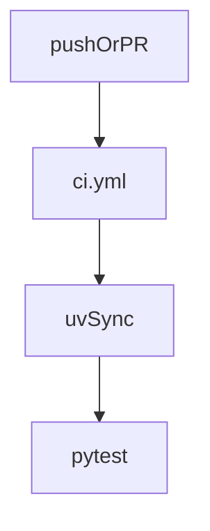

# .github

## Purpose

GitHub repository automation for MTG Loop Engine. CI must stay green on the full pytest suite; it does not download Oracle or Spellbook snapshots.

## Context

## What belongs here

- GitHub Actions workflows
- Future issue/PR templates if the team wants them

## What does not belong here

- Card snapshots, DuckDB evaluation databases, or secrets
