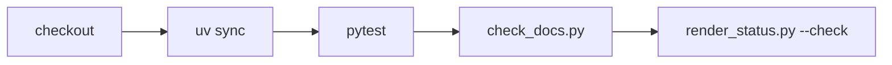

# workflows

## Purpose

GitHub Actions job definitions for the repository merge gate.

## Role in pipeline

`.github` event hooks → **THIS (`ci.yml`)** → install → pytest → docs hygiene → STATUS freshness.

## Inputs

- Checked-out repo at the commit under test
- Python 3.13 via `astral-sh/setup-uv`

## Outputs

- Job success/failure on every push and pull request

## Responsibilities

- `ci.yml` currently:
  1. `uv sync --frozen --group dev`
  2. `uv run pytest`
  3. `uv run python scripts/check_docs.py`
  4. `uv run python scripts/render_status.py --check`

## Non-responsibilities

- Deployment, release scanning, or M7 explorer hosting
- Network fetches of Oracle/Spellbook

## Core invariants

- Offline eval fixtures under repo-root `eval/` must be sufficient for pytest.
- STATUS prose must match frozen `eval/baseline/*.json`.

## Main entry points

- `ci.yml`

## Data contracts

Matches local operator commands documented in root README quick start and `scripts/README.md`.

## Failure behavior

Any step failure fails the job.

## Testing

Exercised on every PR. Prefer reproducing failures locally with the same four commands.

## Extension guide

If adding a docs check that duplicates STATUS freshness, use `check_docs.py --skip-status` so STATUS is checked once. Prefer keeping STATUS as its own named step for clearer CI UX.

## Bigger-picture relationship

Parent: [`../README.md`](../README.md).
