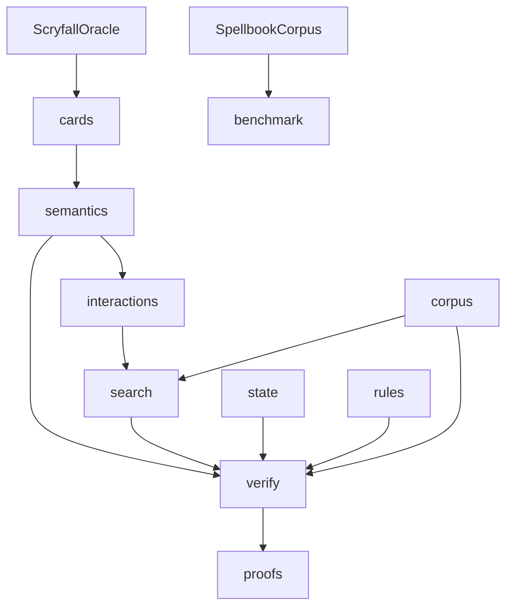

# MTG Loop Engine

## Purpose

Explainable interaction-discovery system for Magic: The Gathering. Compiles Oracle cards into semantic actions, searches for two-card repeatable loops, verifies them against modeled rules, and emits structured proofs. Discovery may speculate; verification may not.

## Context



## Quick start

```bash
uv sync
uv run pytest
uv run mtg-loop-engine verify-gold
uv run mtg-loop-engine compile-coverage
uv run mtg-loop-engine discover-gold
uv run mtg-loop-engine fetch-scryfall
uv run mtg-loop-engine fetch-spellbook --pages 3
```

## What belongs here

- Python package `mtg_loop_engine` (M0–M3: corpus, witness verifier, compiler, blind discovery)
- Tests, scripts, and gitignored local `data/` snapshots

## What does not belong here

- Deckbuilding, pricing, collections, ManaBox integration
- FastAPI/Postgres explorer (M7)
- LLM-authored semantics on the path to `VERIFIED`

## M1 contract

`LoopWitness` (cards + IR + setup + loop actions) → rules-aware executor → proof-specific `LoopRelevantState` recurrence → `LoopProof` (`VERIFIED` or typed rejection).

## M3 contract

Semantic cards with hidden pair labels → capability joins → bounded search → the same conservative verifier.
