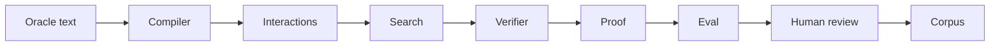

# MTG Loop Engine

## What is MTG Loop Engine?

MTG Loop Engine asks a Magic question: can we find two-card **loops**—repeatable activation sequences where the board returns to a usable state and you gain something each lap (mana, untaps, tokens, damage, and so on)—from **Oracle text** (the official rules wording on the card; what Scryfall and Gatherer show under *Oracle*, not reminder text, flavor text, or art), and show those steps really repeat?

It reads that wording from Scryfall snapshots, pairs cards whose abilities complement each other, searches for a legal sequence, and checks the result under an explicit rules model. [Commander Spellbook](https://commanderspellbook.com/) (a community combo catalog) is a **yardstick** for “have we seen this before?”—not an input to discovery.

**Strict two-card** means both named cards must **take steps** in the loop. Generic mana or any creature to sacrifice is fine; a third **specific** card is a different claim.

Search may speculate. Verification may not.

## From Oracle text to a checked loop

The engine walks card text through a fixed pipeline. Search may propose generously; only the verifier accepts or rejects a concrete recipe.



*Compiler* = read and parse Oracle text into executable steps—not deckbuilding. *Eval* measures reference recovery; humans adjudicate **candidates** (machine-accepted discoveries queued for review).

First, a pattern library turns each card’s Oracle text into activations the engine can run (from Scryfall, not from memory or Spellbook write-ups). Cards with complementary abilities—untap paired with tap-for-mana, and similar—are matched as potential partners. Search then tries legal activation sequences within bounded limits. When it finds a promising sequence, it writes a **witness**: a structured recipe for the verifier. The verifier runs setup and the loop body once; it accepts or rejects with a specific reason. Machine-accepted hits become candidates for human review.

Search proposes; the verifier decides. The project prefers fewer trustworthy **`VERIFIED`** results over broad, untrusted recall. If the engine does not understand a line of Oracle text, it **rejects rather than guesses**. Deeper product stance: [docs/PHILOSOPHY.md](docs/PHILOSOPHY.md). Package and dependency map: [docs/ARCHITECTURE.md](docs/ARCHITECTURE.md).

### What is a witness?

A **witness** is a checkable recipe—not a decklist or a Spellbook entry. Search (or a human author) hands it to the verifier; the verifier does not invent missing steps.

Take **Midnight Guard** + **Presence of Gond** ([`core_guard_gond.json`](src/mtg_loop_engine/corpus/gold_core/witnesses/core_guard_gond.json)). The witness names the two essential cards and a starting board: Guard and Gond on the battlefield, Guard untapped and enchanted. Each lap of the **loop body** is: tap Guard to make a 1/1 token, then resolve Guard’s “whenever another creature enters, untap this creature” trigger so Guard is ready again. After one lap, Guard is untapped and both cards are still present—that is what must **recur**. Each lap also gains another token and another ETB; the engine tracks typed outputs, not casual “infinite.”

The witness is the **claim**: if you run these steps under these assumptions, the board returns to a repeatable state and the stated advantage accumulates. If the check succeeds, the verifier emits a **proof**—a structured audit record with status **`VERIFIED`** or a specific rejection reason (resource shortfall, state does not recur, unsupported card text, and so on). Field-level detail: [docs/TERMINOLOGY.md](docs/TERMINOLOGY.md).

**Basalt Monolith** + **Phyrexian Altar** shows why participation matters: the pair can look plausible, but Altar is a **bystander**—in the search but never activates in the loop steps. Discovery filters those today ([docs/ARCHITECTURE.md](docs/ARCHITECTURE.md)); humans still catch edge cases via adjudication.

### Where people fit in

Machine **`VERIFIED`** is necessary but **not sufficient** for “this is a real strict two-card combo.” Reviewers **adjudicate** candidates in the **adjudication workbench** (`adjudicate-workbench`): valid strict two-card, duplicate or bystander, needs a third piece, false positive, and other labels ([docs/ADJUDICATION.md](docs/ADJUDICATION.md)). Discoveries **not listed in Spellbook** stay that way until reviewed—the machine label is `ABSENT_FROM_REFERENCE`; only human review may upgrade one to **`NOVEL`**. Human labels feed tests, fixtures, and pattern growth—the learning loop in [docs/PHILOSOPHY.md](docs/PHILOSOPHY.md).

**Near term ([ROADMAP.md](ROADMAP.md)):** **M5 (in progress)** grows Oracle coverage, runs blind discovery on real cards, and adjudicates meaningful absences from certified runs. **M6** adds incremental rescans when sets or Oracle change—humans review what changed, not the whole corpus by hand. **M7** adds a local **explorer** UI to browse proofs, rejections, and adjudications—a lens, not a second truth source; public deploy stays deferred.

No LLM judging combos; no Spellbook replacement; humans keep ownership of novelty and product claims.

## What VERIFIED means (and what it doesn't)

**`VERIFIED` means:** the engine executed the witness’s steps under its **modeled rules**—an explicit subset of Magic it can simulate (costs, taps, triggers, and similar)—and confirmed the board state the proof cares about recurs, with the stated per-loop gain.

**`VERIFIED` does not mean:**

- The Comprehensive Rules in full were simulated.
- A human has signed off on a valid strict two-card combo or a novel finding.
- Spellbook (or any reference corpus) lists the pair.
- Casual “infinite”—only that the modeled loop recurs under the stated outputs.
- Every word on the card was understood; unsupported lines still yield rejection, not **`VERIFIED`**.

Schema names (`LoopWitness`, `LoopProof`, and enums): [docs/TERMINOLOGY.md](docs/TERMINOLOGY.md).

## Current maturity

M5 focuses on novel-candidate adjudication; M7 will add a local explorer over proofs and adjudications. Track gates and frozen decisions in [ROADMAP.md](ROADMAP.md).

| Milestone | Status |
|-----------|--------|
| M0 Corpus | ✓ Complete |
| M1 Verifier | ✓ Complete |
| M2 Compiler | ✓ Complete |
| M3 Blind discovery | ✓ Complete |
| M4 Evaluation | ✓ Complete |
| M5 Novel candidates | ◐ In progress |
| M6 Incremental scans | ○ Not started |
| M7 Explorer | ○ Not started |

For current numbers and baselines, see [docs/STATUS.md](docs/STATUS.md) and committed summaries under [`eval/baseline/`](eval/baseline/).

## Quick start

```bash
uv sync
uv run pytest
```

Core smoke commands (one sentence each):

```bash
# Oracle gold_core (Wave 0 may be empty) + Oracle hard negatives.
uv run mtg-loop-engine verify-gold

# Synthetic/divergent physics suite regressions.
uv run mtg-loop-engine verify-physics

# Report deterministic compiler coverage on gold Oracle fixtures.
uv run mtg-loop-engine compile-coverage

# Blind-discover Oracle gold pairs (no pair labels).
uv run mtg-loop-engine discover-gold

# Blind-discover physics fixture pairs.
uv run mtg-loop-engine discover-physics
```

Evaluation / adjudication:

```bash
uv run mtg-loop-engine eval-gold-extras
uv run mtg-loop-engine eval-spellbook --variants eval/fixtures/spellbook_conventional_sample.jsonl
uv run --group eval mtg-loop-engine adjudicate-workbench
```

Optional data fetches (local, gitignored snapshots):

```bash
uv run mtg-loop-engine fetch-scryfall
uv run mtg-loop-engine fetch-spellbook --pages 3
```

CLI details: [docs/CLI.md](docs/CLI.md).

## Repository map

| Path | Role |
|------|------|
| [`src/mtg_loop_engine/`](src/mtg_loop_engine/README.md) | Installable library |
| [`src/mtg_loop_engine/cards/`](src/mtg_loop_engine/cards/README.md) | Scryfall / Oracle ingest |
| [`src/mtg_loop_engine/semantics/`](src/mtg_loop_engine/semantics/README.md) | Deterministic compiler + IR |
| [`src/mtg_loop_engine/interactions/`](src/mtg_loop_engine/interactions/README.md) | Capability signatures / joins |
| [`src/mtg_loop_engine/search/`](src/mtg_loop_engine/search/README.md) | Bounded blind discovery |
| [`src/mtg_loop_engine/verify/`](src/mtg_loop_engine/verify/README.md) | Witness verifier |
| [`src/mtg_loop_engine/proofs/`](src/mtg_loop_engine/proofs/README.md) | Witness / proof contracts |
| [`src/mtg_loop_engine/state/`](src/mtg_loop_engine/state/README.md) | Game-state model |
| [`src/mtg_loop_engine/rules/`](src/mtg_loop_engine/rules/README.md) | Modeled rules surface |
| [`src/mtg_loop_engine/corpus/`](src/mtg_loop_engine/corpus/README.md) | Gold fixtures and builders |
| [`src/mtg_loop_engine/eval/`](src/mtg_loop_engine/eval/README.md) | Evaluation + adjudication workbench |
| [`src/mtg_loop_engine/benchmark/`](src/mtg_loop_engine/benchmark/README.md) | Spellbook extract / reference helpers |
| [`eval/`](eval/README.md) | Committed fixtures, adjudications, baselines |
| [`tests/`](tests/README.md) | Pytest suites |
| [`docs/`](docs/README.md) | Narrative and operating docs |
| [`data/`](data/README.md) | Gitignored local snapshots (Oracle bulk stays gitignored) |
| [`scripts/`](scripts/README.md) | Helper scripts |

## How to contribute

Start with [CONTRIBUTING.md](CONTRIBUTING.md) and [AGENTS.md](AGENTS.md). Align work with [ROADMAP.md](ROADMAP.md), browse [docs/](docs/README.md), and record durable product choices under [docs/decisions/](docs/decisions/).

## Project boundaries

**This is not:**

- A combo database or Spellbook replacement
- A deckbuilder, pricing tool, collection manager, or ManaBox integration
- A full Comprehensive Rules engine or SMT/Z3 solver
- An LLM-authored semantics path to `VERIFIED`
- A deployed / public UI (local explorer is M7 later; public deploy stays deferred)

Three-card discovery and performance-optimization passes are also explicitly out of scope for now—see ROADMAP deferred list.

## Source-of-truth hierarchy

When sources disagree, use the artifact that answers that kind of question.

| Question type | Authoritative source |
| --- | --- |
| Why is the system designed this way? | [`docs/decisions/`](docs/decisions/), frozen decisions in [`ROADMAP.md`](ROADMAP.md) |
| What does the implementation actually enforce? | Schemas, tests, golden proofs, engine code under `src/` |
| What has been measured? | [`eval/baseline/`](eval/baseline/) (summarized in [`docs/STATUS.md`](docs/STATUS.md)); prose numbers are summaries only |
| What milestone is complete vs gated? | [`ROADMAP.md`](ROADMAP.md) |
| How do I learn the system? | This README, package READMEs, [`docs/`](docs/README.md)—learning docs follow the contracts above |

If an agent finds disagreement across layers, reconcile it in the same change or document it as an unresolved defect.

Glossary: [docs/TERMINOLOGY.md](docs/TERMINOLOGY.md).
