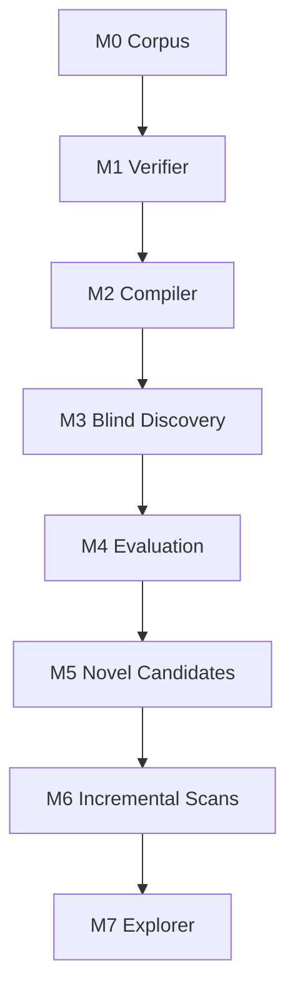

# MTG Loop Engine — Roadmap (gate document)

## North star

```
Oracle text → semantics → blind discovery → rules proof
```

Search may speculate. Verification may not. **Optimize verified precision over recall.**

No LLM-generated semantics on the path to `VERIFIED`. No binary "infinite." Loop type × output × consequence × delta.

## Milestone flow



**Active milestone:** M5 — Novel candidates ◐ **IN PROGRESS**

Quantitative snapshot (baselines): [`docs/STATUS.md`](docs/STATUS.md). Keep volatile counts out of this file.

---

## Completed milestones

### M0 — Corpus ✓

- Scryfall Oracle bulk ingest; gitignored snapshots with manifest hashes.
- Commander Spellbook extract → DuckDB; conventional two-card filter.
- `gold_core` (10 positive witnesses, 9 hard negatives), `gold_extended` (15 stubs).
- Essential vs generic vs functional-external labels on every corpus entry.

### M1 — Witness verifier ✓

- `LoopWitness` in → `LoopProof` out. Verifier is witness-in / proof-out (deterministic semantics).
- Rules-aware executor: costs, tap/untap, sac, simple triggers, cost modifiers, replacements.
- Proof-specific `LoopRelevantState` (`EXACT` / `MINIMUM` / `MAXIMUM`).
- Fail-closed: `PARTIAL_RELEVANT_TO_PROOF` → typed rejection.
- Typed rejection vocabulary (`RESOURCE_DEFICIT`, `STATE_NOT_RECURRENT`, …).
- All `gold_core` positives `VERIFIED`; hard negatives produce correct typed rejection.

### M2 — Deterministic compiler ✓

- Oracle text → `CardSemantics` via deterministic pattern library.
- 19/19 gold Oracle fixtures compile `COMPLETE`; `fragment_coverage = 1.0`.
- `compile-coverage` CLI.

### M3 — Blind discovery ✓

- Capability signatures + inverted-index joins → bounded BFS → same verifier.
- 10/10 `gold_core` pairs rediscovered without pair labels.
- Explorer is the single acceptance oracle; `discover_loops` does not re-verify.
- `corpus.builders` shared between gold fixtures and discovery so witness shapes stay comparable.

### M4 — Evaluation ✓

Exit criteria: **precision correctness** + **minimum real-Oracle eligibility** (not broad Spellbook recall).

| Gate | Evidence |
|------|----------|
| Participant enforcement | `explore_pair` requires `VERIFIED` + `strict_two_card`; Basalt bystander regressions in `tests/eval/test_classify_store.py` |
| Gold-pool precision | `eval/baseline/m4_gold_pool_summary.json` — precision **1.0** (3/3 real) |
| ≥1 eligible Spellbook pair | `eval/baseline/m4_spellbook_recovery_summary.json` — **eligible=1** / **rediscovered=1** (Gravecrawler + Phyrexian Altar) |
| Baselines + STATUS | `scripts/render_status.py --check`; [`docs/STATUS.md`](docs/STATUS.md) |

Also shipped: M3.5 seam, eval schema/workbench, CI, real-Oracle curriculum start (irrelevant statics, zone recursion, any-color, cast-from-GY). **Compiler curriculum continues under M5** as coverage growth.

Historical playbook: [`docs/runbooks/M4_FOLLOW_THROUGH.md`](docs/runbooks/M4_FOLLOW_THROUGH.md).

---

## M5 — Novel candidate adjudication ◐ IN PROGRESS

Blind discovery among real **COMPLETE**-compiled Oracle cards from Spellbook name sets. Absence is a label; humans own `NOVEL`.

### Goals

- Discover among COMPLETE cards compiled from local Scryfall for Spellbook names.
- In Spellbook → `IN_REFERENCE`; not in Spellbook → `ABSENT_FROM_REFERENCE` (never auto-`NOVEL`).
- Human adjudication upgrades absence → `NOVEL` only (ADR 0005); report `NOVEL` outside the precision denominator.
- Leave joins open unless a precision bug is proven (ADR 0004).

### Remaining

0. **Corpus / evaluation integrity (campaign; ahead of 95% and broad M5 recall)** ◐ —
   ADR [0007](docs/decisions/0007-corpus-provenance-physics-vs-oracle.md) (**Accepted**;
   trust-boundary impl landed). `Provenance` + audited `ORACLE_EXACT` subset + frozen
   divergent quarantine + `is_precision_eligible_ids` / physics vs Oracle pools.
   Inventory:
   [`docs/decisions/reviews/corpus-provenance-inventory.md`](docs/decisions/reviews/corpus-provenance-inventory.md).
   ADR [0008](docs/decisions/0008-verifier-owned-mandatory-recurrence.md) (**Accepted**):
   verifier-owned once-per-turn + pending-trigger recurrence dims.
   **Next in this campaign:** stronger claim/`proof_hash` binding.
   **Keep line coverage floor at 92%** until the campaign lands enough that percentages
   measure faithful claims.

1. **Absent-discovery path** ✓ — `eval/reference_absent.py` + `scripts/spellbook_absent_discovery.py`.
2. **Grow COMPLETE pool** — prefer **self-starting** two-card physics (path **a**): patterns that can close without an external seeded event. Curriculum order: [`docs/runbooks/M5_NOVEL_CANDIDATES.md`](docs/runbooks/M5_NOVEL_CANDIDATES.md).
   - **Slice 1 (aura channel)** ✓ — Freed / Pemmin’s; COMPLETE **17→19**.
   - **Slices 2–3 (activated artifacts + Intruder Alarm)** ✓ — Staff of Domination suite, live Basalt/Alarm; COMPLETE **19→24**.
   - **Slice 4 (life-drain + statics)** ✓ — Vito/Bond/Exquisite patterns; GAIN_LIFE / OPPONENT_LOSE_LIFE triggers; Flash/Devoid/Evolve/land-tapped statics.
   - **Path a (active):** unlock more COMPLETE cards whose abilities can initiate and close a two-card loop from the default board (tap-for-mana engines, ETB untap/damage/life, etc.).
     - **Slice 5 (self-starters)** ✓ — power-tap mana (Viridian Joiner); ETB damage (Impact Tremors / Purphoros / Alliance); ETB untap-self (Midnight Guard); anthem/devotion/lifelink-reminder as proof-irrelevant.
     - **Slice 6 (token auras + false-COMPLETE fix)** ✓ — Presence of Gond host-tap tokens; narrow Enchant irrelevant so Splinter Twin/Bear Umbra fail closed; Aphetto/Morph.
   - **Path b (deferred, deliberate):** generic **life-gain seed** in `default_initial_state` when a searched card has `GAIN_LIFE` triggers (ADR 0002 fodder-style). Would let Vito/Bond + Exquisite-class pairs rediscover without a third piece. **Do not implement until path a plateaus or a human widens scope** — document only.
   - **Rules-evidence rails (supporting; land before widening modeled physics):** cheap epistemic adapters so coverage growth stays deliberate (ADR 0003). Not an M5 exit gate; not CR ingest or executor expansion.

   | Piece | Why |
   | ----- | --- |
   | Principle in [`AGENTS.md`](AGENTS.md): memory proposes; sources decide | Blocks “I remember → patch Executor”; same epistemology as search/verify |
   | Thin Cursor rule (~20–40 lines) scoped to `rules` / `semantics` / `verify` / `tests` / `eval` | Adapter that routes agents to the skill; not a rulebook corpus |
   | Thin agent skill: how to investigate a rules question | Workflow + citation format (LAR-skill pattern); progressive load only when needed |
   | `docs/RULES_EVIDENCE.md` (to add) | Authority roles: Oracle vs Comprehensive Rules vs rulings vs Spellbook — codifies ADJUDICATION / PHILOSOPHY |

3. **Workbench adjudication** — review absences; promote `NOVEL` only with human records.
4. **Optional baseline** — freeze an absent-discovery summary only when intentionally certified.

Playbook: [`docs/runbooks/M5_NOVEL_CANDIDATES.md`](docs/runbooks/M5_NOVEL_CANDIDATES.md).

### First local probe (not a baseline)

Post–slice 6 + host-recurrence fix: **31** COMPLETE; **5** verified; **5** in-reference; **`absent_from_reference=0`**. Gond + Tremors / Warleader / Basalt no longer verify (host tap in `LoopRelevantState`); Guard/Alarm + Gond remain in-reference. Continue path **a**; path **b** stays deferred.

---

## M6 — Incremental scans

- Trigger a re-run when new Scryfall snapshots differ from previous.
- Detect newly eligible pairs (compiler coverage grows over time).
- Track proof hash stability across engine versions.

---

## M7 — Explorer

- Local web UI beyond the adjudication workbench.
- Card images via Scryfall URL (art stays gitignored).
- Search, filter, and browse all verified loops.
- FastAPI or equivalent; first cut without Postgres.

---

## Explicitly deferred (do not plan or scaffold)

- LLM-generated semantics on any path to `VERIFIED`
- Three-card discovery
- Z3 / SMT solving
- Full Comprehensive Rules implementation
- ManaBox integration
- Deployed / public UI
- Performance optimization passes

---

## Frozen product decisions

| Topic | Decision |
|-------|----------|
| Choice ownership | Combo player favorable; opponent adversarial; cooperation → `OPPONENT_COOPERATION_REQUIRED` |
| Two-card definition | Exactly two essential functional pieces; generic fodder OK; functional external is not strict |
| Verifier contract | Witness-in / proof-out; search never inside verifier |
| Mandatory recurrence | Verifier merges once-per-turn + pending-trigger dims (ADR 0008); witnesses cannot omit them to soft-pass |
| Fail-closed coverage | `PARTIAL_RELEVANT_TO_PROOF` → never `VERIFIED` |
| Determinism | V1 deterministic-only; nondeterministic → typed rejection |
| LLM ban | No LLM on the `VERIFIED` path, indefinitely |
| Data hygiene | Oracle bulk JSON stays under gitignored `data/` |
| Loop model | No binary `infinite`; loop type × output × consequence × delta |
| Spellbook absence | `ABSENT_FROM_REFERENCE`, not false positive; `NOVEL` only after adjudication |
| Precision goal | Adjudicated precision over raw recall |

Longer rationale: [`docs/decisions/`](docs/decisions/) and [`docs/EVALUATION.md`](docs/EVALUATION.md).

---

## Governance

- **Review at milestone start:** re-read this file and confirm goals, constraints, and deferred items are still accurate.
- **Update at milestone exit:** the PR that completes a milestone must mark it done and refresh the next milestone's gates.
- **Feature branches:** all non-trivial work on a `feature/<slug>` branch; CI green before merge into `main`. Policy: [`CONTRIBUTING.md`](CONTRIBUTING.md).
- **Canonical docs:** In-repository documentation is canonical. Session notes outside the repository are ephemeral execution aids—not durable strategy. Durable decisions land in this roadmap, ADRs, `docs/`, and issues/PRs.
