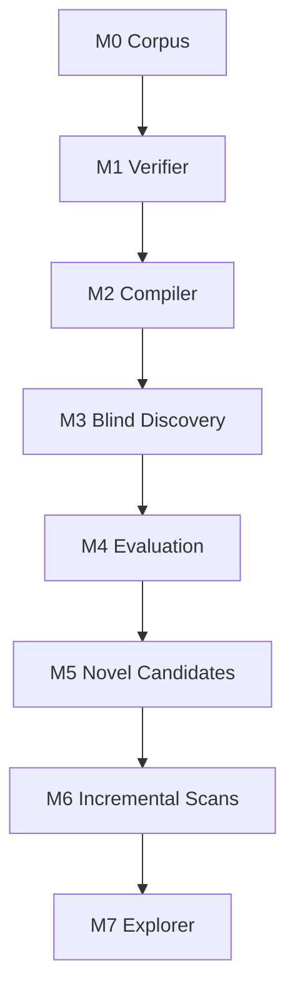

# MTG Loop Engine — Roadmap

## North star

```
Oracle text → semantics → blind discovery → rules proof
```

Discovery may speculate. Verification may not. **Optimize verified precision over recall.**

No LLM-generated semantics on the path to `VERIFIED`. No binary "infinite." Loop type × output × consequence × delta.

## Milestone flow



---

## Completed milestones

### M0 — Corpus ✓

- Scryfall Oracle bulk ingest; gitignored snapshots with manifest hashes.
- Commander Spellbook extract → DuckDB; conventional two-card filter.
- `gold_core` (10 positive witnesses, 9 hard negatives), `gold_extended` (15 stubs).
- Essential vs generic vs functional-external labels on every corpus entry.

### M1 — Witness verifier ✓

- `LoopWitness` in → `LoopProof` out. No search inside the verifier; no LLM.
- Rules-aware executor: costs, tap/untap, sac, simple triggers, cost modifiers, replacements.
- Proof-specific `LoopRelevantState` (`EXACT` / `MINIMUM` / `MAXIMUM`).
- Fail-closed: `PARTIAL_RELEVANT_TO_PROOF` may never emit `VERIFIED`.
- Typed rejection vocabulary (`RESOURCE_DEFICIT`, `STATE_NOT_RECURRENT`, …).
- All `gold_core` positives `VERIFIED`; hard negatives produce correct typed rejection.

### M2 — Deterministic compiler ✓

- Oracle text → `CardSemantics` via deterministic pattern library.
- 19/19 gold Oracle fixtures compile `COMPLETE`; `fragment_coverage = 1.0`.
- `compile-coverage` CLI.

### M3 — Blind discovery ✓

- Capability signatures + inverted-index joins → bounded BFS → same verifier.
- 10/10 `gold_core` pairs rediscovered without pair labels.
- Explorer is the single acceptance oracle; `discover_loops` does not re-verify.
- `corpus.builders` shared between gold fixtures and discovery so witness shapes stay comparable.

### M4 — Evaluation ✓

- **M3.5 seam gate:** Oracle fixtures → compiler → blind discovery → verifier (10/10 still).
- Prerequisite analysis: `strict_two_card` derived from essential-piece participation, not raw card count.
- Adjudication schema (`VALID_STRICT_TWO_CARD`, `DUPLICATE_OR_EQUIVALENT_INTERACTION`, …).
- DuckDB + JSONL persistence; local Streamlit adjudication workbench.
- 24 gold-pool extras adjudicated: **7 valid (29%), 17 duplicates (71%)**.
  - Root cause: join proposes pairs but search accepts witnesses where one card never acts.
- Spellbook conventional two-card recovery: 99 selected, **0 eligible** (compiler coverage is the bottleneck).
- Baselines frozen: `eval/baseline/m4_gold_pool_summary.json`, `m4_spellbook_recovery_summary.json`.
- GitHub Actions CI (`uv run pytest`) added.

---

## Next: M4 follow-through (correctness fixes before M5)

These items are the direct consequence of M4 adjudication findings. They are not a new milestone — they are M4 bugs that must be fixed before M5 can be meaningful.

### 1. Participant filter (correctness)

**Problem:** search accepts a witness even when one of the two searched cards never activates. 17/24 extras were `DUPLICATE_OR_EQUIVALENT_INTERACTION` for this reason.

**Fix:** after a witness is built, require that every essential oracle ID appears as an actor in at least one loop step. Reject otherwise. Add regression tests from the 17 adjudicated duplicates.

**Why before M5:** M5 labels new discoveries as `NOVEL`; that label only means something if precision is already trustworthy.

### 2. Compiler patterns for real Oracle (coverage)

**Problem:** the compiler matches gold-fixture wording, not real card text. Gravecrawler + Phyrexian Altar compile with the fixture text but fail on real Oracle (extra clauses).

**Fix:** extend deterministic patterns to cover common real-Oracle fragments. Use Spellbook failure taxonomy as the curriculum — pick the most-common unsupported family first (e.g. `{B}: Return [cardname] from your graveyard…` with zone-restriction clauses). Validate with `eval-spellbook --fetch-oracle`: target at least one eligible pair from the 99-row Spellbook sample.

**Sequence:** participant filter first (it is pure correctness); then compiler expansion (it adds recall).

---

## M5 — Novel candidate adjudication

Once M4 correctness fixes are in:

- Run discovery on real compiled Oracle cards from Spellbook entries.
- Accepted pairs not in Spellbook start as `ABSENT_FROM_REFERENCE`.
- Human adjudication upgrades to `NOVEL` only after review.
- Report `NOVEL` separately from precision denominator.
- Do not tighten joins to suppress `ABSENT_FROM_REFERENCE` results — label them.

---

## M6 — Incremental scans

- Trigger a re-run when new Scryfall snapshots differ from previous.
- Detect newly eligible pairs (compiler coverage grows over time).
- Track proof hash stability across engine versions.

---

## M7 — Explorer

- Local web UI beyond the adjudication workbench.
- Card images via Scryfall URL (never committed art).
- Search, filter, and browse all verified loops.
- FastAPI or equivalent; still no Postgres in the first cut.

---

## Explicitly deferred (do not plan or scaffold)

- LLM-generated semantics on any path to `VERIFIED`
- Three-card discovery
- Z3 / SMT solving
- Full Comprehensive Rules implementation
- ManaBox integration
- Deployed / public UI
- Performance optimization passes

---

## Frozen product decisions

| Topic | Decision |
|-------|----------|
| Choice ownership | Combo player favorable; opponent adversarial; cooperation → `OPPONENT_COOPERATION_REQUIRED` |
| Two-card definition | Exactly two essential functional pieces; generic fodder OK; functional external is not strict |
| Verifier contract | Witness-in / proof-out; search never inside verifier |
| Fail-closed coverage | `PARTIAL_RELEVANT_TO_PROOF` → never `VERIFIED` |
| Determinism | V1 deterministic-only; nondeterministic → typed rejection |
| LLM ban | No LLM on the `VERIFIED` path, indefinitely |
| Data hygiene | Never commit Oracle bulk JSON; `data/` gitignored |
| Loop model | No binary `infinite`; loop type × output × consequence × delta |
| Spellbook absence | `ABSENT_FROM_REFERENCE`, not false positive; `NOVEL` only after adjudication |
| Precision goal | Adjudicated precision over raw recall |

---

## Governance

- **Review at milestone start:** before implementation begins on any milestone, re-read this file and confirm goals, constraints, and deferred items are still accurate.
- **Update at milestone exit:** the PR that completes a milestone must include a `ROADMAP.md` update marking it done and refreshing the next milestone's goals.
- **Feature branches:** all non-trivial work on a branch; CI green before merge into `main`. See `.cursor/rules/feature-branches.mdc`.
- **Plan file:** `~/.cursor/plans/mtg_loop_engine_cc3ab45a.plan.md` tracks in-session todos. This file tracks durable strategy. Both should stay consistent.
