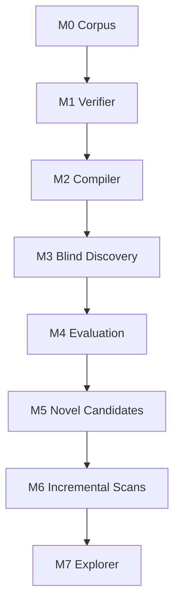
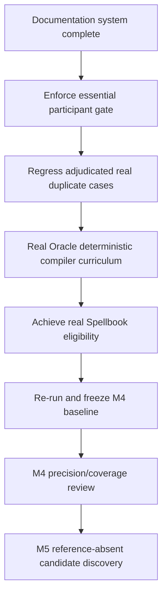

# MTG Loop Engine — Roadmap (gate document)

## North star

```
Oracle text → semantics → blind discovery → rules proof
```

Discovery may speculate. Verification may not. **Optimize verified precision over recall.**

No LLM-generated semantics on the path to `VERIFIED`. No binary "infinite." Loop type × output × consequence × delta.

## Milestone flow



**Active milestone:** M4 — Evaluation ◐ **IN PROGRESS**

Quantitative snapshot (baselines): [`docs/STATUS.md`](docs/STATUS.md). Do not paste volatile counts into this file.

---

## Completed milestones

### M0 — Corpus ✓

- Scryfall Oracle bulk ingest; gitignored snapshots with manifest hashes.
- Commander Spellbook extract → DuckDB; conventional two-card filter.
- `gold_core` (10 positive witnesses, 9 hard negatives), `gold_extended` (15 stubs).
- Essential vs generic vs functional-external labels on every corpus entry.

### M1 — Witness verifier ✓

- `LoopWitness` in → `LoopProof` out. No search inside the verifier; no LLM.
- Rules-aware executor: costs, tap/untap, sac, simple triggers, cost modifiers, replacements.
- Proof-specific `LoopRelevantState` (`EXACT` / `MINIMUM` / `MAXIMUM`).
- Fail-closed: `PARTIAL_RELEVANT_TO_PROOF` may never emit `VERIFIED`.
- Typed rejection vocabulary (`RESOURCE_DEFICIT`, `STATE_NOT_RECURRENT`, …).
- All `gold_core` positives `VERIFIED`; hard negatives produce correct typed rejection.

### M2 — Deterministic compiler ✓

- Oracle text → `CardSemantics` via deterministic pattern library.
- 19/19 gold Oracle fixtures compile `COMPLETE`; `fragment_coverage = 1.0`.
- `compile-coverage` CLI.

### M3 — Blind discovery ✓

- Capability signatures + inverted-index joins → bounded BFS → same verifier.
- 10/10 `gold_core` pairs rediscovered without pair labels.
- Explorer is the single acceptance oracle; `discover_loops` does not re-verify.
- `corpus.builders` shared between gold fixtures and discovery so witness shapes stay comparable.

---

## M4 — Evaluation ◐ IN PROGRESS

M4 is **not** complete because evaluation infrastructure exists. Exit requires precision correctness closure and minimum real-Oracle eligibility.

### Completed (instrumentation)

- **M3.5 seam gate:** Oracle fixtures → compiler → blind discovery → verifier (10/10 still).
- Evaluation / adjudication schema (`AdjudicationClass`, `ReferenceStatus`, prerequisite analysis).
- DuckDB + JSONL persistence; local Streamlit adjudication workbench.
- Frozen baselines under `eval/baseline/` (authoritative measured counts — see [`docs/STATUS.md`](docs/STATUS.md)).
- GitHub Actions CI (`uv run pytest` + docs/status checks).

### Remaining before M5

1. **Participant enforcement** — reject witnesses where an essential card never acts (condition detected in adjudication; not yet enforced in search).
2. **Regress real duplicate cases** — tests from adjudicated *real-card* `duplicate_or_equivalent_interaction` extras (not fixture-invalid rows).
3. **Deterministic real-Oracle compiler expansion** — curriculum from unsupported Spellbook/Oracle fragments, not only gold-fixture wording.
4. **≥1 eligible Spellbook pair** on the conventional sample (today: selected ≫ 0, eligible = 0 — details in STATUS).
5. **Re-run and freeze** truthful post-fix baselines; refresh STATUS via `scripts/render_status.py`.
6. **Reconcile docs/status** with the new freeze.

Playbook: [`docs/runbooks/M4_FOLLOW_THROUGH.md`](docs/runbooks/M4_FOLLOW_THROUGH.md).

### Next engineering plan (after docs)



Do not begin M5 merely because evaluation tooling exists.

---

## M5 — Novel candidate adjudication

Once M4 correctness and eligibility gates are in:

- Run discovery on real compiled Oracle cards from Spellbook entries.
- Accepted pairs not in Spellbook start as `ABSENT_FROM_REFERENCE`.
- Human adjudication upgrades to `NOVEL` only after review.
- Report `NOVEL` separately from precision denominator.
- Do not tighten joins to suppress `ABSENT_FROM_REFERENCE` results — label them.

---

## M6 — Incremental scans

- Trigger a re-run when new Scryfall snapshots differ from previous.
- Detect newly eligible pairs (compiler coverage grows over time).
- Track proof hash stability across engine versions.

---

## M7 — Explorer

- Local web UI beyond the adjudication workbench.
- Card images via Scryfall URL (never committed art).
- Search, filter, and browse all verified loops.
- FastAPI or equivalent; still no Postgres in the first cut.

---

## Explicitly deferred (do not plan or scaffold)

- LLM-generated semantics on any path to `VERIFIED`
- Three-card discovery
- Z3 / SMT solving
- Full Comprehensive Rules implementation
- ManaBox integration
- Deployed / public UI
- Performance optimization passes

---

## Frozen product decisions

| Topic | Decision |
|-------|----------|
| Choice ownership | Combo player favorable; opponent adversarial; cooperation → `OPPONENT_COOPERATION_REQUIRED` |
| Two-card definition | Exactly two essential functional pieces; generic fodder OK; functional external is not strict |
| Verifier contract | Witness-in / proof-out; search never inside verifier |
| Fail-closed coverage | `PARTIAL_RELEVANT_TO_PROOF` → never `VERIFIED` |
| Determinism | V1 deterministic-only; nondeterministic → typed rejection |
| LLM ban | No LLM on the `VERIFIED` path, indefinitely |
| Data hygiene | Never commit Oracle bulk JSON; `data/` gitignored |
| Loop model | No binary `infinite`; loop type × output × consequence × delta |
| Spellbook absence | `ABSENT_FROM_REFERENCE`, not false positive; `NOVEL` only after adjudication |
| Precision goal | Adjudicated precision over raw recall |

Longer rationale: [`docs/decisions/`](docs/decisions/) and [`docs/EVALUATION.md`](docs/EVALUATION.md).

---

## Governance

- **Review at milestone start:** re-read this file and confirm goals, constraints, and deferred items are still accurate.
- **Update at milestone exit:** the PR that completes a milestone must mark it done and refresh the next milestone's gates.
- **Feature branches:** all non-trivial work on a `feature/<slug>` branch; CI green before merge into `main`. Policy: [`CONTRIBUTING.md`](CONTRIBUTING.md); Cursor adapters: [`.cursor/rules/feature-branches.mdc`](.cursor/rules/feature-branches.mdc), [`.cursor/rules/land-and-return.mdc`](.cursor/rules/land-and-return.mdc).
- **Canonical docs:** In-repository documentation is canonical. Agent/session plans under a developer's home directory are ephemeral execution aids—not durable strategy. Durable decisions land in this roadmap, ADRs, `docs/`, and issues/PRs.
