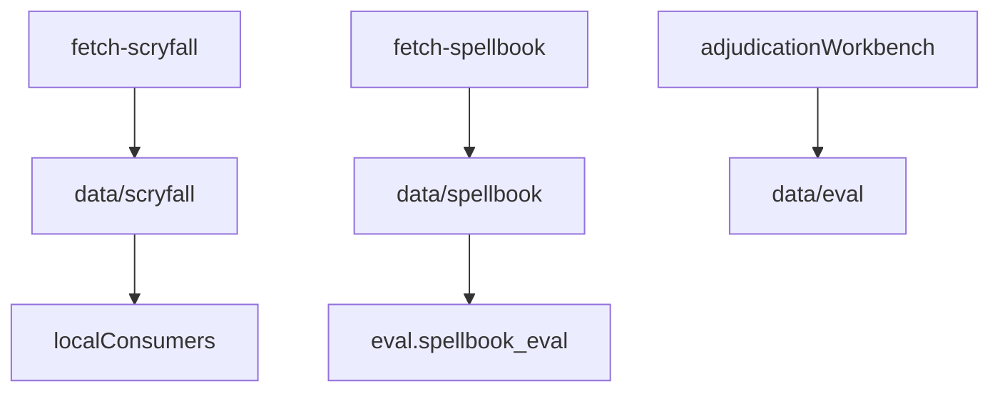

# data

## Purpose

Gitignored local caches for Scryfall Oracle snapshots, Commander Spellbook reference extracts, and working evaluation databases.

**Keep this README:** snapshots stay out of git; this file documents how operators populate them.

## Role in pipeline

CLI `fetch-*` / eval workbench → **THIS (local disk)** → offline compile, recovery, and adjudication workflows.



## Inputs

- Network fetches via `mtg-loop-engine fetch-scryfall` / `fetch-spellbook`
- Workbench / store writes for DuckDB under `data/eval/`

## Outputs

- Versioned snapshot directories with `manifest.json`
- DuckDB / analytics files for local review

## Responsibilities

- Hold large, redistributable-restricted, or regenerable datasets off git.
- Keep a clear split from committed eval copies under repo-root `eval/`.

## Non-responsibilities

- Source code
- Committed Oracle bulk JSON (ToS / redistribution)
- Frozen baseline summaries (those live in `eval/baseline/`)

## Core invariants

- Contents are gitignored; CI must not require this tree.
- Committed evaluation artifacts (fixtures, adjudications, baselines) live under repo-root `eval/`, not here.

## Main entry points

Populate with:

```bash
uv run mtg-loop-engine fetch-scryfall
uv run mtg-loop-engine fetch-spellbook --pages 3
```

M4 working adjudications default to gitignored `data/eval/adjudications.duckdb`.

## Data contracts

Snapshot layout and manifests are owned by `cards` / `benchmark` ingest code. DuckDB schema aligns with `mtg_loop_engine.eval.store`.

## Failure behavior

Missing snapshots cause CLI/eval commands to fail loudly; they do not invent empty corpora.

## Testing

Ingest/filter unit tests use fixtures or temp dirs — not committed bulk under `data/`.

## Extension guide

Add new gitignored subtrees here only for regenerable local caches. Anything needed for CI belongs under `eval/` or `tests/`.

## Bigger-picture relationship

Cards ingest: [`../src/mtg_loop_engine/cards/README.md`](../src/mtg_loop_engine/cards/README.md). Spellbook: [`../src/mtg_loop_engine/benchmark/README.md`](../src/mtg_loop_engine/benchmark/README.md). Committed eval: [`../eval/README.md`](../eval/README.md).
