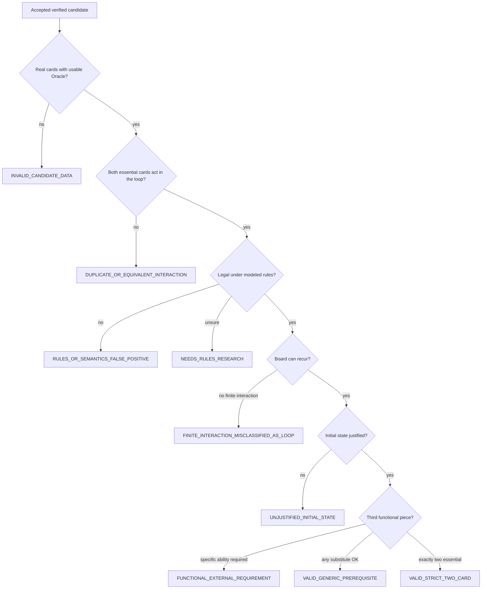

# Adjudication guide

## Purpose

Human review of engine-accepted discoveries. The Streamlit workbench is a research instrument; this document is the durable class guide (also summarized in the workbench sidebar).

Canonical enums live in `mtg_loop_engine.eval.schema` (`AdjudicationClass`, `AdjudicationFailureReason`, `ReferenceStatus`).

## Decision flow (accepted candidate)

---

## `AdjudicationClass`

### `valid_strict_two_card`

**Rule:** Both cards actively participate in every iteration; no third functional piece is required. Generic fodder (mana of the right colors, untapped permanence the cards themselves provide, etc.) may be assumed only when intrinsic to the pair.

**Example:** Basalt Monolith + Rings of Brighthearth.

**Counts toward precision:** yes (valid).

### `valid_generic_prerequisite`

**Rule:** The loop needs a third object (e.g. "any creature to sacrifice"), but that object's identity is irrelevant—any legal substitute works.

**Example:** Token Breeder + Intruder Alarm (seeded creature token fodder; any token works). See calibration case `CC-005` in [`eval/calibration/adjudication_cases.jsonl`](../eval/calibration/adjudication_cases.jsonl).

**Boundary vs `unjustified_initial_state`:** Generic prerequisite assumes fodder the loop can reasonably obtain or that is explicitly modeled as intrinsic/generic setup. Unjustified initial state means the engine assumed board state the pair cannot establish under stated assumptions (e.g. five tokens when the loop only creates one per iteration).

**Counts toward precision:** yes (valid).

### `functional_external_requirement`

**Rule:** A specific third card *type* or ability is required that is not "any creature/artifact"—it must have a particular functional ability. Not strict two-card.

**Example:** Deadeye Navigator + Peregrine Drake framed as needing a land that taps for 5+ (specific functional ability, not generic fodder).

**Boundary vs `valid_generic_prerequisite`:** If any legal substitute of the same broad category works, prefer generic prerequisite. If a particular ability or card type is essential, use functional external requirement.

**Counts toward precision:** no (invalid for strict/valid precision).

### `unjustified_initial_state`

**Rule:** The starting board the engine assumed (e.g. tokens pre-seeded) is not something the combo itself can set up in a normal game under the stated assumptions.

**Example:** Engine seeds 5 tokens; the pair only ever creates 1 per loop iteration.

**Counts toward precision:** no.

### `rules_or_semantics_false_positive`

**Rule:** The engine made a rules or semantics mistake—the loop is not actually legal under the Comprehensive Rules intent for the modeled interaction (wrong timing, wrong zone, once-per-turn, etc.).

**Example:** Engine ignores "activate only as a sorcery."

**Counts toward precision:** no.

### `duplicate_or_equivalent_interaction`

**Rule:** One of the two "essential" cards never acts in the loop—it is a bystander, not a participant. Often the same interaction as a known one-card or different-pair witness.

**Example:** Basalt Monolith loops by itself; the second searched card just watches.

**Boundary vs `finite_interaction_misclassified_as_loop`:** Bystander / redundant means one searched card never acts. Finite interaction means both act (or would), but the sequence cannot repeat.

**Counts toward precision:** no. Discovery now rejects these via the search participant gate; remaining historical labels are regression fixtures only until the next baseline freeze.

### `finite_interaction_misclassified_as_loop`

**Rule:** The cards interact productively under modeled rules, but the board cannot return to a repeatable `LoopRelevantState`—a finite combo was accepted (or would have been labeled) as a loop. Prefer this over `rules_or_semantics_false_positive` when execution is legal and the failure is recurrence / resource restoration.

**Example:** Impact Tremors + Presence of Gond (host taps once; no untapper; damage once). Same shape: Warleader's Call + Presence of Gond.

**Optional diagnostics:** set `AdjudicationRecord.failure_reasons` to `recurrence_failure` and/or `resource_not_restored` (see below).

**Counts toward precision:** no.

### `invalid_candidate_data`

**Rule:** One or both cards are not usable real Magic cards for this evaluation—test fixture stand-in, missing Oracle text, or lookup failure.

**Example:** "Impact Tremors Lite" is a gold-core fixture, not a real card.

**Counts toward precision:** **excluded from the denominator entirely** (inventory only).

### `needs_rules_research`

**Rule:** Reviewer is unsure. Prefer this when evidence is insufficient for a confident label.

**Example:** Edge cases involving obscure replacement interactions.

**Boundary vs `rules_or_semantics_false_positive`:** False positive means the modeled rules/semantics path is confidently wrong under current engine understanding. Needs rules research means insufficient evidence to choose. Investigation discipline: [`RULES_EVIDENCE.md`](RULES_EVIDENCE.md).

**Counts toward precision:** no (treat as not yet resolved for precision claims).

---

## `AdjudicationFailureReason` (optional diagnostics)

Typed codes on `AdjudicationRecord.failure_reasons`. They refine a class; they do not replace it.

| Code | Typical parent class | Meaning |
| --- | --- | --- |
| `recurrence_failure` | `finite_interaction_misclassified_as_loop` | Relevant state does not restore after the sequence |
| `resource_not_restored` | `finite_interaction_misclassified_as_loop` | A spent resource (tap, counter, fodder) is not returned |
| `participant_failure` | `duplicate_or_equivalent_interaction` | A searched essential never acts |
| `illegal_execution` | `rules_or_semantics_false_positive` | Modeled path is not legal under CR intent |

Leave the list empty when the class alone is enough.

---

## Calibration cases

Executable taxonomy examples live in [`eval/calibration/`](../eval/calibration/). Calibration is curated; adjudications are observational. LAR Tier A measures class/boundary coverage against calibration inventory.

---

## `ReferenceStatus`

Independent of adjudication class. Answers "how does this relate to Commander Spellbook (or another reference corpus)?"

### `in_reference`

**Rule:** The pair (or equivalent interaction) appears in the reference corpus used for this evaluation run.

**Still requires:** separate adjudication class — reference membership and proof correctness are independent.

### `absent_from_reference`

**Rule:** The accepted discovery is not in the reference corpus.

**Implication:** Label as `ABSENT_FROM_REFERENCE`. Spellbook is incomplete ground truth; leave joins open unless a precision bug is proven.

### `novel`

**Rule:** Human adjudication upgrades an absent-from-reference result after review. Machines must not auto-label `NOVEL`.

**Requires:** human judgment that the interaction is meaningfully new relative to known corpora and prior adjudications.

---

## Precision denominator (reminder)

Valid for precision:

- `valid_strict_two_card`
- `valid_generic_prerequisite`

Excluded from denominator:

- `invalid_candidate_data`

All other classes count as adjudicated but not valid.

See [`EVALUATION.md`](EVALUATION.md) and frozen numbers in [`STATUS.md`](STATUS.md).
