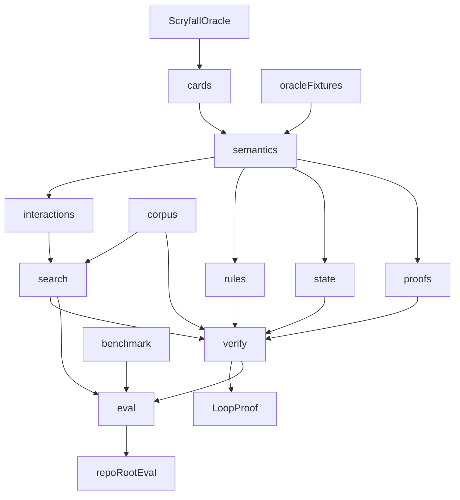
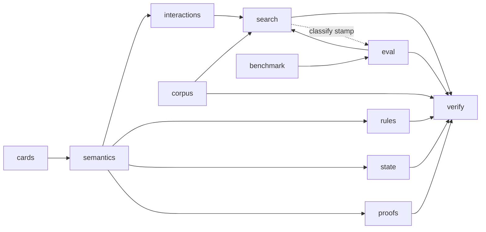
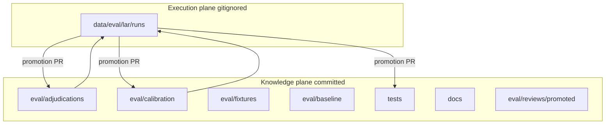

# Architecture

Package boundaries, data flow, and dependency direction for MTG Loop Engine.

Cross-cutting narrative: [`PHILOSOPHY.md`](PHILOSOPHY.md), [`TERMINOLOGY.md`](TERMINOLOGY.md), [`EVALUATION.md`](EVALUATION.md). Package-local operating contracts live next to code under `src/mtg_loop_engine/*/README.md`.

## Pipeline (high level)

**North star:** Oracle text → semantics → blind discovery → rules proof. Search may speculate; verification checks a given witness. Optimize verified precision over recall.

## Dependency direction (normative)

| Edge | Status | Why |
| --- | --- | --- |
| `search → verify` | **Required** | Search proposes; verifier accepts or rejects. Explorer injects `Verifier` as the acceptance oracle. |
| `verify → search` | **Prohibited** | Verifier is witness-in / proof-out only. Enforced by `tests/unit/test_search_boundary.py`. |
| `interactions → search` | Allowed | Joins propose pairs; search explores sequences. |
| `search → interactions` | Owned elsewhere | Joins live in `interactions`; search consumes `CandidatePair`. |
| `semantics → {interactions, rules, state, proofs, verify}` | Allowed | IR is the shared language. |
| `{verify, search} → semantics` | Read-only | Consume compiled IR; compile stays in `semantics`. |
| `corpus → {verify, search, eval}` | Allowed | Fixtures and shared builders. |
| `search → corpus.builders` | Allowed | Shared witness shape (`bf`, `two_card`); gold pair keys stay off the discovery path. |
| `eval → {search, verify, corpus, benchmark}` | Allowed | Research / measurement layer sits above the engine. |
| `search → eval.classify` | **Acknowledged cycle** | Explorer stamps classification via `analyze_prerequisites`. Prefer extracting classify into a neutral module later; keep verify independent of eval. |
| `benchmark → corpus` | Unused | Spellbook extract stays off gold authorship. |

Solid arrows are intended production dependencies. The dashed `search → eval` edge is the classification stamp used when building discovered witnesses; verifier acceptance stays independent of eval.

## Layer responsibilities (one line each)

| Package | Contract |
| --- | --- |
| `cards` | Ingest Scryfall Oracle snapshots; semantics stay in `semantics`. |
| `semantics` | Oracle language → deterministic IR + coverage. |
| `semantics/patterns` | Ordered deterministic clause matchers. |
| `interactions` | Capability joins → candidate pairs (propose only). |
| `search` | Bounded exploration → witness candidates. Acceptance stays in `verify` (+ search participant gate). |
| `verify` | **Acceptance boundary.** Witness → proof. Exploration stays in `search`. |
| `rules` | Modeled executor for costs/effects/triggers. |
| `state` | Minimal `GameState` for recurrence paths. |
| `proofs` | Shared pydantic contracts (`LoopWitness`, `LoopProof`, …). |
| `corpus` | Curated epistemic fixtures + shared builders. |
| `benchmark` | Spellbook reference extract/filter. |
| `eval` (package) | Recovery metrics + human-adjudicated precision. |
| `eval/` (repo root) | Committed fixtures, adjudications, calibration, frozen baselines, promoted review evidence. |

## Participant gate (search acceptance)

**Both searched essentials must participate before discovery accepts a hit.**

- **Detection:** `mtg_loop_engine.eval.classify.analyze_prerequisites` computes `used_oracle_ids` / `unused_oracle_ids` / `strict_two_card` from which searched cards act in loop steps (including continuous cost-reduction participation). Explorer stamps `Classification.strict_two_card` onto the witness. `unused_oracle_ids` remain on `PrerequisiteAnalysis` only.
- **Enforcement (search-only):** `explore_pair` accepts only when `Verifier.verify` returns `VERIFIED` **and** `strict_two_card`. Bystander-verified sequences are skipped; BFS continues. The verifier does not read participation flags (hand-authored bystander witnesses can still verify).
- **Evidence:** `tests/eval/test_classify_store.py` — five real Basalt bystander pairs → no hit; Basalt + Synthetic Cost Reducer still accepted.
- **Baselines:** committed `eval/baseline/` numbers are the post-eligibility M4 freeze (gold extras post-gate; Spellbook eligible≥1). Regenerate only when metrics intentionally change.

## Fail-closed coverage

`SemanticCoverage` (`semantics.enums`):

| Value | Meaning | Verifier |
| --- | --- | --- |
| `COMPLETE` | All fragments matched | May `VERIFIED` |
| `PARTIAL_IRRELEVANT_TO_PROOF` | Gaps marked irrelevant | May `VERIFIED` if otherwise sound |
| `PARTIAL_RELEVANT_TO_PROOF` | Proof-relevant gaps (default for unmatched) | Typed rejection → `UNSUPPORTED_SEMANTICS` |

Fail-closed also fires when any card’s `relevant_unsupported()` is true. Discovery often leaves witness-level `semantic_coverage` at its default; per-card IR coverage remains the load-bearing gate.

## Evaluation split

| Instrument | Question | Spellbook absence |
| --- | --- | --- |
| Reference recovery | Among eligible/supported reference rows, how many rediscover? | N/A (denominator is eligible only) |
| Human-adjudicated precision | Of accepted real-card discoveries, how many are valid? | `ABSENT_FROM_REFERENCE` (label; adjudicate class separately) |

Frozen numbers: `eval/baseline/*.json` (prefer over prose). See [`EVALUATION.md`](EVALUATION.md).

## Evaluation data lifecycle (LAR v2)

**Invariant:** evaluation execution is ephemeral; accepted knowledge is durable. A run is temporary; a finding earns permanence through review.

## Testing as epistemic contracts

| Suite | Contract |
| --- | --- |
| `tests/gold_core` | **Positives** → `VERIFIED` |
| `tests/hard_negatives` | **Hard negatives** → exact typed rejection |
| `tests/gold_extended` | Unsupported stubs stay non-`VERIFIED` (curriculum) |
| `tests/golden_proofs` | Proof JSON / hash / `normalize_proof` as executable artifacts |
| `tests/semantic` | Compiler coverage + compile→verify seam |
| `tests/discovery` | Blind recall + compiled Oracle→discovery→verify seam |
| `tests/eval` | Classify detection, recovery sample, precision exclusions |
| `tests/unit/test_search_boundary` | `verify` imports stay free of `search` |
