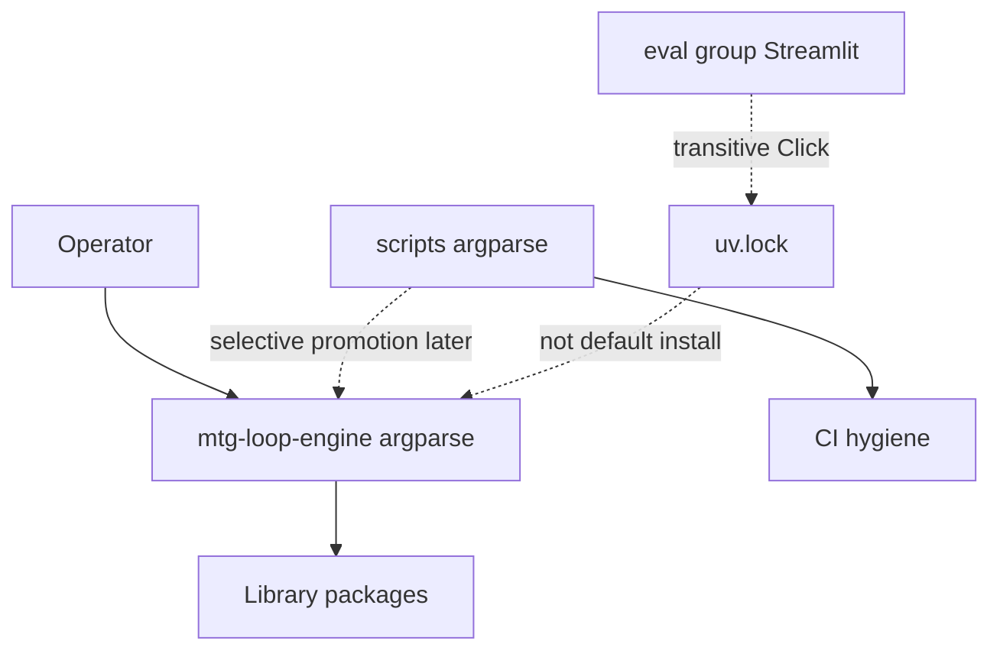

# CLI reference

Entry point: `uv run mtg-loop-engine` (`mtg_loop_engine.cli`).

| Command | Milestone | Purpose | Expected output |
| ------- | --------- | ------- | --------------- |
| `verify-gold` | M5 | Run Oracle-exact `gold_core` positives and Oracle hard negatives | Per-witness status + proof hash; exit `0` if all match (Wave 0: empty gold is success) |
| `verify-physics` | M5 | Run synthetic/divergent physics fixtures + physics hard negatives | Same shape as verify-gold for the physics suite |
| `fetch-scryfall` | M0 | Download Scryfall Oracle Cards bulk snapshot into gitignored `data/` | JSON manifest (paths, hashes); creates local snapshot dirs |
| `fetch-spellbook` | M0 | Download Commander Spellbook sample pages into gitignored `data/` | JSON manifest; `--pages` controls how many API pages (default 2) |
| `compile-coverage` | M2 | Report deterministic compiler coverage on gold Oracle fixtures | Per-card fragment counts; JSON summary with `fragment_coverage`; exit `0` only if coverage is `1.0` on gold fixtures |
| `discover-gold` | M5 | Blind-discover Oracle `gold_core` pairs without pair labels | JSON discovery stats; exit `0` if all Oracle gold pairs rediscovered |
| `discover-physics` | M5 | Blind-discover physics fixture pairs without pair labels | JSON discovery stats for the physics suite |
| `eval-gold-extras` | M4 | Snapshot gold-pool extra discoveries and report adjudicated precision over real-card pairs | JSON: `extras_total`, real/fixture splits, `adjudicated`, `valid`, `precision`, `by_class`; persists store/JSONL |
| `eval-spellbook` | M4 | Reference recovery on a conventional two-card Spellbook-shaped JSONL | `RecoveryReport` JSON (`counts`, `rows`); optional `--out`; `--fetch-oracle` resolves names via Scryfall then compiles |
| `adjudicate-workbench` | M4 | Launch local Streamlit adjudication UI | Opens Streamlit on the workbench app; requires eval optional deps (`uv run --group eval …`). Stop with Ctrl+C in that terminal so DuckDB unlocks; closing the browser tab is not enough |

## Common flags

| Command | Flag | Meaning |
| ------- | ---- | ------- |
| `fetch-spellbook` | `--pages N` | Max Spellbook API pages to fetch |
| `eval-spellbook` | `--variants PATH` | JSONL of variants (default `eval/fixtures/spellbook_conventional_sample.jsonl`) |
| `eval-spellbook` | `--fetch-oracle` | Resolve missing names via Scryfall collection API, then compile |
| `eval-spellbook` | `--out PATH` | Write `RecoveryReport` JSON to path |
| *(all)* | `--version` | Print package version |

## Related docs helpers

| Command | Purpose |
| ------- | ------- |
| `uv run python scripts/render_status.py` | Refresh generated section of [`STATUS.md`](STATUS.md) from frozen baselines |
| `uv run python scripts/render_status.py --check` | Exit non-zero if `STATUS.md` is out of sync |
| `uv run python scripts/check_docs.py` | README / link / governance file checks |
| `uv run python scripts/spellbook_compiler_priority.py` | Live diagnostic: rank Spellbook compiler gaps from local snapshot + Scryfall bulk |

See [`runbooks/M4_FOLLOW_THROUGH.md`](runbooks/M4_FOLLOW_THROUGH.md) for the post-docs engineering sequence these commands support. Details: [`scripts/README.md`](../scripts/README.md).

---

## Architecture

The product CLI is **thin wiring** over library APIs under `src/mtg_loop_engine/`. Handlers import packages, print structured output, and return exit codes. Business logic (verify, compile, discover, eval) stays in packages — see [`src/mtg_loop_engine/README.md`](../src/mtg_loop_engine/README.md).

Today the surface is eight flat subcommands (stdlib `argparse` in `cli.py`), with only a handful of flags beyond `--version`. CI runs pytest plus [`scripts/`](../scripts/README.md) hygiene helpers; it does not invoke `mtg-loop-engine`. `cli.py` is omitted from the coverage gate by design.

Click may appear in `uv.lock` via the **eval** optional group (Streamlit / Uvicorn). That is a transitive lockfile entry. Default install remains `duckdb`, `httpx`, and `pydantic` only.

### Compatibility contracts

Any future framework change must preserve the operator-facing surface:

- Documented command names, flags, and defaults in this file and the root README
- Gate exit codes: `verify-gold`, `compile-coverage`, `discover-gold` → `0` / `1`
- `eval-spellbook` missing variants path → stderr guidance + exit `1`
- Mixed human-line + JSON stdout shapes as documented above
- Blind discovery and deterministic `VERIFIED` path (see [`AGENTS.md`](../AGENTS.md))

---

## Framework choice

**Verdict:** keep stdlib `argparse` until viability triggers fire. Click is a later upgrade path when those triggers are met. Typer is disqualified for the default product CLI under the current dependency bar (Rich). This is stack / operator-surface guidance — not an ADR-class epistemic freeze (see [`decisions/`](decisions/)).

| Option | Fit today | Cost | Notes |
| ------ | --------- | ---- | ----- |
| Keep argparse | Best | Zero | Matches eight flat leaves and wiring-only |
| argparse `parents=` | When shared flags appear | Zero | Prefer before any new framework |
| Click (no Rich) | When triggers fire | First-class dep + docs blast | Preferred future upgrade if needed |
| Typer | Poor | Rich + shellingham + vendored Click | Disqualified under current default-dep bar |

Lockfile presence of Click is not a free product dependency. Adopting it requires a first-class pin in `[project.dependencies]`, CI/runtime expansion, and updates across every doc that encodes command strings.

### Viability triggers

Re-open a framework upgrade when **two or more** of these are true, or **one** is an explicit human product requirement:

1. ≥12 leaf commands in ≥3 named groups (nested `eval` / `fetch` / `scan`), not eight flat names
2. The same option set copied onto ≥3 commands and argparse `parents=` is getting painful
3. Documented shell completion for non-dev operators (README / runbook)
4. Product CLI becomes a CI merge-gate surface **and** the tree has grown past a thin dispatcher
5. Parser + dispatch wiring (not domain handlers) exceeds ~400 lines with a real option graph

**Out of scope as triggers:** lockfile presence of Click; prettier `--help`; fat handlers such as `compile-coverage` (extract library code instead); M6 / M7 existing on the roadmap alone.

Until triggers fire: stay on argparse. If shared flags appear first, use **argparse parents in the same PR as those flags**. If Click later wins, prefer **Click without Rich**.

### Roadmap fit

Advisory sequencing only — not an exit criterion for any milestone in [`ROADMAP.md`](../ROADMAP.md).

| Milestone | CLI framework work? | Rationale |
| --------- | ------------------- | --------- |
| **M4** (active) | Stay on argparse | Competes with compiler curriculum, Spellbook eligibility, baseline freeze. ADR 0006 milestone discipline. |
| **M5** Novel candidates | Stay on argparse (default) | Likely extends existing eval / discovery commands; still flat recipes. Use parents if shared flags appear. |
| **M6** Incremental scans | **Best first window** | Snapshot-diff re-runs and shared path / config flags can introduce a small command cluster. Upgrade **only if viability triggers fire** while building that surface. |
| **M7** Explorer | Web UI (FastAPI or equivalent) | At most a thin `serve` leaf; the explorer milestone is not a CLI-framework project. |

**Recommended sequencing for a future upgrade PR:**

1. Finish M4 exit gates.
2. Grow operator commands for the real need (typically M6 orchestration) on argparse first, or with argparse parents if flags are shared.
3. If triggers are met, open a **behavior-preserving** Click migration PR (separate from domain work), with wiring tests and full sync of this file plus README / runbook surfaces.
4. Prefer **Click without Rich** unless default-dep policy explicitly accepts Rich.

### Migration constraints (if / when — Click)

1. Pin Click in `[project.dependencies]`; do not hitchhike Streamlit's transitive Click.
2. Preserve command names, flags, exit codes, and stdout / stderr contracts above.
3. Promote scripts on their own criteria (below), separately from the framework PR when needed.
4. Add wiring tests only (exit codes, JSON keys, stderr). Domain contracts stay in gold / discovery / eval suites; do not un-omit `cli.py` solely to manufacture coverage %.
5. Rename or nest only with aliases that preserve documented strings; add Rich / Typer / completion only when that is the requirement.
6. Same-PR updates for every doc that encodes command strings.

---

## Scripts vs product CLI

[`scripts/`](../scripts/README.md) holds optional helpers that are not library imports. The primary product CLI remains `mtg-loop-engine`. Promote individual scripts when criteria below hold.

### Promotion criteria

Promote a script into a thin product CLI leaf when **most** of these hold:

1. Operators run it as part of the discovery / eval / scan workflow (not only CI)
2. It shares paths / flags with existing product commands (`--variants`, snapshot dirs, `--out`)
3. Logic can move (or already lives) behind a library function; CLI stays wiring-only
4. Documented in runbooks next to other `mtg-loop-engine` commands

Keep under `scripts/` when **any** of these dominate:

1. CI / docs hygiene with no product identity
2. Repo-layout checks that assume a checkout (not an installed package)
3. One-off local diagnostics that must not expand default install or CI surface

### Per-script recommendation

| Script | Promote? | When / how | Notes |
| ------ | -------- | ---------- | ----- |
| `spellbook_compiler_priority.py` | **Strongest candidate** | After M4 eligibility work stabilizes, or early M5 / M6 when compiler-gap diagnostics are recurring; ideally as `compiler-priority` (or under a future `diag` / `eval` group) | Already overlaps `eval-spellbook` / compiler curriculum. Extract analysis to a library module first; CLI becomes thin. An argparse leaf is fine. |
| `render_status.py` | **Optional / weak** | Only if the product CLI becomes the single operator entry *and* CI is willing to call `mtg-loop-engine status --check` (or similar) | Pure docs / baseline hygiene. Fine forever as a script. Promotion is ergonomics, not architecture. |
| `check_docs.py` | **Least appropriate** | Prefer stay in `scripts/` indefinitely | Checkout-layout / README / link hygiene; odd fit for an installable package console script. CI should keep invoking `python scripts/check_docs.py`. |

### Roadmap coupling

- Script promotion is **orthogonal** to a Click upgrade. Promote `spellbook_compiler_priority` as an argparse leaf (after library extract) when the operator need is real.
- If Click lands at M6 because of nested `scan` / `eval` / `diag` groups, that is a natural moment to place a promoted diagnostic under a group — still only if the promotion criteria are met.
- Promote scripts for operator need, not to justify Click.

### If promoting (future constraints)

1. Library extract first where logic is fat (especially compiler-priority).
2. Preserve script invocation as a thin shim or document deprecation aliases so CI / runbooks stay continuous mid-cutover.
3. Update `scripts/README.md`, this file, and the CI workflow in the same change.
4. Keep network-free invariants for anything CI still calls.

---

## Out of scope until triggers fire

| Topic | Revisit when |
| ----- | ------------ |
| Click or Typer on the product CLI | Viability triggers above (or explicit human requirement) |
| Blanket merge of all `scripts/` into the product CLI | Individual promotion criteria |
| Promoting `check_docs.py` for a single entrypoint | Product identity changes |
| Treating M7 as a CLI-framework project | Explorer needs a thin `serve` leaf only |
| Numbered ADR whose only decision is “we chose argparse” | Stack choice stays advisory here |
