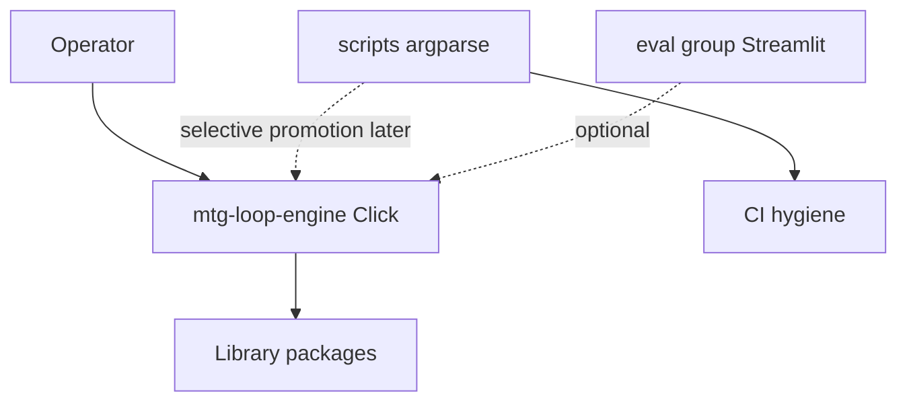

# CLI reference

Entry point: `uv run mtg-loop-engine` (`mtg_loop_engine.cli`).

| Command | Milestone | Purpose | Expected output |
| ------- | --------- | ------- | --------------- |
| `verify-gold` | M5 | Run Oracle-exact `gold_core` positives and Oracle hard negatives | Per-witness status + proof hash; exit `0` if all match (Wave 0: empty gold is success) |
| `verify-physics` | M5 | Run synthetic/divergent physics fixtures + physics hard negatives | Same shape as verify-gold for the physics suite; also prints first 3 `gold_extended` witnesses (informational) |
| `fetch-scryfall` | M0 | Download Scryfall Oracle Cards bulk snapshot into gitignored `data/` | JSON manifest (paths, hashes); creates local snapshot dirs |
| `fetch-spellbook` | M0 | Download Commander Spellbook sample pages into gitignored `data/` | JSON manifest; `--pages` controls how many API pages (default 2) |
| `compile-coverage` | M2 | Report deterministic compiler coverage on gold Oracle fixtures | Per-card fragment counts; JSON summary with `fragment_coverage`; exit `0` only if coverage is `1.0` on gold fixtures |
| `discover-gold` | M5 | Blind-discover Oracle `gold_core` pairs without pair labels | JSON discovery stats; exit `0` if all Oracle gold pairs rediscovered |
| `discover-physics` | M5 | Blind-discover physics fixture pairs without pair labels | JSON discovery stats for the physics suite |
| `eval-gold-extras` | M4 | Snapshot gold-pool extra discoveries and report adjudicated precision over real-card pairs | JSON: `extras_total`, real/fixture splits, `adjudicated`, `valid`, `precision`, `by_class`; persists store/JSONL |
| `eval-spellbook` | M4 | Reference recovery on a conventional two-card Spellbook-shaped JSONL | `RecoveryReport` JSON (`counts`, `rows`); optional `--out`; `--fetch-oracle` resolves names via Scryfall then compiles |
| `adjudicate-workbench` | M4 | Launch local Streamlit adjudication UI | Opens Streamlit on the workbench app; requires eval optional deps (`uv run --group eval …`). Stop with Ctrl+C in that terminal so DuckDB unlocks; closing the browser tab is not enough |

## Common flags

| Command | Flag | Meaning |
| ------- | ---- | ------- |
| `fetch-spellbook` | `--pages N` | Max Spellbook API pages to fetch (default 2) |
| `eval-spellbook` | `--variants PATH` | JSONL of variants (default `eval/fixtures/spellbook_conventional_sample.jsonl`) |
| `eval-spellbook` | `--fetch-oracle` | Resolve missing names via Scryfall collection API, then compile |
| `eval-spellbook` | `--out PATH` | Write `RecoveryReport` JSON to path |
| *(all)* | `--version` | Print package version |
| *(all)* | `-h`, `--help` | Show help (root or per-command) |

## Exit codes

| Command | Exit `0` | Exit `1` |
| ------- | -------- | -------- |
| `verify-gold` | All witnesses match expected status | Any mismatch |
| `verify-physics` | All physics fixtures match | Any mismatch |
| `fetch-scryfall` | Always | — |
| `fetch-spellbook` | Always | — |
| `compile-coverage` | `fragment_coverage == 1.0` on gold fixtures | Coverage below 1.0 |
| `discover-gold` | All Oracle gold pairs rediscovered | Missing pairs |
| `discover-physics` | All physics pairs rediscovered | Missing pairs |
| `eval-gold-extras` | Always | — |
| `eval-spellbook` | Variants path exists and eval completes | Missing variants path (stderr guidance) |
| `adjudicate-workbench` | Streamlit subprocess exits 0 | DuckDB locked (stderr) or subprocess non-zero |

## Getting started (cookbook)

### First-time engine smoke

```bash
uv sync
uv run mtg-loop-engine fetch-scryfall          # optional: local Oracle bulk for M5 scripts
uv run mtg-loop-engine compile-coverage        # gate: fragment_coverage must be 1.0
uv run mtg-loop-engine verify-gold
uv run mtg-loop-engine discover-physics        # physics suite regression
```

### M4 evaluation loop

```bash
uv run mtg-loop-engine eval-spellbook \
  --variants eval/fixtures/spellbook_conventional_sample.jsonl
uv run --group eval mtg-loop-engine adjudicate-workbench
# Stop workbench with Ctrl+C in the same terminal (DuckDB lock)
uv run mtg-loop-engine eval-gold-extras
```

### M5 absent discovery (scripts; requires local Scryfall snapshot)

```bash
uv run mtg-loop-engine fetch-scryfall
uv run mtg-loop-engine fetch-spellbook --pages 3
uv run python scripts/spellbook_compiler_priority.py
uv run python scripts/spellbook_absent_discovery.py --persist-workbench
uv run --group eval mtg-loop-engine adjudicate-workbench
```

See [`runbooks/M5_NOVEL_CANDIDATES.md`](runbooks/M5_NOVEL_CANDIDATES.md).

## Help discovery

```bash
uv run mtg-loop-engine --help                  # all commands
uv run mtg-loop-engine verify-gold --help      # one command
uv run mtg-loop-engine --version
```

Click generates grouped option lists and long help from command docstrings.

## Shell completion

Completion requires an **installed entry point** (not `python -m`). After `uv sync`, `uv run mtg-loop-engine` works for commands; tab completion needs the console script on your PATH (e.g. `uv pip install -e .` or activate the project venv).

**Bash** (add to `~/.bashrc`):

```bash
eval "$(_MTG_LOOP_ENGINE_COMPLETE=bash_source mtg-loop-engine)"
```

**Zsh** (add to `~/.zshrc`):

```bash
eval "$(_MTG_LOOP_ENGINE_COMPLETE=zsh_source mtg-loop-engine)"
```

**Fish** (save to `~/.config/fish/completions/mtg-loop-engine.fish`):

```fish
_MTG_LOOP_ENGINE_COMPLETE=fish_source mtg-loop-engine | source
```

To avoid eval-on-every-shell startup, generate a static script once:

```bash
_MTG_LOOP_ENGINE_COMPLETE=bash_source mtg-loop-engine > mtg-loop-engine-complete.bash
```

## Related docs helpers

| Command | Purpose |
| ------- | ------- |
| `uv run python scripts/render_status.py` | Refresh generated section of [`STATUS.md`](STATUS.md) from frozen baselines |
| `uv run python scripts/render_status.py --check` | Exit non-zero if `STATUS.md` is out of sync |
| `uv run python scripts/check_docs.py` | README / link / governance file checks |
| `uv run python scripts/freeze_gold_witnesses.py` | Re-freeze Oracle gold witness JSON (reviewed; `--check` for drift) |
| `uv run python scripts/spellbook_compiler_priority.py` | M5.1 frontier: rank compiler gaps by pair unlock (local Spellbook + Scryfall) |
| `uv run python scripts/spellbook_absent_discovery.py` | M5 blind discovery among COMPLETE Spellbook cards; `--persist-workbench` for DuckDB |

Key script flags: `--variants`, `--scryfall-dir`, `--out` / `--out-json` / `--out-md`, `--max-depth`, `--persist-workbench`, `--frontier-only`, `--db`. Details: [`scripts/README.md`](../scripts/README.md).

See [`runbooks/M4_FOLLOW_THROUGH.md`](runbooks/M4_FOLLOW_THROUGH.md) for the post-M4 engineering sequence.

---

## Architecture

The product CLI is **thin Click wiring** over library APIs under `src/mtg_loop_engine/cli/`. Commands import packages, emit structured output, and exit with gate codes. Business logic stays in packages — see [`src/mtg_loop_engine/README.md`](../src/mtg_loop_engine/README.md).

Ten flat subcommands on a root Click group. CI runs pytest plus [`scripts/`](../scripts/README.md) hygiene helpers (stdlib `argparse`); it does not invoke `mtg-loop-engine`. The `cli/` package is omitted from the coverage gate by design.

Default install dependencies: `click`, `duckdb`, `httpx`, `pydantic`. Streamlit (eval group) may pull additional packages transitively; product CLI does not depend on Rich or Typer.



### Compatibility contracts

Operator-facing surface is stable across the Click migration:

- Documented command names, flags, and defaults in this file and the root README
- Gate exit codes in the table above
- `eval-spellbook` missing variants path → stderr guidance + exit `1`
- Mixed human-line + JSON stdout shapes as documented
- Blind discovery and deterministic `VERIFIED` path (see [`AGENTS.md`](../AGENTS.md))

---

## Framework choice

**Verdict:** product CLI uses **Click** (no Rich). [`scripts/`](../scripts/README.md) helpers stay on stdlib `argparse`. Typer is disqualified under the default dependency bar. Stack guidance lives here — not an ADR-class epistemic freeze.

| Layer | Framework | Notes |
| ----- | --------- | ----- |
| `mtg-loop-engine` | Click ≥8.1, &lt;9 | First-class pin in `[project.dependencies]` |
| `scripts/*.py` | argparse | CI / checkout hygiene; promote individually when criteria hold |
| Eval workbench | Streamlit | Launched via `adjudicate-workbench`; optional `[dependency-groups] eval` |

### Adding commands

1. Add handler in `src/mtg_loop_engine/cli/commands/<family>.py` and register on the root group.
2. Update this file (command table, flags, exit codes).
3. Add `CliRunner` wiring tests in `tests/unit/test_cli_wiring.py`.
4. Sync root README smoke block and owning package README if domain-specific.

Agent workflow: [`.agents/skills/click-cli/`](../.agents/skills/click-cli/). Cursor rule: [`.cursor/rules/cli-development.mdc`](../.cursor/rules/cli-development.mdc).

### Future nesting

Flat commands are intentional today. If M6 introduces nested `scan` / `eval` / `diag` groups, add aliases so documented flat names keep working.

---

## Scripts vs product CLI

[`scripts/`](../scripts/README.md) holds optional helpers that are not library imports. The primary product CLI remains `mtg-loop-engine`. Promote individual scripts when criteria below hold.

### Promotion criteria

Promote a script into a thin product CLI leaf when **most** of these hold:

1. Operators run it as part of the discovery / eval / scan workflow (not only CI)
2. It shares paths / flags with existing product commands (`--variants`, snapshot dirs, `--out`)
3. Logic can move (or already lives) behind a library function; CLI stays wiring-only
4. Documented in runbooks next to other `mtg-loop-engine` commands

Keep under `scripts/` when **any** of these dominate:

1. CI / docs hygiene with no product identity
2. Repo-layout checks that assume a checkout (not an installed package)
3. One-off local diagnostics that must not expand default install or CI surface

### Per-script recommendation

| Script | Promote? | When / how | Notes |
| ------ | -------- | ---------- | ----- |
| `spellbook_compiler_priority.py` | **Strongest candidate** | After M4 eligibility work stabilizes, or early M5 / M6 when compiler-gap diagnostics are recurring; ideally as `compiler-priority` (or under a future `diag` / `eval` group) | Extract analysis to a library module first; CLI becomes thin Click leaf |
| `render_status.py` | **Optional / weak** | Only if the product CLI becomes the single operator entry *and* CI is willing to call `mtg-loop-engine status --check` (or similar) | Pure docs / baseline hygiene. Fine forever as a script |
| `check_docs.py` | **Least appropriate** | Prefer stay in `scripts/` indefinitely | Checkout-layout / README / link hygiene |

### If promoting (future constraints)

1. Library extract first where logic is fat (especially compiler-priority).
2. Preserve script invocation as a thin shim or document deprecation aliases so CI / runbooks stay continuous mid-cutover.
3. Update `scripts/README.md`, this file, and the CI workflow in the same change.
4. Keep network-free invariants for anything CI still calls.
