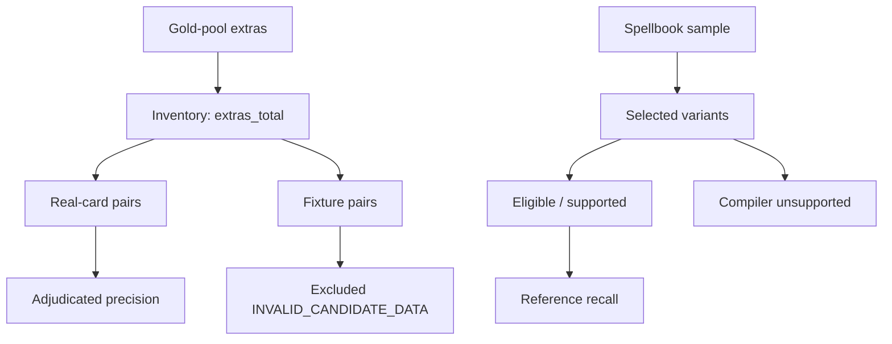

# Evaluation denominators

## Purpose

Evaluation answers several different questions. Collapsing them into a single "accuracy" number hides failure modes and invites gaming the wrong metric.

There is **no** project-wide aggregate accuracy score.

## Source hierarchy

| Question | Authority |
| -------- | --------- |
| What was measured | `eval/baseline/*` (see [`STATUS.md`](STATUS.md)) |
| How labels are assigned | [`ADJUDICATION.md`](ADJUDICATION.md) |
| What still gates M5 | [`ROADMAP.md`](../ROADMAP.md), [`runbooks/M4_FOLLOW_THROUGH.md`](runbooks/M4_FOLLOW_THROUGH.md) |

## Denominators

### 1. Compiler coverage

**Question:** Of the Oracle fragments / cards we attempt to compile, how many have complete, fail-closed semantics for proof-relevant text?

**Typical signals:** fragment coverage on gold Oracle fixtures; fraction of real cards with `COMPLETE` semantics in a Spellbook sample.

**Not the same as:** finding loops, recovering Spellbook pairs, or adjudicated precision.

### 2. Reference eligibility

**Question:** Of selected reference variants (e.g. conventional two-card Spellbook rows), how many are *in scope* for recovery scoring—both cards resolve, compile with supported complete semantics, and meet the strict/eligible policy?

**Typical signals:** `eligible` in Spellbook recovery summaries.

**Rule:** If a pair is not eligible, it cannot contribute to reference recall. Compiler unsupported rows inflate `selected` but leave `eligible` at zero.

### 3. Reference recall

**Question:** Of *eligible* reference pairs, how many does blind discovery + verification rediscover?

\[
\text{recall\_eligible} = \frac{\text{rediscovered}}{\text{eligible}}
\]

when `eligible > 0`; otherwise recall is undefined / null—not "0% accuracy."

**Not the same as:** adjudicated precision on accepted extras, or compiler coverage.

### 4. Accepted discovery count

**Question:** How many candidate pairs did search accept as verified witnesses in a given pool (gold extras, Spellbook-backed scan, etc.)?

This is a **volume** metric. High accepted count with low adjudicated precision is a correctness problem, not success.

### 5. Adjudicated precision

**Question:** Of adjudicated accepted discoveries in the precision denominator, what fraction are labeled valid (`VALID_STRICT_TWO_CARD` or `VALID_GENERIC_PREREQUISITE`)?

\[
\text{precision} = \frac{\text{valid}}{\text{adjudicated}}
\]

**Exclusions:** `INVALID_CANDIDATE_DATA` (fixture stand-ins, missing Oracle, lookup failures) are counted for inventory but **excluded** from the precision denominator. Skipped reviews are not adjudicated.

**Not the same as:** Spellbook presence. `ABSENT_FROM_REFERENCE` is not a false positive; `NOVEL` requires human upgrade from absence.

## Gold-pool vs Spellbook

Current frozen counts: [`STATUS.md`](STATUS.md).

## Anti-patterns

- Quoting "7 valid / 17 duplicate" or other superseded headlines after baselines change.
- Calling Spellbook recovery "0% accurate" when `eligible = 0`.
- Tightening joins solely to suppress `ABSENT_FROM_REFERENCE` discoveries.
- Treating fixture-invalid extras as precision failures.
