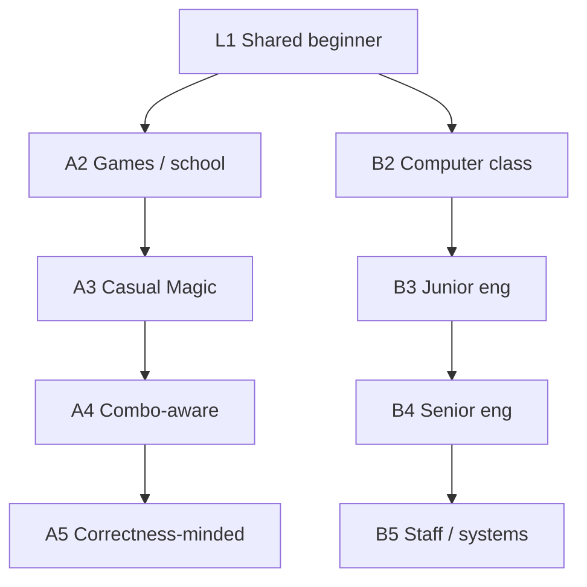

# How it works (progressive)

## Purpose

Onboard readers who do not yet share the project’s vocabulary. Two parallel ladders share a true beginner entry, then climb toward a correctness-minded Magic player or toward a systems-minded engineer. Each level only uses concepts prepared earlier (or defines them in one breath).

This doc is **pedagogical**, not normative. Product contracts live in [`PHILOSOPHY.md`](PHILOSOPHY.md), [`TERMINOLOGY.md`](TERMINOLOGY.md), [`ARCHITECTURE.md`](ARCHITECTURE.md), and ADRs under [`decisions/`](decisions/). Expect further refinement of the ladders.

## Context

**Branch A** grows game intuition into combo-claim discipline. **Branch B** grows the same beginner story into propose-vs-check and trust boundaries.

---

## Shared Level 1 — Five years old

Imagine two toys on the floor.

The **Stamp** toy has a button. When you push the button, it stamps **one sticker** onto a scrap of paper—then the button sticks down and will not push again until something wakes it up.

The **Waker** toy watches for new stickers. Whenever a sticker gets stamped, the Waker pops the Stamp’s button back up.

So the story goes: push → sticker → button pops up → push again. One full time around that circle is a **lap**. Each lap, you get another sticker. The stickers are the **prize**.

If someone says “these toys make stickers forever,” you do not just believe them. You try it yourself: push, get a sticker, see the button come back up, push again. Can you do another lap the same way? Only then do you trust the prize keeps coming.

---

## Branch A — Toward a cEDH player

### Level 2 — Middle / high school (games)

Those toys become game pieces with writing that says what each piece is allowed to do.

Often you must **spend** something—coins, points, energy—before a piece can act. After it acts, it may sit **used** until something makes it **ready** again.

When piece A’s move sets up piece B’s move, and B’s move sets A up again, they make a little closed circle—like the Stamp and the Waker. Each lap should give a clear prize you can name and count (another token, more points), not a vague “you win somehow.”

Now picture a third piece on the roster: the **Duck**. It has a button too, but nobody presses it during the lap. It only watches. A piece listed as part of the team that never takes a turn in the circle does not count.

### Level 3 — Casual Magic / EDH

In Magic, those printed rules are **abilities**. Many permanents **tap** to use an ability (they become “used”) and must **untap** before they can do it again. Some abilities make **tokens**—new creatures that enter the battlefield—and other abilities care about a creature entering.

A classic picture is **Midnight Guard** with **Presence of Gond** on it: you tap Guard to create a 1/1 Elf Warrior token; when that creature enters, Guard’s ability untaps Guard so it is ready to tap again. Lap after lap, both cards keep doing their job, and you keep gaining another token.

That is the Stamp and the Waker, told in Magic language: do the moves and see that both cards act each time.

### Level 4 — Tuned EDH / combo-aware

Serious players look past flavor story text and past the little italic reminders on keywords. They care about the **official rules wording** of the card—the rules text you check on Gatherer or Scryfall when a ruling matters—because that is what the game actually does. (Players and databases often call that line the card’s “Oracle” text; it is just the authoritative rules wording.)

A **strict two-card** combo means exactly those two cards are the essential engines of the loop. Extra generic “fodder” (tokens you make, a free host for an aura) can sit on the board without changing the claim. A real third functional piece—another card the loop needs to keep working—means it is no longer a strict two-card claim.

**Basalt Monolith** next to **Phyrexian Altar** is the bystander trap: the Monolith can untap itself for mana forever while the Altar never activates in the lap, so naming both as a pair is a false “two-card” story. The Altar is the Duck from Level 2.

A good check is a **recipe**: starting board, the sequence of activations and triggers for one lap, and what typed thing you gain each lap (mana, a token, and so on). Someone may **propose** a pair; someone else (or you) must **check** the recipe against the cards’ official wording and against the requirement that both essentials actually act.

### Level 5 — Correctness-minded

No automated checker knows all of Magic’s Comprehensive Rules at once. A careful system models a deliberate subset of how the game works and **fails closed**: if it does not understand something the check needs, the answer is a clear “no” (or “cannot prove”), not a soft maybe. Failures come with kinds you can sort—wrong participation, not enough resources, incomplete model—so you learn *why* a candidate failed.

Finding pairs without peeking at a public combo catalog means the search only uses what the cards’ official wording says they can do, and how those abilities fit together. That catalog is a **yardstick** for “have we seen this before?”: missing from the catalog means “not in this reference list,” not “brand-new to Magic.” Only humans may upgrade that absence into a novelty claim.

A machine saying “this recipe works under our model” is not the same as a human saying “this is a real, tournament-honest strict two-card combo.” The project prefers fewer trustworthy accepts over a bigger pile of hopeful ones—and a chatbot does not get to rubber-stamp “yes.”

---

## Branch B — Toward a software engineer

### Level 1

Identical to [Shared Level 1](#shared-level-1--five-years-old) above.

### Level 2 — Middle / high school (computer class)

Imagine a machine whose job is not to invent games, but to try short recipes and say yes or no.

A “card” here is just a labeled list of rules: what you may spend, what you may do, what happens next. The machine reads those lists. It looks for **pairs that seem to feed each other**—A’s result looks like what B is waiting for, and B’s result looks like what A is waiting for.

For a candidate pair, it builds a tiny pretend table and follows a short script. After one lap it asks: did both named helpers actually run? Did you get a prize? Can you run the same script again without the setup falling apart?

Sometimes a second list is named in the pair, but only the first list’s abilities fire. Call that unused list the **Duck**: one worker, one spectator. A real pair needs **both** named helpers to take part in the lap.

No trading-card game yet—only read lists, match them, try a lap, check the prize, reject spectators.

### Level 3 — Junior engineer

Now the rule-lists are **Magic: The Gathering cards**. The machine reads the **official rules wording** on each card—the text that says what the card actually does (not the story flavor text, not the italic keyword reminders). That is the same wording players check on Gatherer or Scryfall when rulings matter.

**Nouns in place.** A **permanent** is a card sitting on the battlefield. **Tap** means “use it; it becomes exhausted until something untaps it.” An **activated ability** is “pay a cost, get an effect” (often by tapping). A **trigger** is “when X happens, do Y.” A **token** is a temporary creature the rules create; it is not one of the two named combo cards. **Mana** is the resource abilities spend.

**What we mean by a loop.** A **strict two-card loop** is a short, repeatable sequence that uses exactly two **essential** cards as the functional engine. Generic **fodder**—any creature token, any extra mana source that is not a special third engine—may appear as fuel. If you need a **third specific functional piece**, that is a **different claim**.

**Good pair: Midnight Guard + Presence of Gond.** Gond lets the enchanted creature tap to create a 1/1 token. Guard says: whenever another creature enters, untap Guard. Lap: tap Guard → token enters → Guard’s trigger untaps Guard. Both cards’ text is doing work. After the lap, Guard is ready again; you keep gaining tokens.

**Bad shape: bystander.** **Basalt Monolith** can untap itself by spending mana it just made—so the loop lives in one card. Pairing it with **Phyrexian Altar**, which never activates for that same lap, looks like “two cards” on paper while the Altar never acts. That is the Duck. Reject it as a strict two-card claim even if a script somehow “succeeds” around Monolith alone.

**“Compile,” carefully.** In ordinary programming, compile means “turn source into a runnable program.” Here it means: turn official card wording into a structured model of costs, effects, and triggers the engine can run—without pretending it understands every line of Magic’s entire rules. Incomplete understanding must not silently become “yes.”

**Propose vs check.** One part of the system proposes candidate pairs and try-scripts. Another part checks a concrete try against the model. Proposing may be generous; checking is strict. The checker does not invent new pairs to make a hopeful proposal look better.

### Level 4 — Senior engineer

Think in **jobs**, not folder names.

Official wording becomes capabilities. Authority for “what the card does” is that wording (and rules or rulings when the model must resolve ambiguity)—not a fan combo list, not chat memory. Search then proposes candidate two-card interactions and short try-scripts. Over-proposing is fine **here**: false hopes are cheap if a later gate can kill them. Over-proposing is not a substitute for proof.

A **witness** is a concrete story: these two essentials, this starting board, this sequence of activations and triggers. A **proof** (for machine acceptance) is a successful run of that witness under the model such that the lap repeats and both essentials participate. A witness without a passing check is only a hypothesis.

The accepted claim is narrow: strict two-card; both essentials act; fodder allowed; a required third functional piece is a different claim. Guard+Gond fits. Monolith-plus-spectator does not.

Machine **accept** means the witness runs deterministically under the model, recurrence holds, and participation holds. Reject means a **typed** reason—not a vague “nope,” and not “keep searching inside the checker until something works.” Discovery may be noisy. **The checker decides.** Softening the checker to save a favorite pair would turn “accepted” into marketing. Trust lives in the gate, not in the suggestion list.

### Level 5 — Staff / systems engineer

Staff-level design is about **who is allowed to decide what**, and what must remain true as the system grows.

Agents and humans may **speculate** (“these two might loop”). Modeled physics from official sources **decide** whether a witness verifies. External combo encyclopedias may measure recovery (“did we find known pairs?”); they must not teach the search what to find. Candidates come from capabilities taken from card wording and how those capabilities join—not from looking up labeled pairs first.

If proof-relevant behavior is only partly modeled, the outcome is rejection (or “cannot prove”), never a quiet accept. Incomplete coverage is not soft evidence for yes. Accept and each class of reject are named statuses other processes can trust without reinterpreting prose logs.

Missing from a reference list is a fact about the yardstick, not a discovery of a new combo. **Humans own novelty** and other product-facing upgrades of machine results. Machine accept on the verified path does not depend on a language model’s judgment.

Machine accept is **necessary** for “the model says this witness repeats under our physics.” It is **not sufficient** for every human product claim—edge cases outside the model, bystander bugs, novelty, tournament honesty. Prefer fewer high-trust accepts and clear rejects over a larger pile of hopeful greens. The system’s reputation is the checker’s honesty under that discipline.

---

## How the ladders connect

Shared Level 1 carries lap / prize / try-and-check. Level 2 on each branch adds the Duck (listed but never acts). Branch A turns that into Magic, then into combo-claim discipline. Branch B turns the same story into propose-vs-check, then into trust boundaries.

For contracts and vocabulary after you have the intuition: [`PHILOSOPHY.md`](PHILOSOPHY.md), [`TERMINOLOGY.md`](TERMINOLOGY.md), [`ARCHITECTURE.md`](ARCHITECTURE.md).
