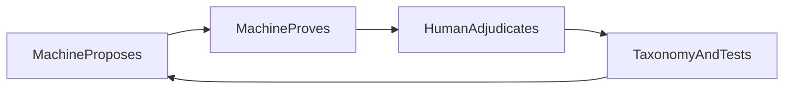

# Philosophy

## Purpose

State the product principles that shape MTG Loop Engine: what we optimize for, what claims require, and how humans and machines share the work.

## Context



## Discovery and proof over lookup

The engine **discovers** two-card interactions from Oracle text and **proves** proposed sequences under an explicit, fail-closed model. Spellbook and similar corpora are **reference material** for recovery metrics.

Absence from a reference corpus is labeled `ABSENT_FROM_REFERENCE`. Only human adjudication upgrades that label to `NOVEL`.

## Deterministic semantics

Oracle text becomes semantic IR through a **deterministic pattern library**. Coverage is explicit (`COMPLETE`, `PARTIAL_IRRELEVANT_TO_PROOF`, `PARTIAL_RELEVANT_TO_PROOF`). There is no LLM on the path to `VERIFIED`—not as a temporary shortcut, and not as a silent fallback when patterns miss.

## Conservative verification

Search may speculate. The verifier may not.

The verifier is witness-in / proof-out: it never searches, never invents missing abilities, and never emits `VERIFIED` when proof-relevant semantics are incomplete (`PARTIAL_RELEVANT_TO_PROOF`). Typed rejections (`RESOURCE_DEFICIT`, `STATE_NOT_RECURRENT`, `UNSUPPORTED_SEMANTICS`, …) are first-class outcomes.

When expanding modeled physics, treat agent memory as a hypothesis only: cite Oracle / Comprehensive Rules / rulings per [`RULES_EVIDENCE.md`](RULES_EVIDENCE.md). Spellbook does not authorize `VERIFIED`.

## Precision over false confidence

An honest `unsupported` or typed rejection is preferable to a wrong `VERIFIED`. Precision-first means missing eligible pairs while coverage is thin is better than teaching the corpus that spectator-card “loops” or unmodeled rules are proven.

## Human adjudication as a system component

Machine acceptance is necessary but not sufficient for product claims about valid strict two-card interactions. Humans classify candidates, catch systematic search bugs (for example, pairs where one “essential” card never acts), and decide when `ABSENT_FROM_REFERENCE` becomes `NOVEL`.

Adjudication is permanent instrumentation and governance. Vocabulary and workflow: [ADJUDICATION.md](ADJUDICATION.md).

## New-set rescanning payoff

Discovery is driven by compiled Oracle and capability joins. Better patterns and a growing supported card set unlock **newly eligible** pairs when sets (and snapshots) change. Incremental rescans (M6) are the long-term payoff of conservative coverage: each fragment the compiler learns can unlock recoveries while the verifier stays fail-closed.

## Positive feedback cycle

```text
machine proposes → proves → human adjudicates → taxonomy / tests improve → proposals improve
```

Gold fixtures, hard negatives, adjudication classes, and regression tests turn human judgment into machine constraint. Clearer labels and better patterns raise precision and, eventually, eligible recall.

**Knowledge lifecycle:** Machines may generate more hypotheses than the repository preserves. Human-reviewed promotion turns useful discoveries into durable cases, tests, measurements, and decisions under `eval/`, `tests/`, and `docs/`. Ordinary LAR execution stays gitignored under `data/eval/lar/runs/`.

## AI–human flourishing

Automation expands what humans can *reliably* know—auditable witnesses, typed failures, frozen baselines. Humans supply judgment the model must not fake: rules edge cases, novelty claims, and whether a proof is about a real two-piece interaction. Each cycle should leave the machine more precise and the human better equipped.
