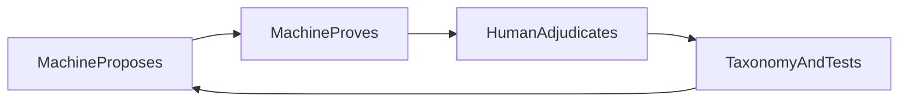

# Philosophy

## Purpose

State the product principles that shape MTG Loop Engine: what we optimize for, what we refuse to claim, and how humans and machines share the work.

## Context



## Not a combo database

Spellbook and similar corpora are **reference material**. Looking up a known pair is useful for recovery metrics; it is not the north star. The engine exists to **discover** two-card interactions from Oracle text and to **prove** proposed sequences under an explicit, fail-closed model.

Absence from a reference corpus is labeled `ABSENT_FROM_REFERENCE`. It is not automatically a false positive, and it is never silently upgraded to `NOVEL` without human adjudication.

## Deterministic semantics

Oracle text becomes semantic IR only through a **deterministic pattern library**. Coverage is explicit (`COMPLETE`, `PARTIAL_IRRELEVANT_TO_PROOF`, `PARTIAL_RELEVANT_TO_PROOF`). There is no LLM on the path to `VERIFIED`—not as a temporary shortcut, and not as a silent fallback when patterns miss.

## Conservative verification

Search may speculate. The verifier may not.

The verifier is witness-in / proof-out: it never searches, never invents missing abilities, and never emits `VERIFIED` when proof-relevant semantics are incomplete (`PARTIAL_RELEVANT_TO_PROOF`). Typed rejections (`RESOURCE_DEFICIT`, `STATE_NOT_RECURRENT`, `UNSUPPORTED_SEMANTICS`, …) are first-class outcomes.

## False confidence is worse than unsupported

An honest `unsupported` or typed rejection is preferable to a polished wrong `VERIFIED`. Precision-first means we would rather miss eligible pairs (especially while compiler coverage is thin) than teach the corpus that spectator-card “loops” or unmodeled rules are proven.

## Human adjudication as a system component

Machine acceptance is necessary but not sufficient for product claims about valid strict two-card interactions. Humans classify candidates, catch systematic search bugs (for example, pairs where one “essential” card never acts), and decide when `ABSENT_FROM_REFERENCE` becomes `NOVEL`.

Adjudication is instrumentation and governance—not a temporary QA patch. Vocabulary and workflow details live in [ADJUDICATION.md](ADJUDICATION.md).

## New-set rescanning payoff

Because discovery is driven by compiled Oracle and capability joins, better patterns and a growing supported card set unlock **newly eligible** pairs when sets (and snapshots) change. Incremental rescans (M6) are the long-term payoff of conservative coverage: each fragment the compiler learns can unlock recoveries without relaxing the verifier.

## Positive feedback cycle

```text
machine proposes → proves → human adjudicates → taxonomy / tests improve → proposals improve
```

Gold fixtures, hard negatives, adjudication classes, and regression tests are how human judgment becomes machine constraint. The loop is meant to compound: clearer labels and better patterns raise both precision and (eventually) eligible recall.

**Knowledge lifecycle corollary:** Machines may generate far more hypotheses and review material than the repository preserves. Human-reviewed promotion turns useful discoveries into durable cases, tests, measurements, and decisions under `eval/`, `tests/`, and `docs/` — while ordinary LAR execution stays gitignored under `data/eval/lar/runs/`.

## AI–human flourishing

Flourishing here means complementarity, not replacement. Automation should expand what humans can *reliably* know—auditable witnesses, typed failures, frozen baselines—while humans supply judgment the model must not fake: rules edge cases, novelty claims, and whether a proof is about a real two-piece interaction. The system succeeds when each cycle leaves the machine more precise and the human better equipped, with neither asked to do the other’s job.
