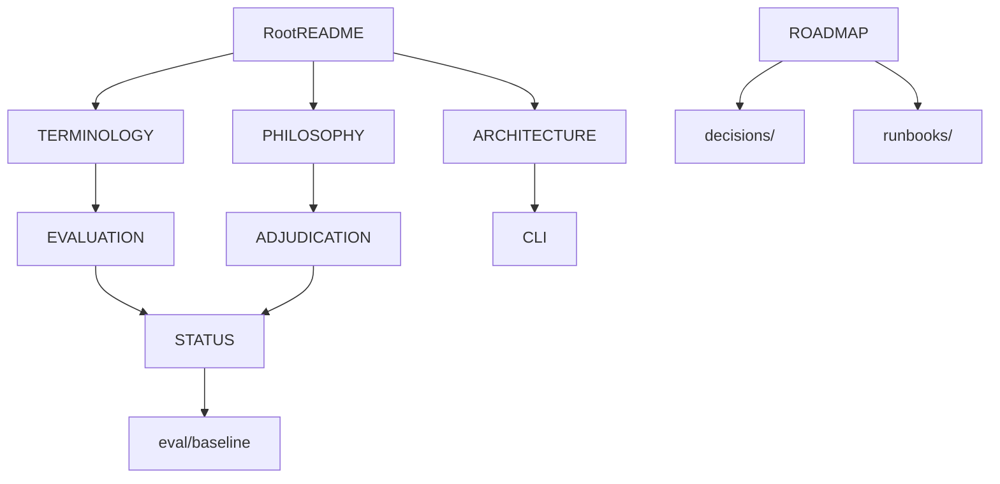

# docs

## Purpose

Cross-cutting project documentation for newcomers and contributors: product stance, shared vocabulary, architecture overview, evaluation and adjudication contracts, CLI, status snapshots, runbooks, and decision records.

Package-local operating contracts live next to code under `src/mtg_loop_engine/*/README.md`. Milestone gates and frozen product decisions live in [`../ROADMAP.md`](../ROADMAP.md).

## Context

## Navigation

### Orientation (start here)

| Doc | What it answers |
| --- | --------------- |
| [`../README.md`](../README.md) | Product pitch, maturity, quick start, source hierarchy |
| [`PHILOSOPHY.md`](PHILOSOPHY.md) | Why precision-first discovery + proof; AI–human flourishing |
| [`TERMINOLOGY.md`](TERMINOLOGY.md) | Shared vocabulary (loop, witness, coverage, precision, …) |
| [`ARCHITECTURE.md`](ARCHITECTURE.md) | Package boundaries and data flow |

### Evaluation and review

| Doc | What it answers |
| --- | --------------- |
| [`EVALUATION.md`](EVALUATION.md) | Denominators (no aggregate “accuracy”); recovery vs precision |
| [`ADJUDICATION.md`](ADJUDICATION.md) | Human label guide for accepted discoveries |
| [`STATUS.md`](STATUS.md) | Quantitative snapshot from frozen baselines |

### Operators and decisions

| Doc | What it answers |
| --- | --------------- |
| [`CLI.md`](CLI.md) | CLI commands by milestone; framework / upgrade / scripts-promotion guidance |
| [`runbooks/`](runbooks/) | Ordered engineering follow-through (e.g. M4) |
| [`decisions/`](decisions/) | Lightweight ADRs (why constraints exist) |

### Contributor contracts (repo root)

| Doc | What it answers |
| --- | --------------- |
| [`../CONTRIBUTING.md`](../CONTRIBUTING.md) | How to contribute |
| [`../AGENTS.md`](../AGENTS.md) | Agent / human operating rules |
| [`../ROADMAP.md`](../ROADMAP.md) | Active milestone, deferred scope, frozen decisions |

## What belongs here

- Durable explanations that span packages
- Generated/validated status summaries linked from `ROADMAP.md`
- Runbooks and ADRs that outlive any one chat or plan file

## Boundaries

| Concern | Owner |
| --- | --- |
| Engine implementation | `src/` |
| Volatile metrics | `STATUS.md` / `eval/baseline/` |
| Package-local contracts | package `README.md` files |
