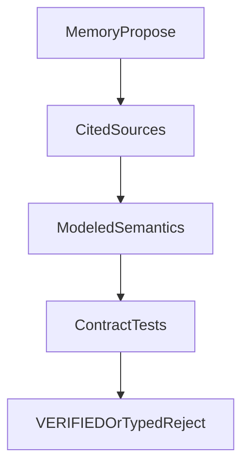

# Rules evidence

## Purpose

Authority roles and investigation discipline when changing **modeled Magic rules**
(compiler patterns, executor physics, verifier gates, or tests that encode those
claims). Memory may hypothesize; cited sources decide.

This is not a Comprehensive Rules corpus and not an M5 exit gate. It is the
cheap epistemic adapter named in [`ROADMAP.md`](../ROADMAP.md) before Wave 3–style
executor primitives.

## Authority roles

| Source | Role in this project | May justify |
| --- | --- | --- |
| **Oracle text** (Scryfall / Gatherer; audited records under `semantics/audited/`) | Card-facing rules text we compile | Pattern matches, `ORACLE_EXACT` fixtures, compile→verify seams |
| **Comprehensive Rules (CR)** | Timing, zones, state-based actions, replacement/prevention layers | Executor / verifier physics; typed rejection when the model is incomplete |
| **Official rulings** (Gatherer / Wizards FAQ style) | Narrow clarifications of Oracle/CR interaction | Edge-case modeling when Oracle alone is ambiguous |
| **Spellbook / other combo databases** | Discovery and **recovery** reference only (ADR 0001 / 0004) | Eval labels (`IN_REFERENCE` / `ABSENT_FROM_REFERENCE`); **never** `VERIFIED` semantics |
| **Agent / human memory** | Hypothesis generator | Test ideas, candidate rules — **not** acceptance of `VERIFIED` |

Spellbook absence is a **label**, not a rules proof. Novelty is human-owned
([`ADJUDICATION.md`](ADJUDICATION.md), ADR 0005).

## Epistemic loop (same shape as search / verify)



1. **Propose** — name the rules question and the intended product claim.
2. **Cite** — Oracle text and/or CR section (and ruling if needed). Prefer committed
   audited records when claiming `ORACLE_EXACT`.
3. **Model deliberately** — expand patterns or executor with tests and package README
   updates in the **same** change (ADR 0003). Do not quiet-patch to green a case.
4. **Fail closed** — if proof-relevant coverage is incomplete, emit a typed rejection
   (`UNSUPPORTED_SEMANTICS`, `UNSUPPORTED_RULE`, …), not `VERIFIED`.

## Citation format (for PRs, ADRs, and adjudication notes)

Use a short block so a later reader can re-check:

```text
Claim: <one sentence product claim>
Oracle: <card name — quoted clause or audited record path>
CR: <e.g. 704.5f — paraphrase + why it matters>   # omit if Oracle-only
Ruling: <optional>
Engine: <pattern / executor / verifier touch + test path>
```

Example:

```text
Claim: Sacrificing a noncreature does not increment DEATH event counters.
Oracle: (N/A — counter semantics are CR/event modeling)
CR: 700.4 — a permanent dies if moved from battlefield to graveyard and it is a creature
Engine: rules/executor.py die(); tests/unit/test_executor_soundness.py
```

## When to load the skill

Use the `rules-evidence` agent skill when:

- adding executor primitives (delayed triggers, undying, SBAs, …)
- changing what `VERIFIED` requires
- adjudicating `NEEDS_RULES_RESEARCH` / `RULES_OR_SEMANTICS_FALSE_POSITIVE`
- promoting Wave 3 `oracle_gaps` into `gold_core`

Pattern-only curriculum that matches existing audited Oracle (no new physics)
does not require a full CR dive — still cite Oracle for new `ORACLE_EXACT` cards.

## Related

- Product stance: [`PHILOSOPHY.md`](PHILOSOPHY.md)
- Human labels: [`ADJUDICATION.md`](ADJUDICATION.md)
- Determinism / fail-closed: [`decisions/0003-deterministic-semantics-and-fail-closed.md`](decisions/0003-deterministic-semantics-and-fail-closed.md)
- Provenance: [`decisions/0007-corpus-provenance-physics-vs-oracle.md`](decisions/0007-corpus-provenance-physics-vs-oracle.md)
- Agent contract: [`../AGENTS.md`](../AGENTS.md)
- Skill wrapper: [`.agents/skills/rules-evidence/`](../.agents/skills/rules-evidence/)
