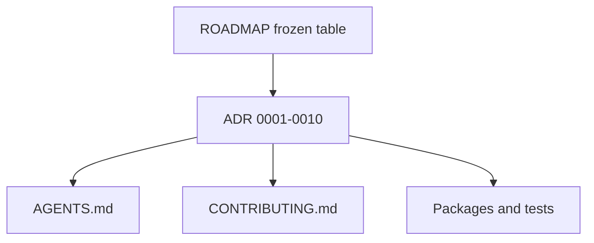

# Architecture decision records

## Purpose

Durable, in-repo record of frozen product and architecture decisions for the MTG loop engine. ADRs are canonical; session notes outside the repository are not.

## Context

## What belongs here

- Numbered ADRs (`NNNN-title.md`) with Context, Decision, Consequences, and Status
- Pre-ADR review matrices under [`reviews/`](reviews/) (process: [`reviews/PROCESS.md`](reviews/PROCESS.md))
- This index README

## What does not belong here

- Milestone narrative (see root `ROADMAP.md`)
- Package-local how-to (see package `README.md`)
- Metric snapshots (see `eval/baseline/`)

## Index

| ADR | Title | Status |
|-----|-------|--------|
| [0001](0001-discovery-verification-boundary.md) | Discovery / verification boundary | Accepted |
| [0002](0002-two-card-essential-piece-definition.md) | Two-card essential-piece definition | Accepted |
| [0003](0003-deterministic-semantics-and-fail-closed.md) | Deterministic semantics and fail-closed | Accepted |
| [0004](0004-reference-recovery-vs-adjudicated-precision.md) | Reference recovery vs adjudicated precision | Accepted |
| [0005](0005-human-adjudication-and-novel-labeling.md) | Human adjudication and `NOVEL` labeling | Accepted |
| [0006](0006-milestone-and-deferred-scope-policy.md) | Milestone and deferred-scope policy | Accepted |
| [0007](0007-corpus-provenance-physics-vs-oracle.md) | Corpus provenance: physics fixtures vs Oracle truth | Accepted |
| [0008](0008-verifier-owned-mandatory-recurrence.md) | Verifier-owned mandatory recurrence dimensions | Accepted |
| [0009](0009-claim-bound-proof-hash.md) | Claim-bound proof_hash | Accepted |
| [0010](0010-oracle-identity-vs-state-construction.md) | Oracle identity exactness vs state-construction completeness | Accepted |

## Notes

When changing an Accepted decision, prefer a new ADR that supersedes the old one (or an explicit Status change with rationale) rather than silently editing history. Update `ROADMAP.md` frozen table in the same change when product language shifts.
