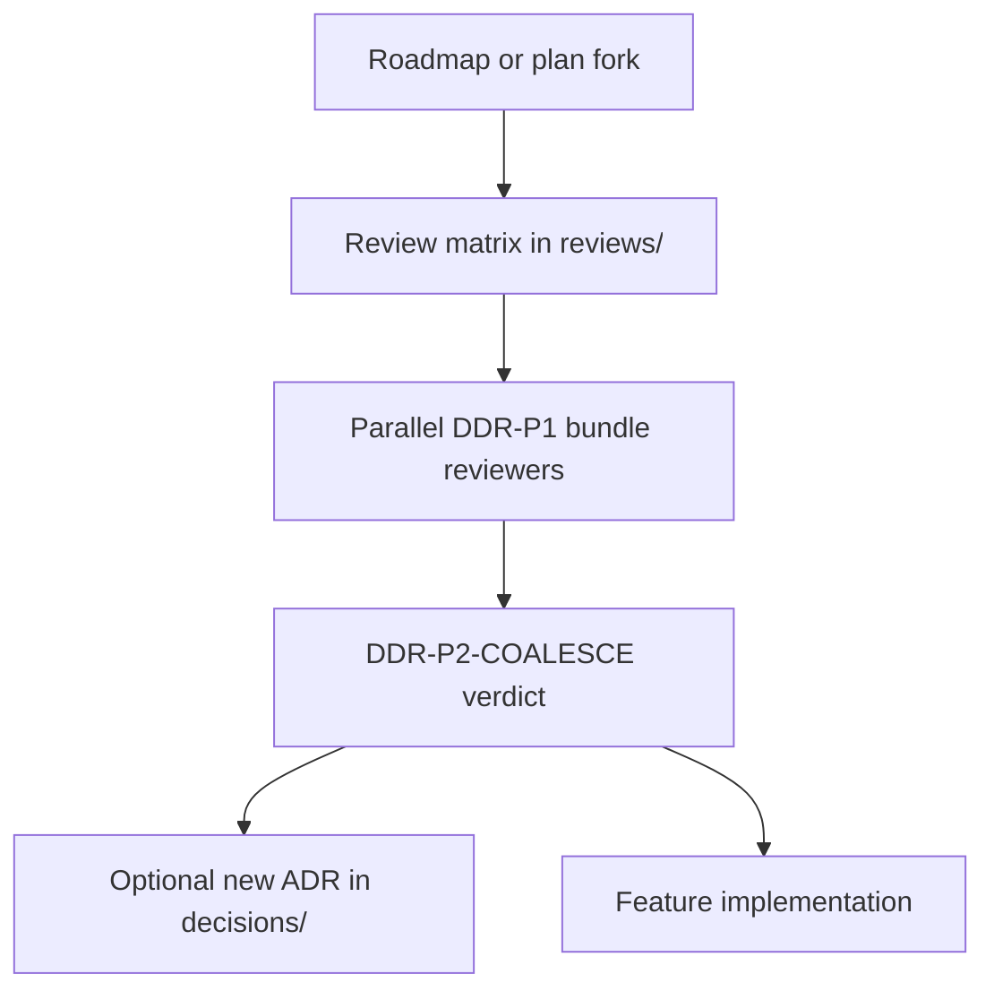

# Design decision reviews

## Purpose

Working records for **multi-option design decisions** before implementation. Reviews capture parallel bundle evaluation, scores, and the coalesced verdict. Accepted outcomes may become numbered ADRs in the parent folder.

## Context

## What belongs here

- `*-review.md` matrices with dimensions, bundles, per-bundle findings, and final verdict
- Campaign inventories that feed Proposed ADRs (e.g. [`corpus-provenance-inventory.md`](corpus-provenance-inventory.md))
- [`PROCESS.md`](PROCESS.md) — sole process home (workflow + agent task stubs)
- This index README

## What does not belong here

- Accepted ADRs (promote to `../NNNN-*.md` when frozen)
- Milestone narrative (`ROADMAP.md`)
- Session-only notes outside the repository

## Process

See [`PROCESS.md`](PROCESS.md).
