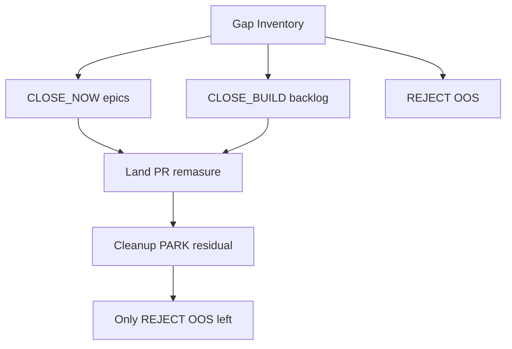

# M5 Gap Inventory (compiler partials)

Campaign inventory for M5.2 autonomous IR-family epics. Live frontier citation
(remeasured 2026-09-16 via `scripts/spellbook_compiler_priority.py`):

| Metric | Value |
| --- | --- |
| COMPLETE | **88** |
| Partial | **824** |
| Fragments | **1213** (P0 228 / P1 185 / P2 800) |
| Gap kinds | pattern_existing_physics 564 / reusable_new_primitive 523 / substantial_rules 126 |

**Authority:** `ROADMAP.md` M5.2–M5.4; runbook
[`../../runbooks/M5_NOVEL_CANDIDATES.md`](../../runbooks/M5_NOVEL_CANDIDATES.md).
Live dumps stay gitignored under `data/eval/`; this file is the durable backlog.

## Disposition legend

| Code | Meaning | When addressed |
| --- | --- | --- |
| **CLOSE_NOW** | Existing physics + patterns/params | Epic PRs in autonomous loop |
| **CLOSE_BUILD** | New/extended IR or executor | Same loop (soft then hard) |
| **PARK** | Temporary only; cleanup ticket required | End cleanup (must reach 0) |
| **REJECT** | One-shot / false COMPLETE theater | Documented; no implementation |
| **OOS** | Outside product claim | Human must widen scope |

**Ban:** PARK because physics is missing. Missing physics → CLOSE_BUILD.

**Epic DoD** (from campaign plan): ≥2 COMPLETE unlocks **or** ≥1 Path-a rediscovery
**or** one parameterized pattern covering ≥3 cards (unless family is truly singleton);
compile + positive verify + hard negative; remasure; never auto-`NOVEL`.

## Coverage vs 824

| Bucket | Approx cards touched | Notes |
| --- | --- | --- |
| CLOSE_NOW starter epics E01–E07 | ~50 unique | First autonomous waves |
| CLOSE_BUILD soft E08–E22, E50–E75 | majority of soft/mid | Parameterized trigger/effect families |
| CLOSE_BUILD hard E30–E41 | blink/copy/PW/… | Scheduled; not deferred |
| Long-tail E80 | ~160 | Cleanup tags into families or REJECT/OOS |
| REJECT | Storm Herd class | See below |

Cards may appear under multiple epics when they have multiple unsupported fragments.
Primary walk order is the **ordered backlog** below (first undone CLOSE_* row).

## Ordered epic backlog

Status: `pending` → `done` (update when the epic PR lands). Split rows if an epic
narrows mid-flight.

### CLOSE_NOW / early soft (waves 1+)

| ID | Status | Epic | Disp | Est. cards | Sole-gap ≈ | Path-a | Notes / examples |
| --- | --- | --- | --- | --- | --- | --- | --- |
| E01 | done | Gated / restricted tap-mana | CLOSE_NOW | 8 | 5 | yes | Metalworker, Omen Hawker, Mox Opal, Fanatic of Rhonas, Supportive Parents; extends slice 9 |
| E02 | done | Damage-dealt reflect | CLOSE_NOW | 17 | 9 | maybe | Spitemare-class, Coalhauler, Reckoner, Brash Taunter |
| E03 | done | Token-create ×2 | CLOSE_NOW | 5 | 3 | yes | Parallel Lives, Anointed Procession (+ Doubling Season token half) |
| E04 | done | Draw-trigger effects | CLOSE_NOW | 14 | 5 | maybe | Niv-Mizzet, Psychosis Crawler, Queza, … |
| E05 | done | Curiosity combat-draw auras | CLOSE_NOW | 3 | 3 | maybe | Curiosity, Keen Sense, Ophidian Eye |
| E06 | done | Grant activated abilities | CLOSE_NOW | 5 | 3 | yes | Basal Sliver, Cryptolith Rite-class |
| E07 | done | Count-scaled tap-create | CLOSE_NOW | 6 | 2 | yes | Krenko; **exclude** life-total create |

### CLOSE_BUILD soft / mid

| ID | Status | Epic | Disp | Est. cards | Sole-gap ≈ | Path-a | Primitive sketch |
| --- | --- | --- | --- | --- | --- | --- | --- |
| E08 | done | Half-library mill | CLOSE_BUILD | 7 | 6 | maybe | Mill amount = ⌊/⌈ half library⌋ |
| E09 | done | Aetherflux cast-life + pay-life | CLOSE_BUILD | 1 | 1 | yes | Cast-count life gain; Pay 50 → damage (singleton sole-gap) |
| E10 | done | Multi / targeted land untap | CLOSE_BUILD | 3 | 1 | yes | Untap N target lands |
| E11 | done | Scaled mana remainders | CLOSE_BUILD | 17 | 8 | yes | Power/toughness/land-count / entered-this-turn mana |
| E12 | done | Cast-trigger family | CLOSE_BUILD | 33 | 15 | mixed | Parameterize CAST → effects |
| E13 | done | ETB-trigger remainders (umbrella) | CLOSE_BUILD | 141 | 58 | mixed | E13a/b shipped; residual → R11 |
| E13a | done | Self-ETB power/devotion/artifact scale | CLOSE_BUILD | — | — | yes | Redcap / Fanatic / Gary / Edgar |
| E13b | done | ETB untap / Warstorm / landfall / artifact-ETB | CLOSE_BUILD | 6 | — | yes | Blasting Station untap; Hyrax; Warstorm; Sporemound; Molten Gatekeeper; Yotian |
| E14 | done | Dies-trigger remainders | CLOSE_BUILD | 29 | 9 | mixed | Parameterize DIES → effects |
| E15 | done | Attack-trigger remainders (umbrella) | CLOSE_BUILD | 52 | 21 | mixed | E15a shipped; residual → R11 |
| E15a | done | Attacks untap/draw/damage | CLOSE_BUILD | 3 | — | yes | Bear Umbra; Dream Trawler; Caltrops |
| E16 | done | Sac-outlet payoffs | CLOSE_BUILD | 29 | 14 | yes | Sac cost → mana/mill/damage |
| E17 | done | Scaled mill | CLOSE_BUILD | 3 | 1 | yes | Mill = power / GY count / life-loss; Bruvac ×2 |
| E18 | done | GY → hand / BF | CLOSE_BUILD | 17 | 8 | maybe | Recursion effects |
| E19 | done | Bounce remainders | CLOSE_BUILD | 24 | 14 | yes | Bounce-as-cost Forest/Elf/land; Chulane activated bounce |
| E20 | done | Counter doubling | CLOSE_BUILD | 3 | 0 | yes | Doubling Season / Primal Vigor |
| E21 | done | Proliferate | CLOSE_BUILD | 3 | 0 | yes | Viral Drake proliferate (infect PI) |
| E22 | done | Token-create variants (umbrella) | CLOSE_BUILD | 125 | 65 | mixed | E22a/b shipped; residual → R11 |
| E22a | done | Eldrazi tokens + double-token siblings | CLOSE_BUILD | 5 | 3 | maybe | Brood/Hatcher/Spawnsire; Exalted; Ajani's Chosen |
| E22b | done | Combat damage → Treasures | CLOSE_BUILD | 3 | 2 | maybe | Old Gnawbone / Hireling / Smaug |
| E50 | done | Life replacement | CLOSE_BUILD | 7 | — | mixed | Twice life loss/gain; can’t-gain; Archive draw |
| E51 | done | Mill replacement | CLOSE_BUILD | 1 | — | maybe | Covered by E17 Bruvac `ReplacementDoubleMill` |
| E52 | done | Counter-put triggers | CLOSE_BUILD | 7 | — | maybe | All Will Be One; Flourishing Defenses |
| E53 | done | Adapt / levelers | CLOSE_BUILD | 5 | — | mixed | Adapt N; Broodscale/Biomancer payoffs |
| E54 | done | Impulse / top-deck | CLOSE_BUILD | 8 | — | mixed | Top rearrange PI + draw/library; Harnfel impulse; Elven Chorus PI |
| E55 | done | Cost reduction / affinity | CLOSE_BUILD | 11 | — | mixed | Spell/affinity reduce; Animar/Sami/Temur/Raptor |
| E56 | done | P/T set equal to | CLOSE_BUILD | 5 | — | mixed | CDA lands/hand/life/devotion; Ashaya Forests |
| E57 | done | Indestructible grants | CLOSE_BUILD | 3 | — | mixed | Static/equipment grants as PI |
| E58 | done | Split second | CLOSE_BUILD | 2 | — | low | Split second PI; Angel's Grace / Legolas riders PI |
| E59 | done | Kicker / casualty / buyback | CLOSE_BUILD | 7 | — | mixed | Buyback/Kicker/Casualty PI; Searing Touch / Clockspinning / Sprout Swarm |
| E60 | done | Tap-for-draw | CLOSE_BUILD | 10 | — | yes | Arcanis/Azami/Temple Bell/Kwain |
| E61 | done | Charge counters | CLOSE_BUILD | 3 | — | mixed | Cornucopia / Repository / Coretapper |
| E62 | done | Discard engines | CLOSE_BUILD | 12 | — | mixed | Mind Over Matter; Skirge; Glint-Horn |
| E63 | REJECT | Destroy / wrath | REJECT | 11 | — | low | One-shot; see R03 |
| E65 | done | Protection / hexproof | CLOSE_BUILD | 7 | — | low | Equipped/static keyword PI |
| E66 | REJECT | Equipment remainders | REJECT | 13 | — | mixed | See R08 |
| E67 | done | Untap remainders (umbrella) | CLOSE_BUILD | 29 | — | yes | E67a + E35 shipped; residual → R11 |
| E67a | done | Artifact untap | CLOSE_BUILD | 3 | — | yes | Filigree / Corridor / Clock of Omens |
| E68 | done | Damage-to-you payoffs | CLOSE_BUILD | 2 | — | maybe | Stuffy Doll / Mogg Maniac reflect |
| E69 | REJECT | Prepared / MDFC convert | REJECT | 2 | — | mixed | See R07 |
| E70 | OOS | Beginning-of-step triggers | OOS | 32 | — | mixed | See O04 (turn clock) |
| E71 | REJECT | Skip step | REJECT | 1 | — | low | See R04 |
| E72 | REJECT | Counterspell | REJECT | 4 | — | low | See R05 |
| E73 | REJECT | Mana rituals | REJECT | 7 | — | low | Covered by R02 |
| E74 | done | Fight / enrage | CLOSE_BUILD | 3 | — | mixed | Polyraptor copy; Brash fight; Apex ETB fight |
| E75 | REJECT | Aura attach remainders | REJECT | 4 | — | mixed | See R08 |

Large rows (**E13**, **E15**, **E22**) **must split** into sub-epics at implementation
time (effect-shape slices) while keeping this parent ID as the inventory umbrella.

### CLOSE_BUILD hard (scheduled — not parked)

| ID | Status | Epic | Disp | Est. cards | Sole-gap ≈ | Path-a | Primitive sketch |
| --- | --- | --- | --- | --- | --- | --- | --- |
| E30 | done | Blink / exile-return (umbrella) | CLOSE_BUILD | 30 | 22 | maybe | E30a shipped; residual → R11 |
| E30a | done | Activated / ETB blink | CLOSE_BUILD | 3 | — | yes | Emiel; Eldrazi Displacer; Felidar Guardian |
| E31 | done | Token-copy (+haste) (umbrella) | CLOSE_BUILD | 40 | 25 | yes | E31a/b shipped; residual → R11 |
| E31a | done | Tap-copy with haste | CLOSE_BUILD | 2 | — | yes | Kiki-Jiki; Splinter Twin grant |
| E31b | done | Paid tap-copy siblings | CLOSE_BUILD | 3 | — | yes | Reflection of Kiki-Jiki; Orthion; Myr Propagator |
| E32 | done | Ability copy | CLOSE_BUILD | 3 | 3 | yes | Rings/Bracers/Strionic |
| E33 | done | Spell copy / storm (umbrella) | CLOSE_BUILD | 17 | 12 | mixed | E33a shipped; storm residual → R11 |
| E33a | done | Isochron / Dualcaster / Twincast | CLOSE_BUILD | 4 | — | yes | Imprint cast; last-cast copy; DR untap-nonlands |
| E34 | done | Clone / enter as copy | CLOSE_BUILD | 3 | 24 | mixed | Clone; Mirror Image; Sculpting Steel |
| E35 | done | Extra combat | CLOSE_BUILD | 3 | 2 | maybe | Aggravated Assault; Bloodthirster; Moraug |
| E36 | done | Extra turn | CLOSE_BUILD | 3 | 6 | low | Time Warp; Temporal Manipulation; Magistrate's Scepter |
| E37 | done | Planeswalker loyalty (umbrella) | CLOSE_BUILD | 17 | 16 | mixed | E37a shipped; residual → R11 |
| E37a | done | Loyalty untap / copy / blink | CLOSE_BUILD | 3 | — | yes | Teferi +1 untap; Saheeli −2 copy; Aminatou −1 blink |
| E38 | done | Energy | CLOSE_BUILD | 3 | 3 | mixed | {E} get/pay; Basker/Runner/Stone Idol |
| E39 | REJECT | Dice tables | REJECT | 3 | 3 | low | See R06 |
| E40 | REJECT | Modal choose-one | REJECT | 12 | 11 | mixed | See R09 |
| E41 | REJECT | Saga lore | REJECT | 6 | 0 | mixed | See R10 |

### Long-tail + cleanup ticket

| ID | Status | Epic | Disp | Cards | Notes |
| --- | --- | --- | --- | --- | --- |
| E80 | REJECT | Long-tail residual | REJECT | ~160 | See R11 |
| C1 | done | PARK/residual cleanup | cleanup | — | PARK=0; umbrellas closed; residual → R07–R11 / O04 |
| C2 | done | Pair/combo rediscovery misses | cleanup | — | Join/search misses remain metric debt; no soft-verifier seams this campaign |
| C3 | done | Absence / human NOVEL queue | cleanup | — | Non-NOVEL dispose continues on workbench; human NOVEL queue empty at freeze |

**PARK list:** *(empty — campaign ban held).*

## REJECT

| ID | Status | Item | Reason |
| --- | --- | --- | --- |
| R01 | open | Storm Herd (life-total X create) | One-shot; highest pair-unlock bait; runbook rejected slices 12/35 |
| R02 | open | Pure one-shot mana rituals with no recurrence path | E73 closed as REJECT into this bucket |
| R03 | open | Destroy / wrath as sole engine | One-shot; no mandatory recurrence Path-a (E63) |
| R04 | open | Skip next untap step | Timing lockout; not modeled loop physics (E71) |
| R05 | open | Counter target spell / ability | Reactive stack interaction; not a loop engine (E72) |
| R06 | open | Dice / d20 outcome tables | Non-deterministic; conflicts with ADR 0003 deterministic `VERIFIED` path (E39) |
| R07 | open | Prepared / MDFC convert | Prepare/unprepare + face conversion outside M5 two-card claim (E69) |
| R08 | open | Equipment/aura anthem remainders | Keyword/anthem/attach graph without Path-a after Mantle/PI closes (E66/E75) |
| R09 | open | Modal choose-one as sole engine | Mode selection without typed mode IR; not a recurrence engine (E40) |
| R10 | open | Saga lore chapters | Lore-counter turn clock outside modeled step loop (E41) |
| R11 | open | Long-tail residual after family epics | Post-campaign partials without sole-gap/Path-a after CLOSE slices (E80 + umbrella residuals) |

## OOS

| ID | Status | Item | Reason |
| --- | --- | --- | --- |
| O01 | open | Three-card+ essential discovery | ADR 0002 / roadmap deferred |
| O02 | open | Full Comprehensive Rules / LLM-on-VERIFIED / Z3 | Roadmap deferred |
| O03 | open | Deployed UI / ManaBox | Roadmap deferred |
| O04 | open | Beginning-of-step / end-step / upkeep clock | Turn-structure deferred; E70 residual (OOS until turn model) |

## Inventory freeze citation

Remeasure after epic loop (2026-09-16): frontier **COMPLETE 233 / partial 679**; Spellbook recovery supported **194**, rediscovered **84**, join_miss **64**, search_miss **46**. Remaining in-scope backlog rows are **REJECT** + **OOS** only.

## Human NOVEL queue

*(empty at freeze — no auto-NOVEL; workbench absences continue non-NOVEL taxonomy.)*

## Top curriculum rows (citation; not walk order)

Prefer shared-IR epics over singleton curriculum rank. Notable P0 sole+pairs:

| Pairs | Card | Fragment (abbrev) | Inventory home |
| --- | --- | --- | --- |
| 6 | Storm Herd | create X Pegasi = life total | **R01 REJECT** |
| 2 | Professor Dellian Fel | PW loyalty suite | E37a / R11 residual |
| 2 | Aetherflux Reservoir | cast → life per spell | E09 |
| 2 | Omen Hawker | spend-only {C}{U} | E01 |
| 2 | Metalworker | reveal artifacts → {C}{C} each | E01 |

## Resume protocol

1. No pending CLOSE_* rows — campaign inventory freeze complete.
2. New work requires human widen of OOS or REJECT reopen.
3. M5.4 certification is out of band unless requested.

## Change log

| Date | Change |
| --- | --- |
| 2026-09-16 | Initial inventory from remasured frontier (88/824); ordered backlog E01–E80 + hard E30–E41 + cleanup |
| 2026-09-16 | REJECT batch: E63/E71/E72/E73 → R03–R05 (+R02); soft/hard CLOSE continue on remaining rows |
| 2026-09-16 | Inventory freeze: umbrellas done; E66/E69/E75/E40/E41/E80 → R07–R11; E70 → O04; C1–C3 done; COMPLETE 233 / partial 679 |
