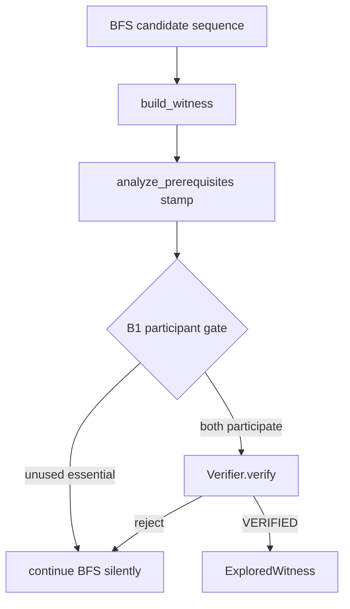

# Bundle B1 review — M4 participant enforcement gate

**Reviewer role:** Honest advocate for bundle B1  
**Matrix:** [`participant-enforcement-gate-review.md`](participant-enforcement-gate-review.md)  
**Bundle:** Q1=A · Q2=bundle · Q3=silent · Q4=none · Q5=single  
**Status:** Independent P1 review (no implementation)

---

## 1. Bundle summary

Bundle **B1** implements the M4 participant gate as a **search-only acceptance filter** in `explore_pair`, **bundles** the five real-card Basalt duplicate regressions in the **same PR**, **silently continues BFS** when a witness fails participation (no new typed verifier rejection), **defers baseline re-freeze** to the later runbook step (after eligibility), and lands as a **single PR** (code + tests + package README contract updates).

This matches the review matrix “recommended default” hypothesis: smallest architectural move that closes runbook items 1 and 2 without touching verifier boundaries or prematurely refreshing `eval/baseline/`.

---

## 2. Pros / cons (evidence-cited)

### Pros

| Point | Evidence |
|-------|----------|
| **Detection already exists; enforcement is the only gap** | `analyze_prerequisites` in `eval/classify.py` computes `used_oracle_ids`, `unused_oracle_ids`, and `strict_two_card` from loop-step actors (L81–84) plus continuous cost-reduction participation (L86–92). `build_witness` stamps `Classification.strict_two_card` onto the witness (L294–308 in `explorer.py`). |
| **Runbook explicitly scopes work to the search path** | `docs/runbooks/M4_FOLLOW_THROUGH.md` §1: “after a witness is built, require every essential oracle ID to appear as an actor in at least one loop step; reject otherwise.” It does not instruct verifier changes. |
| **Search README already documents the intended fix location** | `src/mtg_loop_engine/search/README.md` “Participant requirements — detection vs enforcement (open defect)”: enforcement “Not implemented”; product fix = reject witnesses where an essential oracle ID never acts; cites `test_basalt_altar_is_not_strict_two_card` as living defect evidence. |
| **Silent continue matches existing BFS semantics** | Today `explore_pair` only returns when `proof.status == VERIFIED` (L345–347). Verifier rejections already fall through to further BFS expansion. A participation check before return preserves that pattern without new proof statuses (matrix Q3 constraint: typed UX requires Q1 ∈ {B,C}). |
| **Bundled regressions lock the adjudicated duplicate contract** | Five real-card Basalt pairs are frozen as `DUPLICATE_OR_EQUIVALENT_INTERACTION` in `eval/gold_extras.py` (L54–72) with notes like “Basalt self-untap only. Altar never acts.” Runbook §2 directs regressions from these rows, not fixture-invalid pairs. |
| **Positive control already in test suite** | `tests/eval/test_classify_store.py::test_basalt_grounds_is_strict_via_cost_reduction` proves Basalt + Training Grounds must remain accepted with both oracle IDs in `used_oracle_ids` via cost-reduction participation (L22–30). |
| **No premature baseline churn** | Runbook sequence places “Re-freeze baseline” after real Oracle compiler curriculum and Spellbook eligibility (steps 3–5). Q4=none respects roadmap ordering while still allowing contract test updates. |
| **Single PR satisfies change discipline** | `AGENTS.md` requires code, tests, and package README updates together when behavior changes. Q5=single avoids split gate/docs drift. |

### Cons

| Point | Evidence |
|-------|----------|
| **Verifier still accepts bystander witnesses on non-search paths** | `verify/README.md` L42–52: participant / `strict_two_card` is stamped by search/eval classify, not enforced by verifier. `verifier.py` rejects high essential counts and functional externals (L167–182) but not `essential_card_count < 2` or unused pair members. Direct `Verifier.verify()` on a hand-built witness could still `VERIFIED`. |
| **Search→eval dependency is real (pre-existing)** | `build_witness` already imports `analyze_prerequisites` from `eval.classify` (L10, L294). Gate logic reuses stamped fields; no new cycle, but eval remains on the discovery acceptance path. |
| **`eval-gold-extras` expected-count contract will shift** | `persist_gold_pool_extras` requires `len(extras) == len(GOLD_EXTRA_ADJUDICATIONS)` (L179–182). After gate, five real Basalt duplicate pairs should no longer appear in `report.verified`, dropping extras from 24 unless adjudication metadata / count expectations are updated in the same PR. Q4=none avoids JSON baseline commit, not this metadata fix. |
| **Gate condition must track runbook, not an overloaded label** | Runbook requires actor participation per essential oracle ID. `strict_two_card` also requires `not functional` (`classify.py` L102). Using `strict_two_card` alone is slightly broader than participation-only; prefer `unused_oracle_ids` empty or `essential_functional_count == 2` to match runbook wording. |
| **Silent rejection reduces observability** | Unlike bundle B4/B5 (typed verifier status), failed participation leaves no `LoopProof` artifact—only continued search. Debugging “why no hit” requires logging or classify re-run. |

---

## 3. Architecture fit vs ADR 0001 / ADR 0002

### ADR 0001 — Discovery / verification boundary

**Fit: strong.**

- ADR 0001: discovery may speculate; verification may not; explorer remains the single acceptance oracle separating propose from accept (`docs/decisions/0001-discovery-verification-boundary.md` L13–16).
- B1 adds a **pre-return filter on the discovery acceptance path** after witness construction and alongside the existing verifier call—not a second verification pass inside `discover_loops`, and not search logic inside `verify/`.
- `tests/unit/test_search_boundary.py` continues to hold: verify package must not import search. B1 does not violate this (no verifier edits).
- Participant filtering is a **pair-semantics acceptance rule** (did both searched cards function in the loop?) layered on explorer acceptance, analogous to how explorer already calls verifier as oracle. It does not soften proof obligations inside the verifier.

### ADR 0002 — Two-card essential-piece definition

**Fit: strong.**

- ADR 0002: strict two-card = exactly two essential functional pieces; generic fodder allowed; hidden functional third piece disqualifies (`docs/decisions/0002-two-card-essential-piece-definition.md` L13–17).
- `analyze_prerequisites` already derives essential participation from loop actors, not raw board count (ADR 0002 consequence at L21–22).
- B1 **enforces** the labeling contract at discovery acceptance: witnesses where one searched essential never acts (e.g. `oracle:phyrexian-altar` unused in Basalt+Altar per `test_basalt_altar_is_not_strict_two_card`, L19) cannot be promoted to `ExploredWitness`.
- Cost-reduction participation path (Training Grounds) preserves ADR 0002’s “essential functional piece” notion beyond raw step actors (`classify.py` L86–92)—gate must not regress that positive case.



---

## 4. Concrete code / test changes required

### Code (`src/mtg_loop_engine/search/explorer.py`)

In `explore_pair`, after `build_witness(...)` and **before** returning on `VERIFIED`:

1. Evaluate participation using stamped classification or a fresh `analyze_prerequisites(witness)` call.
2. **Reject (continue BFS)** when any essential oracle ID in `witness.essential_cards` lacks participation—equivalently `analysis.unused_oracle_ids` non-empty or `analysis.essential_functional_count < 2`.
3. Only call `check.verify(witness)` and return `ExploredWitness` when participation passes **and** verifier returns `VERIFIED`.

Recommended condition (matches runbook wording):

```python
analysis = analyze_prerequisites(witness)
if analysis.unused_oracle_ids:
    continue  # Q3: silent BFS continue
```

Do **not** join-tune or prune pairs in `interactions/` to hide bystanders (runbook §1 “Do not: start M5 or chase join-tuning to hide bystanders”).

### Tests

| Change | Location | Contract |
|--------|----------|----------|
| **Invert bystander defect test** | `tests/eval/test_classify_store.py::test_basalt_altar_is_not_strict_two_card` | Change `assert found is not None` → `assert found is None` (or parametrize). Optionally keep classify assertions via direct `build_witness`/fixture if explore returns None. |
| **Add four Basalt duplicate regressions** | New test module or parametrize in `tests/eval/` or `tests/discovery/` | Pairs from `gold_extras.py` L58–72 (real-card only): Basalt+Gravecrawler, Basalt+Intruder Alarm, Basalt+Phyrexian Altar, Basalt+Reassembling Skeleton, plus Ashnods+Basalt (L54–56). Each: `explore_pair(...) is None`. |
| **Preserve positive control** | `test_basalt_grounds_is_strict_via_cost_reduction` | Must still find witness; both IDs in `used_oracle_ids`. |
| **Preserve gold rediscovery** | `tests/discovery/test_blind_discovery.py::test_blind_discovery_rediscovers_gold_core` | 10/10 gold_core pairs still verified (matrix success criterion #2). |
| **Search boundary unchanged** | `tests/unit/test_search_boundary.py` | No verify imports of search. |

### Eval metadata (same PR, not full baseline refresh)

- Update `GOLD_EXTRA_ADJUDICATIONS` / `persist_gold_pool_extras` count expectations so five duplicate pairs are **no longer expected discoveries** (historical adjudication rows may remain for audit, but `collect_gold_pool_extras` should not expect them in `report.verified`). This is a contract fix, not Q4 `eval/baseline/m4_*.json` re-freeze.

### Documentation (single PR, Q5)

| File | Update |
|------|--------|
| `src/mtg_loop_engine/search/README.md` | Mark enforcement **implemented**; update open-defect table and mermaid (`gate` node before verifier return). |
| `src/mtg_loop_engine/verify/README.md` | Clarify participant gate lives on search path only; verifier still witness-in/proof-out for physics. |
| `tests/eval/README.md`, `tests/README.md` | Flip narrative from “documents open defect” to “regresses rejection.” |
| `ROADMAP.md` | Mark participant enforcement + duplicate regressions complete when landed (M4 items 1–2). |

No new ADR required: B1 executes existing ADR 0001/0002 consequences without redefining boundaries.

---

## 5. Risks and mitigations

| Risk | Severity | Mitigation |
|------|----------|------------|
| **Verifier bypass on manual/corpus witnesses** | Medium | Document in verify README; defer defense-in-depth (bundle B5) unless direct-verify bystander acceptance appears in CI. Gold witnesses are curated; discovery path is the M4 defect surface. |
| **`eval-gold-extras` count mismatch** | Medium | Same PR: adjust `GOLD_EXTRA_ADJUDICATIONS` expected discovery set and `persist_gold_pool_extras` length check; do not run full baseline re-freeze until runbook step 5 (Q4). |
| **Wrong gate predicate rejects valid loops** | Medium | Use `unused_oracle_ids` (runbook-aligned), not raw `strict_two_card` alone; keep Training Grounds regression; run full discovery suite. |
| **Silent continue obscures failure analysis** | Low | Optional debug logging behind existing patterns; accept for M4 per Q3. Typed observability deferred to bundles B4/B5. |
| **Accidental join pruning to “fix” metrics** | High (process) | Code review checklist: no changes to `interactions/` join logic; runbook explicitly forbids. |
| **README gate on ancestry** | Low | Edits under `src/mtg_loop_engine/search/` and `verify/` already have READMEs; update in same PR. |

---

## 6. Rubric scores

| Criterion | Weight | Score | Notes |
|-----------|--------|-------|-------|
| **Correctness / safety** | 25% | **23** | Closes the documented bystander acceptance defect on the discovery path; leaves verifier bypass for non-search witnesses (known gap). |
| **Architecture fit (ADR 0001, 0002)** | 25% | **24** | Aligns with explorer-as-oracle, runbook search-path gate, and essential-participation semantics; no verify↔search inversion. |
| **Rollout / blast radius** | 20% | **17** | Low code touch (one function); eval extras count metadata must move in same PR; no baseline JSON churn. |
| **Testability** | 15% | **14** | Existing defect test inverts cleanly; five frozen adjudication rows give oracle IDs; gold 10/10 guards recall. |
| **Roadmap / runbook alignment** | 15% | **14** | Implements runbook §1–2 together; defers §5 baseline; single PR matches change discipline. |

**Weighted total: 92 / 100**

No zero on Correctness/safety; above 70 threshold.

---

## 7. Verdict

**ACCEPT_WITH_RISKS**

Bundle B1 is the smallest coherent package that closes M4 runbook items 1 and 2 while respecting ADR 0001’s discovery/verification split and ADR 0002’s essential-participation contract. Search-only gating with silent BFS continue reuses existing `analyze_prerequisites` output and explorer acceptance flow without new proof statuses or verifier layering. Residual risks—verifier bypass on non-discovery paths and `gold_extras` discovery-count realignment—are manageable in the same single PR without a full baseline re-freeze. Recommend proceeding with B1 unless the team explicitly prioritizes typed rejection observability (B4/B5) or verifier defense-in-depth (B5/B6) over rollout simplicity.
