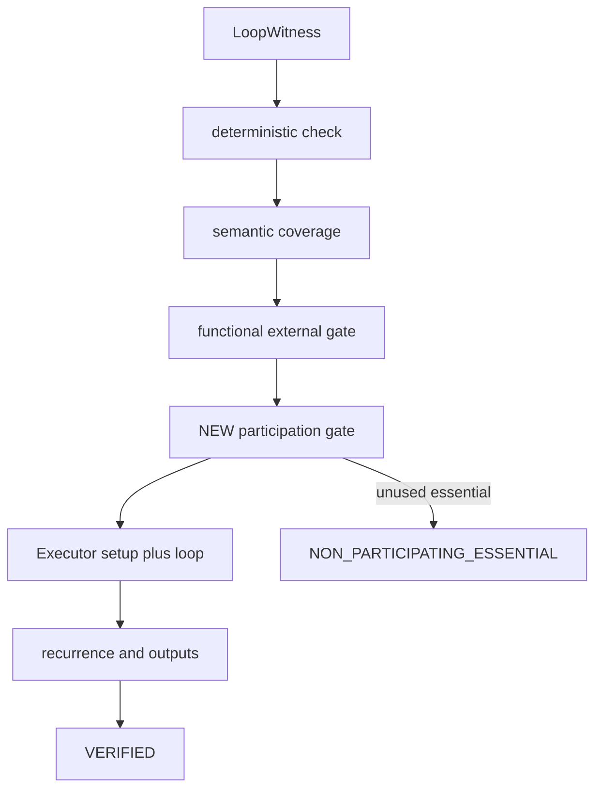

# Review: M4 participant enforcement — bundle B4

**Reviewer:** `[DDR-P1-B4]`  
**Matrix:** [`participant-enforcement-gate-review.md`](participant-enforcement-gate-review.md)  
**Milestone:** M4 follow-through items 1 + 2  
**Assigned bundle:** Q1=B (verifier-only) · Q2=bundle · Q3=typed · Q4=none · Q5=single PR  
**Status:** Complete — no code changes

---

## Bundle hypothesis

Verifier-only participant gate with a **typed rejection status** gives observability (proof artifacts, hard negatives, eval pipelines) while keeping search thin: `explore_pair` already treats any non-`VERIFIED` proof as “continue BFS.” Bundling real Basalt duplicate regressions in the same PR closes the open defect and locks the contract.

---

## Evidence reviewed

| Source | Finding |
|--------|---------|
| `docs/runbooks/M4_FOLLOW_THROUGH.md` §1–2 | Require every essential oracle ID to act; regress adjudicated real duplicate pairs; no join-tuning; baseline re-freeze deferred until eligibility. |
| ADR 0001 | Verifier is witness-in / proof-out acceptance oracle; discovery may speculate; verification may not soften obligations. |
| ADR 0002 | Strict two-card = both essentials **participate**; functional externals disqualify strict two-card; participant filters must reason about essential vs generic vs external roles. |
| ADR 0003 | Typed rejections preferred over silent success; fail-closed. |
| `eval/classify.py` | Participation = actor in `loop_actions` for pair oracle IDs, plus continuous cost-reduction cards when loop pays mana (`Training Grounds` edge case). Sets `unused_oracle_ids`, `strict_two_card`. |
| `search/explorer.py` L345–347 | Acceptance = `proof.status == VerificationStatus.VERIFIED` only; no read of `strict_two_card`. |
| `verify/verifier.py` L167–182 | Rejects `functional_external_requirements` and `essential_card_count > max` with `EXTERNAL_FUNCTIONAL_PIECE_REQUIRED`; **no** participation gate. |
| `semantics/enums.py` | `VerificationStatus` has no bystander-specific value today. |
| `eval/gold_extras.py` | Five real Basalt + {Altar, Gravecrawler, Alarm, Skeleton, Ashnod} pairs adjudicated `DUPLICATE_OR_EQUIVALENT_INTERACTION`. |
| `tests/eval/test_classify_store.py` | `test_basalt_altar_is_not_strict_two_card` documents living defect: explore **succeeds** while `strict_two_card is False`. |
| `tests/hard_negatives/README.md` | Wrong typed status is a product bug even when rejection occurs. |
| `src/mtg_loop_engine/search/README.md` | Open defect table; warns against `verify → eval` import; suggests extracting participation logic if shared. |
| `docs/TERMINOLOGY.md` | Distinguishes **functional external requirement** (third piece outside the pair) from essential that **never acts** (bystander / precision smell). |
| `docs/ADJUDICATION.md` | `duplicate_or_equivalent_interaction` = bystander essential; M4 must enforce and regress. |

---

## Q1 — Verifier-only gate (B)

### Fit

Placing the gate in `Verifier.verify` aligns with ADR 0001: every acceptance path that calls the verifier inherits the gate automatically (`explore_pair`, compile→verify tests, direct corpus checks). No second acceptance oracle in search.

`explore_pair` already implements Q3’s search-side behavior for typed rejections: when the verifier returns a non-`VERIFIED` status, BFS continues without returning a hit. No `explorer.py` filter is **required** for correctness.

### Code paths changed (implementation preview)

| Area | Change |
|------|--------|
| `verify/verifier.py` | New gate: all `witness.essential_cards` oracle IDs must appear in the participation set derived from `loop_actions` (+ cost-reduction rule). Reject before or after executor; pre-executor is sufficient and cheaper. |
| Shared participation logic | Extract from `eval/classify.py` into a neutral module (`proofs/` or `semantics/`) so verifier does not import `eval` (search README explicitly warns against `verify → eval`). Classify reuses the same helper to avoid drift. |
| `search/explorer.py` | **No gate code**; behavior change is indirect via status check. |
| Docs | `verify/README.md`, `search/README.md` (enforcement row), `TERMINOLOGY.md` (verification outcomes). |

### Risks

1. **Logic drift** if participation rules are copy-pasted instead of shared — Basalt + Training Grounds must still pass (cost-reduction participation).
2. **No defense in depth** — a future shortcut that skips verifier or treats stamped `strict_two_card` as sufficient would re-open the defect (bundle B5 addresses this; not in B4 scope).
3. **Runbook wording** (“after a witness is built”) is search-path oriented but satisfied: witness is built, then verified; gate lives in verify.

---

## Q3 — Typed status design (core evaluation)

### Question

Add a new `VerificationStatus` for non-participating essentials, or reuse `EXTERNAL_FUNCTIONAL_PIECE_REQUIRED`?

### Domain semantics (verified)

These are **different failure modes** in the product model:

| Mode | Geometry | Example | Today’s surface |
|------|----------|---------|-----------------|
| **Functional external** | Required piece **outside** the named pair | Third specific permanent needed for the loop | `functional_external_requirements` → `EXTERNAL_FUNCTIONAL_PIECE_REQUIRED` |
| **Essential bystander** | Named pair member **never acts** | Basalt self-untap; Altar on board but unused | `unused_oracle_ids`, `strict_two_card=False`, still `VERIFIED` (defect) |
| **Essential count overflow** | More than `max_essential_cards` functional pieces | (corpus edge) | Also mapped to `EXTERNAL_FUNCTIONAL_PIECE_REQUIRED` today |

ADR 0002 and `TERMINOLOGY.md` treat externals and participation separately. Adjudication maps bystander cases to `duplicate_or_equivalent_interaction`, not to “external piece required.”

### Option A — Reuse `EXTERNAL_FUNCTIONAL_PIECE_REQUIRED`

**Pros**

- Smaller enum diff; no new hard-negative vocabulary row.
- Both outcomes mean “not a strict two-card verified loop.”

**Cons**

- **Observability failure for B4’s stated goal (Q3=typed):** eval, metrics, and human review cannot distinguish bystander duplicates from true external dependencies without parsing `rejection_reason` strings — brittle and untested.
- **Overloads an already dual-purpose status** (externals + essential-count overflow).
- **Misleading name:** “external functional piece” describes a third card, not an idle member of the searched pair.
- **Hard-negative contract:** `tests/hard_negatives/` asserts exact status; corpus case `neg_external_functional` already expects `EXTERNAL_FUNCTIONAL_PIECE_REQUIRED` for functional externals. Reuse would either conflate two contracts or require reason-string branching in tests (anti-pattern per test-quality rules).
- **Proof artifacts:** downstream consumers keyed on status (CLI, JSONL export, baseline summaries) lose signal.

### Option B — New typed status (recommended)

Add a dedicated enum member, e.g.:

```text
NON_PARTICIPATING_ESSENTIAL = "non_participating_essential"
```

(alternate acceptable name: `ESSENTIAL_BYSTANDER`; prefer neutral “non_participating” to match TERMINOLOGY’s “never acts” wording.)

**Pros**

- Matches ADR 0002 / TERMINOLOGY / ADJUDICATION vocabulary.
- Satisfies Q3 observability: proofs, hard negatives, and regressions assert the precise contract.
- Keeps `EXTERNAL_FUNCTIONAL_PIECE_REQUIRED` for external/count cases only.
- Enables bundled regressions to assert `explore_pair(...) is None` **or** injected-verifier proofs with exact status without ambiguous overload.

**Cons**

- Touches `semantics/enums.py`, corpus `expected_status` where applicable, golden proof fixtures, and any status switches (moderate, bounded blast radius).
- Requires one new hard-negative (or gold extended) witness with the new status.

### Verdict on typed status

**Recommend Option B — new `VerificationStatus`, not reuse of `EXTERNAL_FUNCTIONAL_PIECE_REQUIRED`.**

Reuse would undermine the bundle’s reason for choosing typed UX (Q3). If the team ever wanted minimal enum surface, that would be a **different bundle** (e.g. B3 silent verifier-only), not B4.

**Gate placement in verifier (pre-executor):**



---

## Q2 — Bundle regressions (same PR)

Bundling is appropriate: the defect is only closed when both enforcement **and** inverted Basalt duplicate tests land together.

**Regression set (from `gold_extras.py`, real-card duplicates):**

1. Basalt + Phyrexian Altar (already in `test_classify_store.py` — invert to `assert found is None`)
2. Basalt + Ashnod's Altar
3. Basalt + Gravecrawler
4. Basalt + Intruder Alarm
5. Basalt + Reassembling Skeleton

**Retention checks:**

- `explore_pair(BASALT, TRAINING_GROUNDS)` and gold_core 10/10 rediscoveries remain `VERIFIED`.
- Optional: direct `Verifier.verify` unit tests on participation without full BFS.

---

## Q4 / Q5 — Baseline and PR shape

- **Q4=none:** Correct. Runbook places baseline re-freeze after Spellbook eligibility; no STATUS/baseline churn in this PR.
- **Q5=single PR:** Matches AGENTS.md change discipline (code + tests + package READMEs + roadmap/runbook defect closure in one coherent unit).

---

## Comparison to matrix default (B1)

| Dimension | B1 (search-only, silent) | B4 (verifier-only, typed) |
|-----------|--------------------------|---------------------------|
| Acceptance oracle | Search filter before return | Verifier rejection |
| Observability | None at proof layer | Typed status on every rejection |
| Enum change | Unlikely | Required (recommended) |
| Direct `verify()` calls | Would **not** be gated if filter only in explorer | Gated |
| ADR 0001 fit | Acceptable but splits oracle | Stronger — one verifier contract |

B4 trades a modest enum/doc blast radius for clearer epistemic contracts and ADR 0001 alignment. B1 is lower-touch if observability is explicitly deprioritized.

---

## Rubric (100 pts)

| Criterion | Weight | Score | Notes |
|-----------|--------|-------|-------|
| Correctness / safety | 25% | **23** / 25 | Verifier gate closes bystander acceptance on all verify paths; must share participation logic with classify (cost-reduction edge). Verifier-only lacks defense-in-depth (−2). |
| Architecture fit (ADR 0001, 0002) | 25% | **22** / 25 | Verifier-as-oracle ✓; ADR 0002 participation ✓; requires extraction to avoid `verify→eval` (−2); runbook placement slightly implicit (−1). |
| Rollout / blast radius | 20% | **16** / 20 | New enum + doc/test updates; no baseline refresh. Typed status increases touch count vs silent bundles (−4). |
| Testability | 15% | **14** / 15 | Exact status assertions; clear regression corpus; add verifier unit tests for participation (−1). |
| Roadmap / runbook alignment | 15% | **14** / 15 | Closes items 1+2 in one PR; sequence preserved; docs must flip “open defect” language (−1). |

**Weighted total: 89 / 100**

No zero on Correctness / safety. Above 70 threshold.

---

## Disqualifying risks (none blocking)

| Risk | Severity | Mitigation |
|------|----------|------------|
| Participation logic drift vs classify | Medium | Single shared helper; parametrize Basalt+Training Grounds + Basalt+Altar |
| Reusing overloaded status | High (for B4 goals) | Use new `NON_PARTICIPATING_ESSENTIAL` |
| Extra BFS work on bystander candidates | Low | Acceptable for M4; perf not in scope |
| Missing verify-only path coverage | Low | Verifier unit tests + existing discovery/gold suites |

---

## Success criteria check (matrix)

| # | Criterion | B4 meets? |
|---|-----------|-----------|
| 1 | Five Basalt duplicate pairs not accepted | Yes — via verifier rejection + inverted regressions |
| 2 | Basalt + Training Grounds and gold_core 10/10 still succeed | Yes — if shared participation logic preserves cost-reduction rule |
| 3 | Docs stop describing enforcement as open defect | Yes — with bundled README/runbook updates |
| 4 | No join-tuning; no baseline re-freeze | Yes — Q4=none |

---

## Implementation checklist (for follow-up PR; out of scope here)

1. Add `VerificationStatus.NON_PARTICIPATING_ESSENTIAL` (or agreed name) to `semantics/enums.py`.
2. Extract participation analysis to neutral module; wire `classify.py` and `verifier.py`.
3. Reject in `Verifier.verify` when any essential oracle ID is unused; set `rejection_reason` listing unused IDs (human-readable, stable prefix).
4. Invert `test_basalt_altar_is_not_strict_two_card`; add four sibling duplicate regressions.
5. Add hard-negative or corpus case with `expected_status=NON_PARTICIPATING_ESSENTIAL`.
6. Update `verify/README.md`, `search/README.md`, `TERMINOLOGY.md`, `ROADMAP.md` remaining-items wording.
7. Do **not** refresh `eval/baseline/` or `docs/STATUS.md` in this PR.

---

## Verdict

**ACCEPT_WITH_RISKS**

Bundle B4 is a viable M4 follow-through choice when **typed proof observability** matters more than minimizing enum surface area. The critical design decision within B4 is **not** reuse of `EXTERNAL_FUNCTIONAL_PIECE_REQUIRED` — add a dedicated `NON_PARTICIPATING_ESSENTIAL` (or equivalent) status so hard negatives, adjudication classes, and proof artifacts remain aligned with ADR 0002 and `TERMINOLOGY.md`.

**Primary risk to track:** shared participation logic extraction; treat copy-paste between verify and classify as a merge blocker.

**Not recommended if:** the team prefers lowest blast radius and does not need typed rejection — choose B1 or B3 instead.
