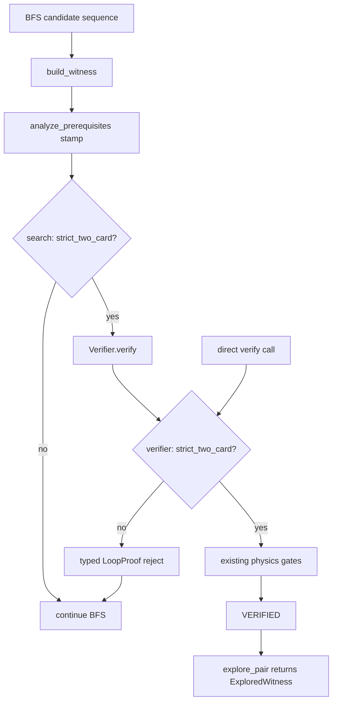

# DDR-P1-B5: Participant enforcement gate review

**Reviewer:** `[DDR-P1-B5]`  
**Matrix:** [`participant-enforcement-gate-review.md`](participant-enforcement-gate-review.md)  
**Milestone:** M4 follow-through items 1 (participant gate) + 2 (duplicate regressions)  
**Assigned bundle:** B5 — defense in depth with typed rejection

| Dimension | Choice |
|-----------|--------|
| Q1 Gate placement | **C** — search **and** verifier |
| Q2 Regression bundling | **bundle** — gate + five Basalt duplicate regressions in one PR |
| Q3 Rejection UX | **typed** — new `VerificationStatus` (not silent BFS continue only) |
| Q4 Baseline refresh | **none** |
| Q5 PR shape | **single** |

---

## Executive summary

Bundle B5 closes the open bystander defect at **two layers**: `explore_pair` refuses to return witnesses that fail essential participation, and `Verifier.verify` rejects the same condition with a typed status for non-search callers. The approach is **correct and testable** and aligns with ADR 0002’s participation-based strict-two-card contract, but it pays a **duplication and boundary-clarity tax** relative to search-only bundles (B1/B6). ADR 0001 is not violated if both gates read the same stamped `Classification.strict_two_card` from `analyze_prerequisites` and the verifier gate remains witness-in / proof-out (no search, no re-classify import). **Verdict: ACCEPT_WITH_RISKS** — recommend only if the team explicitly values verifier-side hardening for direct `verify()` paths; otherwise B1 is the leaner default.

---

## Problem restatement (verified)

Search accepts loops where one searched essential never acts. Detection works; enforcement does not.

| Layer | Location | Today |
|-------|----------|-------|
| Detection | `eval/classify.py` → `analyze_prerequisites` | Computes `used_oracle_ids`, `unused_oracle_ids`, `strict_two_card` from loop-step actors (+ cost-reduction participation) |
| Stamp | `search/explorer.py` `build_witness` L294–308 | Copies `strict_two_card`, essential count, prereqs onto witness |
| Accept | `explore_pair` L345–347 | Returns on first `proof.status == VERIFIED`; ignores participation |
| Verifier | `verify/verifier.py` L167–182 | Gates functional externals and essential **count** max; does **not** read participation / `strict_two_card` |
| Living defect | `tests/eval/test_classify_store.py::test_basalt_altar_is_not_strict_two_card` | Explore **succeeds** while `strict_two_card is False` and Phyrexian Altar is unused |
| Precision impact | `eval/gold_extras.py` GOLD_EXTRA_ADJUDICATIONS | **5** real Basalt-monolith pairs adjudicated `duplicate_or_equivalent_interaction` (bystander class) |

Runbook §1 (`docs/runbooks/M4_FOLLOW_THROUGH.md`) specifies: after witness build, require every essential oracle ID to act; reject otherwise. It names the **search path** explicitly and does not require a verifier duplicate — but it also does not forbid one.

---

## ADR 0001 — discovery / verification boundary

**Relevant constraints:**

- Discovery may speculate; verification may not soften proof obligations.
- Explorer remains the **single acceptance oracle on the discovery path** (injected `Verifier`, no second verify pass in `discover_loops`).
- Changes that blur propose/accept boundaries need ADR + roadmap update.

**B5 boundary analysis:**

- **Search gate:** A pre-return filter in `explore_pair` is consistent with ADR 0001: search still does not re-verify or invent proofs; it **continues proposing** when participation fails. This matches the runbook’s “reject otherwise” on the discovery path.
- **Verifier gate:** Participation is a **truth condition** for claiming a strict two-card loop (ADR 0002), not exploration. `verify/README.md` explicitly invites acceptance gates for truth conditions. Checking `witness.classification.strict_two_card` (or equivalent participation invariant) inside `verify()` does **not** import search and does not run BFS — it stays witness-in / proof-out.
- **Blur risk (material):** Dual gates can imply two acceptance policies if they ever diverge (e.g., search skips verify on `!strict_two_card` while verifier later loosens). Mitigation: **one criterion** — the stamped `strict_two_card` from `analyze_prerequisites` at witness build — read by both layers; no second participation algorithm in verifier.
- **Not a violation** if documented in package READMEs and this review; no ADR revision required unless verifier starts re-running classify or importing search/eval classify.

---

## ADR 0002 — two-card essential-piece definition

**Relevant constraints:**

- Strict two-card = exactly two **essential functional pieces** that **participate**.
- Generic fodder allowed; functional external disqualifies (already verifier-gated via `functional_external_requirements`).
- Participant filters must reason about essential vs bystander roles.

**B5 fit:**

- `analyze_prerequisites` already defines participation consistently with ADR 0002 (actors in loop steps + continuous cost-reduction edge case — see `test_basalt_grounds_is_strict_via_cost_reduction`).
- Bystander duplicates (Basalt + {Altar, Gravecrawler, Intruder Alarm, Skeleton, …}) have `essential_functional_count == 1` and `strict_two_card is False` — enforcement via `strict_two_card` directly implements the ADR labeling contract at acceptance time.
- Bundled regressions (Q2) lock the five adjudicated duplicate pairs per runbook §2 and matrix success criterion 1.

**Residual gap (pre-existing, not introduced by B5):** Bystanders leave `functional_external_requirements` empty, so the verifier’s external-piece gate does not catch them today. B5 closes that hole via participation, not by misusing `EXTERNAL_FUNCTIONAL_PIECE_REQUIRED`.

---

## Defense-in-depth vs duplication cost

### What the second layer buys

| Path | Search-only (A) | Verifier-only (B) | Both (C / B5) |
|------|-----------------|-------------------|---------------|
| `explore_pair` / `discover_loops` | Rejects bystander hits | Relies on typed `verify` reject + BFS continue | Search skip **and** typed proof if verify reached |
| Direct `Verifier.verify(witness)` (gold tests, CLI, future tooling) | **No protection** | Protected | Protected |
| Misconfigured / hand-built witness with wrong stamp | **No protection** | Protected if verifier re-checks participation from loop actions | Protected |
| Verifier regression that drops gate | Search still blocks discovery hits | **Discovery re-opens** | Search backstop remains |

The incremental value of C over A is almost entirely **non-search entry points** and **regression insurance**. The incremental value of C over B is a **search-side backstop** if verifier gate is removed or bypassed on the discovery path.

### Duplication cost (estimated)

| Item | Cost | Notes |
|------|------|-------|
| Search check in `explore_pair` | ~3–6 LOC | After `build_witness`, before or after `verify`; prefer **before** `verify` when `!strict_two_card` to avoid redundant executor work |
| Verifier check | ~6–10 LOC | After classification gates, before executor: reject when `not witness.classification.strict_two_card` |
| New `VerificationStatus` enum member | ~1 LOC + downstream handling | e.g. `ESSENTIAL_NON_PARTICIPANT` — matrix Q3 requires typed, not reuse of `EXTERNAL_FUNCTIONAL_PIECE_REQUIRED` (semantically wrong) |
| Tests | ~60–90 LOC | Invert basalt/altar eval test; 5 duplicate pair regressions; `hard_negatives` direct-verify case; ensure discovery 10/10 + basalt/grounds still pass |
| Docs | README updates in `search/`, `verify/`, architecture open-defect section | Required by change discipline |
| Ongoing maintenance | Low **if** single criterion (`strict_two_card` stamp) | High **if** verifier re-implements participation parsing |

**Net:** Modest LOC; the real cost is **conceptual** — two layers to explain, test, and keep aligned — not line count.

### Duplication vs ADR 0001 “single oracle”

On the discovery path, B5 can feel like “search overrides verifier.” Cleanest story:

1. Verifier is the physics + classification-truth oracle (`VERIFIED` only when strict two-card participation holds).
2. Search treats any non-`VERIFIED` status (including the new typed participant rejection) as **continue BFS**, same as today.
3. Search **additionally** may short-circuit before calling `verify` when `!strict_two_card` — optimization + belt-and-suspenders, not a second proof.

If implementers only add the verifier gate and search implicitly relies on typed rejection, the bundle collapses toward **B4** (verifier-only + typed). B5 requires an **explicit, documented** search-side check to justify Q1=C.

---

## Code paths that change

### `search/explorer.py`

- **`build_witness`:** No change required (already stamps `strict_two_card`).
- **`explore_pair` L341–347:** After `build_witness`, if `not witness.classification.strict_two_card`, do not return — append to BFS queue. Optionally skip `verify` call entirely for that candidate.
- **`discover_loops`:** Inherits behavior via `explore_pair`; no second verify pass (invariant preserved).

### `verify/verifier.py`

- After functional-external / essential-count gates (~L167–182), add participation gate:
  - Reject with new status when `not witness.classification.strict_two_card` (or when essential participation count ≠ 2 — equivalent given current classify definition).
  - Set `rejection_reason` naming unused essentials if available (optional: re-run `analyze_prerequisites` **only in eval tooling**, not in verifier hot path, to avoid eval import in verify — today verify does not import eval).

### `semantics/enums.py`

- Add typed status for Q3 (proposed: `ESSENTIAL_NON_PARTICIPANT = "essential_non_participant"`).

### Unchanged boundaries

- `tests/unit/test_search_boundary.py` — verify package must not import search; B5 preserves this if verifier reads witness fields only.
- No Spellbook pairing leakage; no LLM semantics path (ADR 0003).

---

## Tests that lock the contract

| Test area | Current | B5 expectation |
|-----------|---------|----------------|
| `tests/eval/test_classify_store.py::test_basalt_altar_is_not_strict_two_card` | Asserts explore **finds** bystander hit | **Invert:** `explore_pair` returns `None` (or never returns that witness) |
| `tests/eval/test_classify_store.py::test_basalt_grounds_is_strict_via_cost_reduction` | Positive strict two-card | Must still pass (success criterion 2) |
| `tests/discovery/test_blind_discovery.py::test_blind_discovery_rediscovers_gold_core` | 10/10 gold rediscovery | Must still pass (success criterion 2) |
| New: duplicate regressions (Q2 bundle) | None | Parametrize five `GOLD_EXTRA_ADJUDICATIONS` Basalt duplicate frozensets → `explore_pair` / `discover_loops` returns no verified hit |
| `tests/hard_negatives/` or new unit | — | Direct `Verifier.verify` on a bystander witness → new typed status, not `VERIFIED` |
| `tests/unit/test_explorer.py` | Oracle injection | Confirm participant reject behaves like other reject-all paths for BFS |

Eval layer (`spellbook_eval.py` L171+) already downgrades non-strict hits to `PREREQUISITE_MISMATCH` for **scoring** — orthogonal to engine acceptance; no baseline re-freeze (Q4=none) unless acceptance changes shrink the accepted pool materially (expected: fewer extras, improved precision — document in PR, defer freeze per roadmap).

---

## Risks and disqualifying concerns

| Risk | Severity | Mitigation |
|------|----------|------------|
| Gate drift (search vs verifier disagree) | Medium | Single criterion: stamped `strict_two_card`; code review checklist |
| False rejection of cost-reduction participation | High if broken | Keep `test_basalt_grounds_is_strict_via_cost_reduction` as CI gate |
| Over-broad rejection when `essential_card_count` stamped as 1 but loop valid one-card | Low for two-card search path | Search always pairs two cards; one-card loops are out of scope |
| Semantic misuse of new enum in metrics/dashboards | Low | Document in `TERMINOLOGY.md` / adjudication docs |
| Boundary blur per ADR 0001 | Medium | Document dual-layer rationale; search gate is pre-filter not re-proof |
| Implementers ship verifier-only while claiming B5 | Process | PR review checks both touch points |

**No disqualifying correctness blocker** identified for bundle B5 itself. Blocker would appear if implementation re-parsed participation differently in verifier than in classify.

---

## Comparison to adjacent bundles

| Bundle | Trade-off vs B5 |
|--------|-----------------|
| **B1** (A, silent) | Leaner; runbook-aligned; loses typed observability and direct-verify hardening |
| **B4** (B, typed) | Same typed UX with half the duplication; loses search backstop |
| **B6** (C, silent) | Same dual placement without new enum; weaker debuggability for reject reasons |
| **B5** (C, typed) | Strongest safety story; highest duplication / doc burden |

---

## Rubric score

| Criterion | Weight | Score | Rationale |
|-----------|--------|-------|-----------|
| Correctness / safety | 25% | **23** / 25 | Dual gates close bystander hole on discovery and direct-verify paths; cost-reduction participation already tested; drift is the main residual risk |
| Architecture fit (ADR 0001, 0002) | 25% | **17** / 25 | ADR 0002 fit is strong; ADR 0001 tolerates search pre-filter but dual enforcement needs careful narrative; runbook literally targets search path only |
| Rollout / blast radius | 20% | **16** / 20 | Bundled regressions increase PR scope but match roadmap; new enum is small API surface; no baseline freeze (Q4) avoids premature metric churn |
| Testability | 15% | **13** / 15 | Clear invert-existing-test story + gold_core guard + hard_negative for verifier; some redundant overlap testing both layers |
| Roadmap / runbook alignment | 15% | **13** / 15 | Satisfies items 1+2 bundled; success criteria 1–3 achievable; item sequencing unchanged |

**Weighted total: 82 / 100** (above 70 threshold; no zero on Correctness/safety)

---

## Verdict

**ACCEPT_WITH_RISKS**

Bundle B5 is a **defensible, implementable** choice when the team prioritizes:

1. Typed rejection reasons for participant failures (Q3),
2. Verifier-side enforcement for all witness entry points, **and**
3. A search-side backstop against future verifier regressions,

accepting modest duplication and documentation overhead.

**Recommended implementation guardrails:**

- Use **`witness.classification.strict_two_card`** as the sole shared gate input at both layers.
- Add **`ESSENTIAL_NON_PARTICIPANT`** (or equivalent) to `VerificationStatus`; do not overload `EXTERNAL_FUNCTIONAL_PIECE_REQUIRED`.
- Search gate: skip return (and optionally skip `verify`) when `!strict_two_card`; do not add a second verification pass.
- Bundle five real Basalt duplicate regressions in the same PR (Q2).
- Update open-defect prose in `docs/ARCHITECTURE.md`, `search/README.md`, `verify/README.md`.

**When to prefer another bundle:** If direct `verify()` participant enforcement is deemed unnecessary and typed UX is optional, **B1** (matrix recommended default) delivers the same discovery-path fix with lower architectural surface. If typed UX matters but duplication does not, **B4** is the Pareto choice.

---

## Checklist vs matrix success criteria

| # | Criterion | B5 |
|---|-----------|-----|
| 1 | Basalt + four other duplicate pairs → no accepted hit | Yes, with bundled regressions |
| 2 | Basalt + Training Grounds + gold_core 10/10 | Yes, if cost-reduction participation preserved |
| 3 | Docs stop listing open defect | Yes, with README + architecture updates in same PR |
| 4 | No join-tuning; no baseline re-freeze | Yes (Q4=none) |
