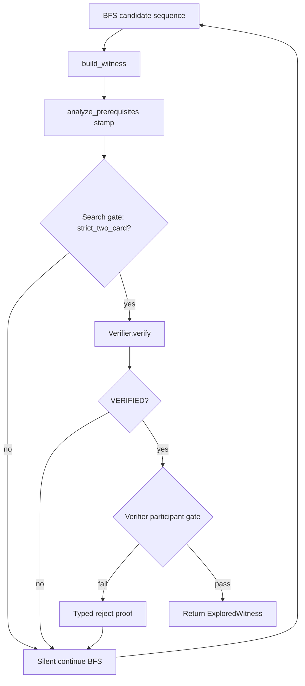

# Review: Participant enforcement bundle B6

**Reviewer:** `[DDR-P1-B6]`  
**Matrix:** [`participant-enforcement-gate-review.md`](participant-enforcement-gate-review.md)  
**Milestone:** M4 follow-through item 1 (+ bundled item 2 regressions)  
**Assigned bundle:** B6 — Q1=C (both layers), Q2=bundle, Q3=silent search skip, Q4=none, Q5=single PR  
**Date:** 2026-08-21

---

## Bundle definition

| Dimension | Choice | Meaning for implementation |
|-----------|--------|----------------------------|
| Q1 Gate placement | **C — both** | Participant check after `build_witness` in `explore_pair` **and** a matching gate in `Verifier.verify` before physics |
| Q2 Regression bundling | **bundle** | Same PR inverts `test_basalt_altar_is_not_strict_two_card` and adds five real-card `duplicate_or_equivalent_interaction` regressions from `gold_extras` |
| Q3 Rejection UX | **silent** | On participant failure, BFS continues; `explore_pair` does not return or log the rejection proof |
| Q4 Baseline refresh | **none** | No `eval/baseline/` re-freeze or STATUS prose update in this PR |
| Q5 PR shape | **single** | Gate + regressions + docs in one change set |

**Hypothesis (from matrix):** Defense in depth with minimal UX churn — search prunes bystanders early; verifier remains the authoritative fail-closed backstop; no new surfacing API.

---

## Problem restatement

Search accepts witnesses where one essential oracle ID never acts. Detection works (`analyze_prerequisites` → `strict_two_card`, `unused_oracle_ids`); enforcement does not (`explore_pair` returns on first `VERIFIED`). Five real Basalt-monolith pairs are adjudicated `duplicate_or_equivalent_interaction`; `test_basalt_altar_is_not_strict_two_card` documents the living defect.

**Central question for B6:** With gates in **both** layers but **silent** search skip, is **verifier-only typed reject** sufficient observability?

---

## Evidence (verified from repo)

### Detection and stamping

`analyze_prerequisites` (`eval/classify.py`) derives participation from loop actors and continuous cost-reduction abilities. It sets `strict_two_card = (essential_count == 2 and not functional)` and fills `unused_oracle_ids`. `build_witness` (`search/explorer.py` L294–308) re-runs classify and stamps `witness.classification.strict_two_card`.

### Acceptance path today

```346:347:src/mtg_loop_engine/search/explorer.py
                if proof.status == VerificationStatus.VERIFIED:
                    return ExploredWitness(witness=witness, proof=proof)
```

Non-`VERIFIED` proofs are dropped silently; BFS continues. Injected verifier is the sole acceptance oracle (`discover.py` L42–44, `tests/unit/test_explorer.py::test_injected_verifier_is_the_acceptance_oracle`).

### Verifier gap

`Verifier.verify` rejects non-empty `functional_external_requirements` and over-large `essential_card_count` but **does not** read `strict_two_card` or `unused_oracle_ids` (`verifier.py` L167–182; `verify/README.md` L42–52).

### Living defect test

`tests/eval/test_classify_store.py::test_basalt_altar_is_not_strict_two_card` asserts `explore_pair(BASALT, PHYREXIAN_ALTAR)` **succeeds** while `strict_two_card is False` and Phyrexian Altar is in `unused_oracle_ids`.

### Runbook and roadmap

`docs/runbooks/M4_FOLLOW_THROUGH.md` §1: after witness build, require every essential oracle ID as an actor in at least one loop step; reject otherwise. `ROADMAP.md` M4 item 1 matches. Item 2 (regress real duplicates) is the natural bundle mate (Q2=bundle).

### ADR alignment

| ADR | Relevance to B6 |
|-----|-----------------|
| **0001** Discovery may speculate; verification may not | Search pre-filter fits “proposal pruning”; verifier gate fits “truth condition.” Dual placement is consistent if both use the same participation contract. Explorer remains acceptance oracle only for **returned** hits — verifier still gates `VERIFIED`. |
| **0002** Strict two-card = both essentials act | Participant gate directly enforces labeling contract. Generic fodder unaffected; functional externals already have a verifier path. |
| **0003** Fail closed; typed rejection | New participant rejection should be a typed `VerificationStatus`, not silent `VERIFIED`. Applies to verifier layer; silent Q3 affects **export**, not whether verifier *internally* types the reject. |
| **0004** Adjudicated precision over raw recall | Fixing bystander acceptance improves precision; silent `None` for bystander-only pairs may **mislabel** eval stages (see Observability). |

### Eval observability today (will change)

`spellbook_eval.py` L170–183: if `explore_pair` returns a hit with `strict_two_card is False`, stage = `PREREQUISITE_MISMATCH`. After enforcement with silent skip, bystander-only pairs return `None` → `SEARCH_MISS` — a semantic downgrade for diagnostics.

### Regression corpus (Q2=bundle)

Five real-card duplicates in `eval/gold_extras.py` `GOLD_EXTRA_ADJUDICATIONS` (Basalt + Altar, Gravecrawler, Intruder Alarm, Phyrexian Altar, Reassembling Skeleton). Fixture-invalid rows excluded per runbook §2.

---

## Proposed code paths (B6)



**Search gate (new):** After L344 `build_witness`, if `not witness.classification.strict_two_card` (or equivalently non-empty unused essentials), `continue` without calling `verify`.

**Verifier gate (new):** Before physics (alongside L167–182), reject when `not witness.classification.strict_two_card` or essential oracle IDs fail participation check — likely reusing `EXTERNAL_FUNCTIONAL_PIECE_REQUIRED` or a dedicated status (matrix allows typed when Q1 ∈ {B,C}; B6 chooses silent **export** only).

**Direct-verify paths:** `gold_core` positives, `test_compile_verify`, CLI verify — hit verifier gate without search pre-filter. Verifier-only reject is the **only** gate on those paths.

---

## Observability analysis (answers central question)

### Short answer

**No.** Verifier-only typed reject is **necessary** for non-search entry points and defense in depth, but **not sufficient** observability for the primary `explore_pair` / `discover_loops` path when search silently skips first.

### Why

1. **Search pre-filter short-circuits verifier.** For bystander witnesses (the defect class), the search gate fires immediately after `build_witness`. With Q3=silent, no `LoopProof` is produced or returned; BFS continues. The verifier’s typed reject never runs for those candidates.

2. **Final API surface is unchanged.** Bystander-only pairs (e.g. Basalt + Phyrexian Altar) still end as `explore_pair(...) is None` — indistinguishable from “no loop exists,” “bounds exhausted,” or “physics never verified.” This is identical to B1 (search-only, silent) and B3 (verifier-only, silent) at the **caller** boundary.

3. **Eval stage regression.** `FailureStage.PREREQUISITE_MISMATCH` becomes unreachable for enforced bystanders; they collapse into `SEARCH_MISS`. That is **correct for acceptance** but **wrong for measurement** if recovery reports are interpreted as “no loop found.”

4. **Where verifier reject *does* matter.** Gold-core hand-built witnesses, compile→verify tests, future `verify` CLI on imported witnesses, and any bug that disables the search gate — verifier typed reject is the safety net and the **only** observable rejection on those paths.

5. **Silent is already the default for all non-VERIFIED proofs.** Today every physics rejection is silently skipped in BFS (`explorer.py` L345–347). B6 extends that pattern to participant rejection at the search layer **without** adding the typed surfacing that bundles B4/B5 (Q3=typed) would require at the verifier boundary when a witness is actually verified.

### Observability verdict

| Concern | Verifier-only reject enough? |
|---------|------------------------------|
| **Correctness** (no bystander `VERIFIED`) | Yes, with both gates |
| **Defense in depth** | Yes — verifier catches bypass paths |
| **Primary discovery diagnostics** | **No** — silent search skip hides reason |
| **Eval / recovery staging** | **No** — `PREREQUISITE_MISMATCH` → `SEARCH_MISS` |
| **Operator debugging** | **No** — no proof artifact for skipped candidates |

For M4 exit criteria focused on **precision** (ADR 0004), silent export is acceptable. For **operability** and eval interpretability, B5 (both + typed export) or a minimal post-hoc classify on `None` pairs would be strictly better.

---

## Architecture trade-offs

### Advantages

- **Defense in depth:** Search avoids useless physics on doomed witnesses; verifier enforces contract for all witness-in paths (ADR 0001 boundary preserved — verifier still does not search).
- **Shared contract:** Both gates should read the same `witness.classification.strict_two_card` stamped by `analyze_prerequisites` in `build_witness` — single source of truth, low drift risk if verifier does not reimplement participation logic independently.
- **Runbook + bundle alignment:** Search gate matches runbook wording (“after witness is built”); bundled regressions close item 2 in one PR (Q2, Q5).
- **Performance:** Skipping `verify()` on bystander candidates reduces work in BFS hot loop.

### Disadvantages

- **Redundant code path:** Two rejection sites to test and keep aligned; violates minimal-gate preference of B1 unless defense-in-depth is explicitly valued.
- **Observability gap:** Silent Q3 + search-first filter means verifier typed reject is often **latent**, not **observed** — undermines the stated hypothesis that verifier backstop compensates for silent search.
- **No new `VerificationStatus` value in B6:** Reusing `EXTERNAL_FUNCTIONAL_PIECE_REQUIRED` conflates “hidden third piece” (ADR 0002) with “named essential never acted”; acceptable short-term but weakens typed diagnostics even when verifier *does* run.
- **Eval tooling drift:** `spellbook_eval` and workbench narratives assume post-hoc classify on successful explores; docs/tests need explicit update that bystander pairs now `SEARCH_MISS`.

### Comparison to sibling bundles

| Bundle | vs B6 |
|--------|-------|
| **B1** (search-only, silent) | Same caller observability; less defense in depth; smaller diff |
| **B3** (verifier-only, silent) | Verifier runs on every candidate (typed reject **internal**); more verify CPU; search cannot prune early |
| **B5** (both + typed) | Same dual gates; typed export when witness reaches verifier — strictly better observability; still misses search-skipped candidates unless explore API extended |
| **B4** (verifier-only + typed) | Typed reject on every bystander candidate that reaches verify; no search CPU win |

---

## Test contract (Q2=bundle)

| Test | B6 expectation |
|------|----------------|
| `test_basalt_altar_is_not_strict_two_card` | **Invert:** `explore_pair` returns `None` (or assert rejection via bundled regression helper) |
| Five real Basalt duplicate pairs | New regressions: explore must not accept |
| `test_basalt_grounds_is_strict_via_cost_reduction` | Still succeeds — both participate |
| `tests/discovery/test_blind_discovery.py` | gold_core 10/10 rediscoveries unchanged |
| `tests/gold_core/test_positives.py` | Direct verify still `VERIFIED` — verifier gate must not break authored strict witnesses |
| `tests/unit/test_search_boundary.py` | Unchanged — verify ↛ search |
| Optional: verifier unit test | Injected bystander witness → typed reject without explore |

Docs to update in same PR: `search/README.md`, `verify/README.md`, `tests/eval/README.md`, `ROADMAP.md` item 1 status — per change discipline.

---

## Rubric (100 pts)

| Criterion | Weight | Score | Rationale |
|-----------|--------|-------|-----------|
| **Correctness / safety** | 25% | **23** | Dual gates close the bystander defect; shared classify stamp limits drift. −2: redundant gates could diverge if verifier reimplements participation instead of reading classification. |
| **Architecture fit** (ADR 0001, 0002) | 25% | **21** | Aligns with discovery/verify split and essential-piece definition. −4: ADR 0001 names explorer as acceptance oracle — dual enforcement is defensible but heavier than search-only; typed participant reason not distinct from external-functional today. |
| **Rollout / blast radius** | 20% | **16** | Bundled regressions good; single PR disciplined. −4: silent UX shifts eval stages; both layers touch hot paths; no baseline refresh (Q4=none) is correct per roadmap sequencing but leaves STATUS describing open defect until follow-up. |
| **Testability** | 15% | **11** | Outcome tests clear (None vs VERIFIED). −4: silent skip behavior hard to assert; dual-layer contract needs separate search-path and direct-verify tests; no observability assertions. |
| **Roadmap / runbook alignment** | 15% | **14** | Implements §1 gate + §2 regressions in one PR. −1: runbook specifies search-path gate only; verifier addition is superset (allowed, not required). |

**Weighted total: 85 / 100**

**Blockers:** None (≥70, no zero on Correctness/safety).

---

## Risks and mitigations

| Risk | Severity | Mitigation in B6 |
|------|----------|------------------|
| Search and verifier gates diverge | Medium | Verifier reads `witness.classification.strict_two_card` only; do not duplicate `analyze_prerequisites` logic |
| Eval mislabels bystander pairs as SEARCH_MISS | Medium | Document in eval README; optional follow-up: classify-on-None helper for metrics only |
| `EXTERNAL_FUNCTIONAL_PIECE_REQUIRED` overload | Low | Accept for M4; dedicated status in later PR if B5 wins observability fork |
| gold_core witness with mis-stamped classification | Low | gold_core uses authorship path; participation tests already exist via classify |
| Over-engineering vs B1 | Low | Justify in PR: verifier backstop for verify-only callers |

---

## Success criteria check (from matrix)

| # | Criterion | B6 meets? |
|---|-----------|-----------|
| 1 | Basalt + four other real duplicate pairs → no accepted hit (Q2=bundle) | **Yes** — with bundled regressions |
| 2 | Basalt + Training Grounds + gold_core 10/10 still succeed | **Yes** — strict participation preserved |
| 3 | Docs stop describing enforcement as open defect | **Yes** — if README/ROADMAP updated in same PR |
| 4 | No join-tuning; no baseline re-freeze (Q4=none) | **Yes** |

---

## Disqualifying risks

None fatal. Observability weakness vs B5 is a **scoping** trade-off, not a correctness blocker.

---

## Verdict

**ACCEPT_WITH_RISKS**

Bundle B6 is **safe to implement** for M4 precision closure: both layers correctly reject bystander witnesses, bundled regressions lock the contract, and roadmap/runbook sequencing is respected. The central observability question receives a clear **no** — verifier-only typed reject does **not** compensate for silent search skip on the primary discovery path because the search gate prevents most bystander witnesses from ever reaching the verifier.

**Recommended mitigations if B6 wins coalesce:**

1. Verifier gate reads stamped `strict_two_card` only (no second participation implementation).
2. Update eval/discovery READMEs to state that bystander-only pairs surface as `None` / `SEARCH_MISS`, not `PREREQUISITE_MISMATCH`.
3. Defer observability improvement to B5-style typed export or a metrics-only classify pass — not required for M4 exit but worth a follow-up note in PR description.

**If coalesce prefers observability:** prefer **B5** (C + typed) over B6; prefer **B1** (A + silent) if minimal diff outweighs defense in depth.

---

## Merge notes for `[DDR-P2-COALESCE]`

- B6 scores **85** — viable, not matrix default (B1 recommended).
- Key differentiator from B1: defense in depth + verify-only path coverage at cost of redundancy and observability illusion (verifier gate often unused in explore).
- Key differentiator from B5: identical gates, worse observability (Q3 silent vs typed).
- Human override not required unless team explicitly prioritizes eval staging over minimal UX.
