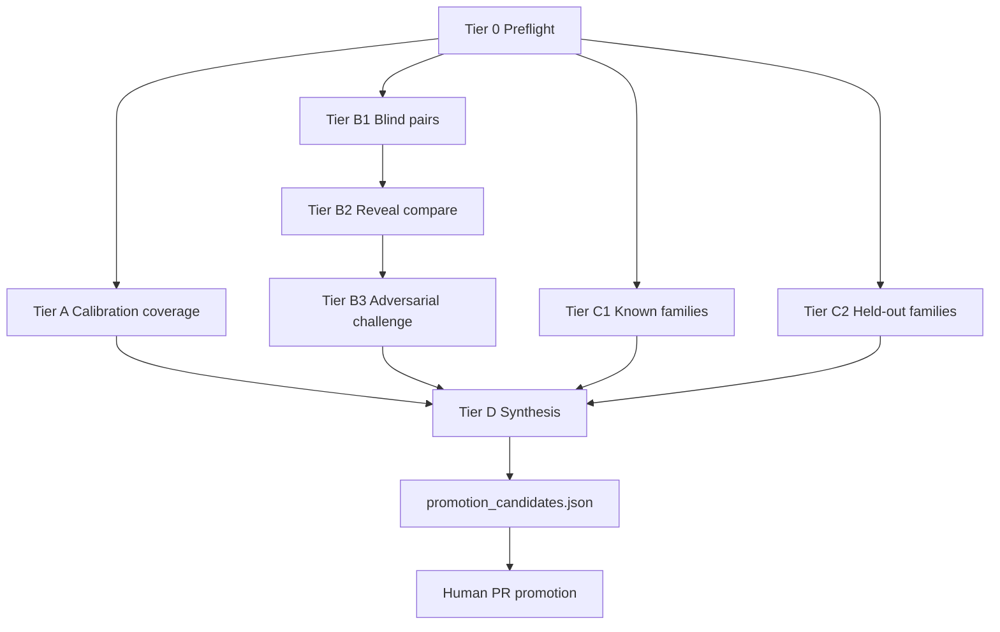

# Runbook: Loop adjudication review (LAR) v2

## Goal

Run tiered human-style reviews of loop claims (taxonomy, pairs, mechanic families), **challenge** classifications where warranted, and **propose promotions** — without turning the repository into an archive of every run.

**Evaluation execution is ephemeral. Accepted knowledge is durable.**

## Not this process

- Engineering option review → [`docs/decisions/reviews/PROCESS.md`](../decisions/reviews/PROCESS.md)
- Routine committed run trees under `eval/reviews/<timestamp>/` (deprecated)

## Two planes

| Plane | Location | Default |
|-------|----------|---------|
| Execution | `data/eval/lar/runs/<run_id>/` | gitignored, disposable |
| Knowledge | `eval/adjudications/`, `eval/calibration/`, `tests/`, `docs/`, `eval/baseline/`, `eval/reviews/promoted/` | committed via PR |



---

## Tier 0 — Preflight and provenance

**Done when:** ignored run directory exists with manifest v2.

| Step | Action |
|------|--------|
| 1 | Read `README.md`, `ROADMAP.md`, `docs/ADJUDICATION.md`, `docs/EVALUATION.md` |
| 2 | `uv sync && uv run pytest` — record pass/fail |
| 3 | Create `data/eval/lar/runs/<run_id>/` from [`eval/reviews/_template/`](../../eval/reviews/_template/) |
| 4 | Fill `manifest.json` (schema v2): engine SHA, protocol version, taxonomy/dataset hashes, blinding flags |

`run_id` format: `YYYY-MM-DD_<short-sha>`.

**Do not** copy the run directory into `eval/reviews/`. **Do not** mutate committed adjudications, calibration, code, or baselines during LAR.

---

## Tier A — Taxonomy calibration

**Question:** Do documented classes have adequate examples and usable boundaries?

| Report | Meaning |
|--------|---------|
| classes defined | 8/8 in docs |
| classes represented in calibration | rows in `eval/calibration/adjudication_cases.jsonl` |
| canonical examples | at least one `kind=canonical` per represented class |
| boundary examples | at least one `kind=boundary` per represented class |

Zero calibration rows for a class → **coverage unknown**.

Outputs: `phase-a/<class_slug>.json` + calibration gap notes.

Emit **promotion candidates** for missing boundaries (do not auto-add JSONL rows).

---

## Tier B1 — Blind pair adjudication

**Most important methodological change.**

For each pair under review, the adjudicator must **not** initially receive:

- frozen adjudication label or rationale;
- tests asserting expected class;
- previous LAR conclusions;
- current engine classification where avoidable.

Provide:

- card identity + Oracle text;
- witness/evidence under review;
- taxonomy definitions (`docs/ADJUDICATION.md`);
- applicable product definitions.

Return (per pair):

```json
{
  "proposed_class": "duplicate_or_equivalent_interaction",
  "confidence": "high",
  "rationale": "...",
  "assumptions": [],
  "rules_evidence": [],
  "alternative_plausible_class": null,
  "needs_escalation": false
}
```

Write to `phase-b/blind.jsonl` **before** reveal.

---

## Tier B2 — Reveal and compare

After blind records are frozen, reveal frozen labels and compare.

Outcomes (primary):

- `agree_high_confidence`
- `agree_low_confidence`
- `disagree`
- `taxonomy_ambiguous`
- `insufficient_evidence`

Legacy `agreement` boolean may remain for compatibility but is not the primary output.

Write merged rows to `phase-b/pairs.jsonl`.

---

## Tier B3 — Adversarial challenge

For disagreements, low-confidence agreements, taxonomy-boundary cases, and a **small sample** of obvious agreements, run a distinct challenge reviewer:

> Construct the strongest evidence-based argument that the proposed or frozen classification is wrong.

Write to `challenge/<pair_scope_id>.json`.

Parallel same-model agents are **throughput**, not statistical independence.

---

## Tier C1 — Known-family regression

Families in gold_core: `mana_tap_untap`, `token_etb_untap`, `zone_recursion_sacrifice`, `counters_damage`, `etb_damage_death`.

**Question:** Does the engine still execute known families end-to-end?

Success here is **regression evidence**, not broad generalization.

Outputs: `phase-c/<family_slug>.json`

---

## Tier C2 — Held-out generalization

Small set of real Oracle cases **deliberately excluded** from the curriculum used to implement the behavior.

**Question:** Can architecture handle semantically related but untrained cases?

Manifest which cases were held out and why in run notes. Does not block M4 unless correctness defect found.

Outputs: `phase-c2/<case_id>.json`

---

## Counterfactual controls

For important positive witnesses, test nearby negatives where practical (wrong cost reducer, missing recur ability, incompatible untap target, etc.).

Counterfactuals stay ephemeral until reviewed; strong ones promote to `eval/calibration/` or `tests/`.

---

## Tier D — Cross-tier synthesis

Task line: `[LAR-P2-SYNTH]`.

Writes:

- `synthesis.md` — human-readable; lead with evidence scope, not confidence theater
- `comparison.json` — structured signals
- `promotion_candidates.json` — routing proposals

Required sections in synthesis:

1. What changed since previous evaluation
2. Evidence scope (real vs fixture, blind vs not, families)
3. Findings (`confirmed` / `likely` / `suspected` / `unknown`)
4. Cross-tier signals — use `suspected_layer`, not definitive architecture ownership
5. **Knowledge changes** counts
6. **Coverage** counts
7. Remaining uncertainty
8. Roadmap implications (only when supported)

Example knowledge changes block:

```text
New calibration cases proposed:  2
Changed adjudications proposed:  0
New regression tests proposed:   1
Unresolved escalations:          1
```

---

## Promotion routing

| Finding | Destination |
|---------|-------------|
| Mislabeled candidate | `eval/adjudications/` |
| Taxonomy boundary | `eval/calibration/` |
| Minimal CI input | `eval/fixtures/` |
| Behavioral invariant | `tests/` |
| Compiler gap | compiler curriculum + tests |
| Certified metric change | `eval/baseline/` |
| Vocabulary / explanation | `docs/` |
| Architecture boundary | `docs/decisions/` |
| Milestone-level audit | `eval/reviews/promoted/` |
| Raw model reasoning | nowhere in Git |

LAR agents emit `promotion_candidates[]`; humans land changes via PR.

---

## Exceptional promoted packages

Only when historically important. Minimum:

```text
eval/reviews/promoted/<evidence_id>/
  summary.md
  manifest.json
  comparison.json
```

First package: [`eval/reviews/promoted/0001-m4-lar-v1/`](../../eval/reviews/promoted/0001-m4-lar-v1/).

---

## Cleanup

After promotion PRs (or explicit discard), delete `data/eval/lar/runs/<run_id>/` locally. CI may retain zipped artifacts briefly — not permanent warehouse.

---

## Agent constraints

> P1/P2 agents may **propose** promotions but may **not** mutate committed adjudications, calibration cases, engine code, or baselines during the review itself.

Use evidence discipline: `observed` | `inferred` | `suspected` | `confirmed`.

## Agent task stubs

Copy and fill paths. These labels are repo protocol for parallel LAR legs.

### Tier overview (parallelism)

| Tier | Phase | Units | Parallelism |
|------|-------|-------|-------------|
| 0 | Preflight + manifest v2 | 1 | sequential |
| A | Taxonomy calibration coverage | 8 classes | 8 `[LAR-P1-A-*]` |
| B1 | Blind pair adjudication | batches | 4 `[LAR-P1-B1-*]` |
| B2 | Reveal + compare | merge | sequential after B1 |
| B3 | Adversarial challenge | sampled + disagreements | `[LAR-P1-B3-*]` |
| C1 | Known-family regression | 5 families | 5 `[LAR-P1-C1-*]` |
| C2 | Held-out generalization | small set | optional `[LAR-P1-C2-*]` |
| D | Cross-tier synthesis | 1 | `[LAR-P2-SYNTH]` |

Run B2 after B1 freezes blind outputs. Run D after A, B3, C legs terminal.

### Blind pair batch

```
[LAR-P1-B1-batch2] LAR v2 run data/eval/lar/runs/<run_id>/.
Blind adjudicate 6 pairs — NO frozen labels before proposed_class.
Write phase-b/blind.jsonl entries only. No durable artifact edits.
```

### Synthesis

```
[LAR-P2-SYNTH] Merge LAR v2 tiers for data/eval/lar/runs/<run_id>/.
Output synthesis.md, comparison.json, promotion_candidates.json.
Include knowledge_changes and coverage sections.
```

### Partial failure

Missing P1 leg: synth marks `unverified_legs` and proceeds with partial merge.
