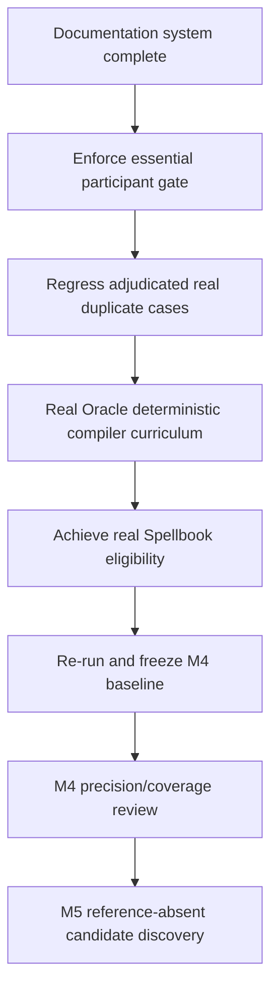

# Runbook: M4 follow-through

## Goal

Close M4 correctness and minimum real-Oracle coverage gates before starting M5. Evaluation tooling alone does not exit M4.

Current quantitative snapshot: [`../STATUS.md`](../STATUS.md). Gates: [`../../ROADMAP.md`](../../ROADMAP.md).

## Sequence



### 1. Participant enforcement ✓

**Shipped:** after a witness is built, `explore_pair` requires `VERIFIED` and `strict_two_card` before acceptance; bystander-verified sequences are skipped silently (BFS continues). Verifier physics unchanged.

**Do not:** start M5 or chase join-tuning to hide bystanders.

### 2. Regress real duplicate cases ✓

Five real-card Basalt bystander pairs are regression-locked in `tests/eval/test_classify_store.py` (must not be accepted again).

### 3. Real Oracle compiler curriculum

Gold-fixture wording is not enough. Extend deterministic patterns using unsupported Spellbook/Oracle fragments (e.g. zone-restricted returns, extra clauses on Altar/Gravecrawler-class text). Prefer the most common `compiler_unsupported` family first.

### 4. Spellbook eligibility

Target **≥1 eligible** pair from the conventional two-card sample (`eval-spellbook`, optionally `--fetch-oracle`). Recall remains undefined until `eligible > 0`.

### 5. Re-freeze baseline

Re-run gold extras + Spellbook recovery; update `eval/baseline/m4_*.json`; run:

```bash
uv run python scripts/render_status.py
uv run python scripts/render_status.py --check
```

Commit baselines and `docs/STATUS.md` together.

### 6. M4 exit → M5

Review adjudicated precision and eligibility against roadmap exit criteria. Only then begin M5 reference-absent / novel candidate work.

## Commands that matter here

| Step | Command |
| ---- | ------- |
| Gold extras / precision | `uv run mtg-loop-engine eval-gold-extras` |
| Spellbook recovery | `uv run mtg-loop-engine eval-spellbook --variants … [--fetch-oracle]` |
| Live compiler priority (local bulk) | `uv run python scripts/spellbook_compiler_priority.py` → `data/eval/compiler_priority_report.{md,json}` |
| Adjudication UI | `uv run --group eval mtg-loop-engine adjudicate-workbench` |
| Status sync | `uv run python scripts/render_status.py [--check]` |
