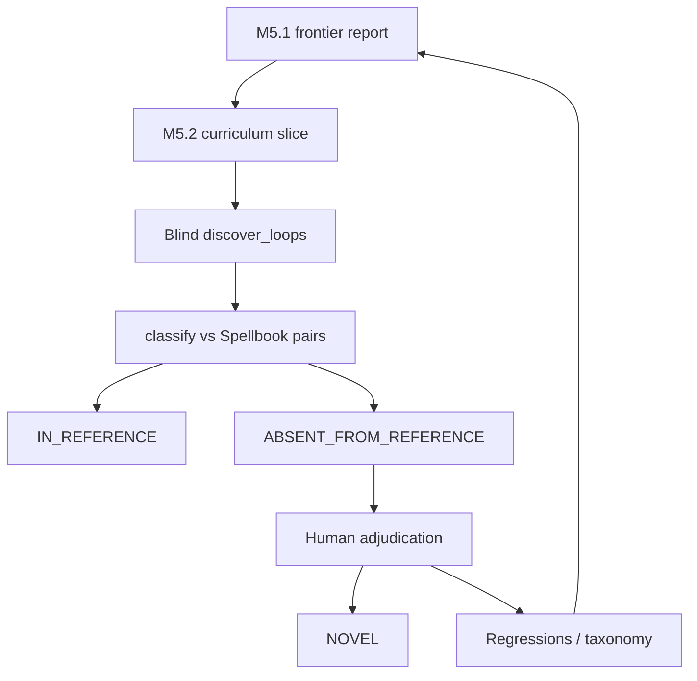

# Runbook: M5 novel / absent candidates

## Goal

Surface verified two-card discoveries among real **COMPLETE**-compiled Oracle cards, label Spellbook membership honestly, and reserve `NOVEL` for human adjudication.

Gates: [`../../ROADMAP.md`](../../ROADMAP.md). Denominators: [`../EVALUATION.md`](../EVALUATION.md). ADRs 0004 / 0005.

## Sequence



### 1. Absent-discovery labeling ✓ (path shipped)

- Library: `mtg_loop_engine.eval.reference_absent.classify_discovery_vs_reference`
- Operator: `uv run python scripts/spellbook_absent_discovery.py`
- Tests: `tests/eval/test_reference_absent.py`
- **Never** auto-set `NOVEL` from this path.

### 1b. Compiler frontier (M5.1) ✓ tool / ritual

Choose Slice 8+ from evidence, not intuition.

```bash
uv run python scripts/spellbook_compiler_priority.py
```

Live outputs (gitignored): `data/eval/compiler_priority_report.{json,md}`.

Library: `mtg_loop_engine.eval.compiler_frontier`. Ranking inputs:

| Field | Meaning |
| --- | --- |
| `distance_to_complete` | Unsupported proof-relevant fragment count |
| `gap_kind` | `pattern_existing_physics` / `reusable_new_primitive` / `substantial_rules` |
| `cards_unlocked` | Cards that become COMPLETE if that fragment closes |
| `pairs_unlocked_both_complete` | Conventional pairs that become **both-COMPLETE** (counterfactual eligibility — **not** rediscovery) |
| Tiers P0 / P1 / P2 | Coarse human decision aid; no weighted scalar score |

Staged `oracle_gaps` (Mikaeus / Saffi) appear in the report and **compete** with other gaps — no privileged sequencing.

**Curriculum PR evidence (durable trail):** paste the relevant P0/P1 rows, pair-unlock estimates, and why that gap beat nearby alternatives. Do **not** maintain a perpetually updated `frontier_latest.md`.

`--simulate-unlocks` is reserved for faithful rediscovery simulation (not implemented in M5.1).

### 2. Grow COMPLETE coverage (M5.2)

**Goal:** enlarge the pool of Spellbook-named cards that compile `COMPLETE`, so blind discovery can surface `ABSENT_FROM_REFERENCE` candidates. Do **not** optimize for Spellbook pair recall as the primary M5 metric.

#### Metrics (each curriculum PR)

1. `# COMPLETE` among Spellbook names (`spellbook_absent_discovery.py` / priority script)
2. `absent_from_reference` count from absent discovery
3. Pair `eligible` / `rediscovered` from `spellbook_compiler_priority.py` (secondary)
4. Frontier P0/P1 citation for the chosen gap

```bash
uv run python scripts/spellbook_compiler_priority.py
uv run python scripts/spellbook_absent_discovery.py
```

#### What scales

| Lever | Use when | Effect |
| ----- | -------- | ------ |
| Proof-irrelevant statics / riders | Clause does not drive modeled loop physics | Unlocks `COMPLETE` without new executor rules |
| Parameterized activated patterns | Same shape, many mana/effect variants | One pattern → many cards |

**Do not chase** the heuristic `other` family (majority of tags). Prefer frontier pair-unlock over raw fragment frequency.

**Defer early:** copy-on-ETB, extra combat, blink/exile-return, soulbond, imprint/copy — high rules cost, low reuse (usually frontier **P2**).

#### Curriculum order

1. **Aura channel** ✓ — `{C}: tap/untap enchanted creature` + irrelevant enchanted riders (Freed / Pemmin’s). Live delta: COMPLETE **17→19**.
2. **Generic activated artifacts** ✓ — Staff of Domination suite, `this artifact` untap, doesn't-untap statics, draw effect.
3. **Global ETB untap** ✓ — Intruder Alarm live wording (`untap all creatures`).
4. **Life-drain family** ✓ — Vito / Bond / Exquisite (+ Conqueror); `GAIN_LIFE` / `OPPONENT_LOSE_LIFE` triggers.
5. **Path a / slice 5 (self-starters)** ✓ — power-tap mana; ETB damage (Impact / Purphoros / Alliance); ETB untap-self; anthem/devotion/lifelink-reminder irrelevant.
6. **Path a / slice 6 (token auras)** ✓ — Presence of Gond host-tap; Enchant false-COMPLETE fix; Aphetto/Morph.
7. **Path a / slice 7 (life-untap / counter-mana)** ✓ — Famished Paladin; Village Bell-Ringer; Gyre Sage; Pestermite.
8. **Mill / graveyard feedback (slice 8)** ✓ — Mindcrank + Bloodchief Ascension; Path-b′ `seed_lose_life`; `core_bloodchief_mindcrank` gold witness. **Probe (2026-08-31):** 46 COMPLETE / 25 in_reference / 0 absent.
9. **Scaled tap-mana (slice 9)** ✓ — `ManaScaleKind` + scaled `pat_tap_add_mana`; explorer creature/elf/defender seeds; frontier P0 cluster (Bloom Tender, Sanctum Weaver, Circle of Dreams Druid, …).
10. **Frontier-driven slices (M5.2):** pick from live P0/P1; ritual below. Path **a** preference remains.
11. **Path b (Bond/Blood)** ✓ — generic life-gain seed; disclosed on witness.
12. **Path b′ (Mindcrank / Bloodchief)** ✓ — generic opponent life-loss seed (drain-sized); disclosed on witness.

#### Per-slice ritual

1. Cite frontier P0/P1 rows + pair-unlock estimate + rejected alternatives.
2. Real Oracle text → RED curriculum fixture → narrow deterministic pattern.
3. Executor primitive **only** if required (rules-evidence first).
4. Positive verify + adversarial hard negative.
5. Discovery/seam regression when search behavior changes.
6. Remeasure frontier + absent discovery; seed workbench when absences appear.

#### Life-drain bootstrap (policy)

| Path | Meaning | Status |
| ---- | ------- | ------ |
| **a** | Prefer cards/patterns that start their own loop from default BF setup | **Active** |
| **b** | Seed generic life-gain when a searched essential has `GAIN_LIFE` triggers | **Widened for Bond/Blood** — explicit seed, disclosed on witness |
| **b′** | Seed generic opponent life-loss when partner has `OPPONENT_LOSE_LIFE` → mill | **Widened for Mindcrank / Bloodchief** — `seed_lose_life`, drain-sized, disclosed |

Expand patterns deliberately with tests/docs (`AGENTS.md`).

#### Rules-evidence rails ✓

Authority and citation format: [`docs/RULES_EVIDENCE.md`](../RULES_EVIDENCE.md). Skill: [`.agents/skills/rules-evidence/`](../../.agents/skills/rules-evidence/). Use before curriculum slices that need **new modeled physics** (executor primitives, not just patterns).

### 3. Adjudicate absences (M5.3 — continuous)

Trigger after every meaningful curriculum/physics PR (COMPLETE growth, new verified discoveries, or proof-relevant executor/compiler changes):

1. `uv run python scripts/spellbook_absent_discovery.py --persist-workbench`
2. `uv run --group eval mtg-loop-engine adjudicate-workbench`
3. Sidebar corpus → `spellbook_absent`, review state → `unreviewed`.
4. Apply [`docs/ADJUDICATION.md`](../ADJUDICATION.md). Upgrade `ABSENT_FROM_REFERENCE` → `NOVEL` only with a human record. Keep `NOVEL` out of the precision denominator.

Absences are curriculum: finite / bystander / illegal activation failures feed the next frontier pass and should become regressions at the lowest useful layer.

### 4. Optional metric freeze / M5.4 exit

Only when intentionally certifying absent-discovery counts: write a baseline under `eval/baseline/`, refresh STATUS, document the sample in the baseline README.

M5 exit also requires the checklist in [`ROADMAP.md`](../../ROADMAP.md) (reproducible pipeline, absences disposed, no known high-priority false `VERIFIED`). Novel combo is **not** required. Coverage floor stays **92%** until a classified miss inventory + contract tests support raising it.

## Commands

| Step | Command |
| ---- | ------- |
| Absent discovery (local bulk) | `uv run python scripts/spellbook_absent_discovery.py` |
| Seed absences into workbench | `uv run python scripts/spellbook_absent_discovery.py --persist-workbench` |
| Compiler priority | `uv run python scripts/spellbook_compiler_priority.py` |
| Adjudication UI | `uv run --group eval mtg-loop-engine adjudicate-workbench` |
| Status check | `uv run python scripts/render_status.py --check` |

## Do not

- Feed Spellbook pair labels into search.
- Treat absence as a false positive or auto-`NOVEL`.
- Tighten joins solely to hide absences.
- Scaffold deferred M6/M7/LLM/`VERIFIED`-path work.
