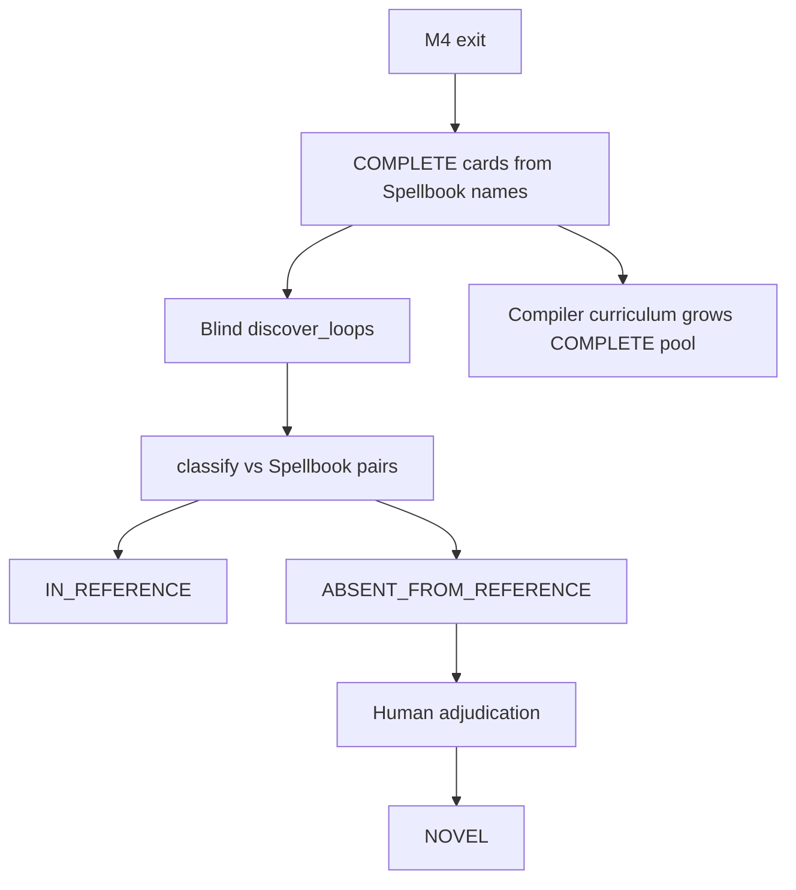

# Runbook: M5 novel / absent candidates

## Goal

Surface verified two-card discoveries among real **COMPLETE**-compiled Oracle cards, label Spellbook membership honestly, and reserve `NOVEL` for human adjudication.

Gates: [`../../ROADMAP.md`](../../ROADMAP.md). Denominators: [`../EVALUATION.md`](../EVALUATION.md). ADRs 0004 / 0005.

## Sequence



### 1. Absent-discovery labeling ✓ (path shipped)

- Library: `mtg_loop_engine.eval.reference_absent.classify_discovery_vs_reference`
- Operator: `uv run python scripts/spellbook_absent_discovery.py`
- Tests: `tests/eval/test_reference_absent.py`
- **Never** auto-set `NOVEL` from this path.

### 2. Grow COMPLETE coverage

**Goal:** enlarge the pool of Spellbook-named cards that compile `COMPLETE`, so blind discovery can surface `ABSENT_FROM_REFERENCE` candidates. Do **not** optimize for Spellbook pair recall as the primary M5 metric.

#### Metrics (each curriculum PR)

1. `# COMPLETE` among Spellbook names (`spellbook_absent_discovery.py` / priority script)
2. `absent_from_reference` count from absent discovery
3. Pair `eligible` / `rediscovered` from `spellbook_compiler_priority.py` (secondary)

```bash
uv run python scripts/spellbook_compiler_priority.py
uv run python scripts/spellbook_absent_discovery.py
```

#### What scales

| Lever | Use when | Effect |
| ----- | -------- | ------ |
| Proof-irrelevant statics / riders | Clause does not drive modeled loop physics | Unlocks `COMPLETE` without new executor rules |
| Parameterized activated patterns | Same shape, many mana/effect variants | One pattern → many cards |

**Do not chase** the heuristic `other` family (majority of tags). Prefer concrete fragment counts.

**Defer early:** copy-on-ETB, extra combat, blink/exile-return, soulbond, imprint/copy — high rules cost, low reuse.

#### Curriculum order

1. **Aura channel** ✓ — `{C}: tap/untap enchanted creature` + irrelevant enchanted riders (Freed / Pemmin’s). Live delta: COMPLETE **17→19**.
2. **Generic activated artifacts** ✓ — Staff of Domination suite, `this artifact` untap, doesn't-untap statics, draw effect.
3. **Global ETB untap** ✓ — Intruder Alarm live wording (`untap all creatures`).
4. **Life-drain family** ✓ — Vito / Bond / Exquisite (+ Conqueror); `GAIN_LIFE` / `OPPONENT_LOSE_LIFE` triggers.
5. **Path a / slice 5 (self-starters)** ✓ — power-tap mana; ETB damage (Impact / Purphoros / Alliance); ETB untap-self; anthem/devotion/lifelink-reminder irrelevant.
6. **Path a (continue):** further self-starting COMPLETE unlocks until `absent_from_reference > 0` is routine.
7. **Path b (deferred):** generic life-gain seed for `GAIN_LIFE` trigger cards — see ROADMAP M5; do not implement without an explicit widen.

#### Life-drain bootstrap (policy)

| Path | Meaning | Status |
| ---- | ------- | ------ |
| **a** | Prefer cards/patterns that start their own loop from default BF setup | **Active** |
| **b** | Seed generic life-gain (or a one-shot life event) when a searched essential has `GAIN_LIFE` triggers | **Deferred on ROADMAP** — ADR 0002 fodder-shaped; widens discovery for Bond/Exquisite without a third card |

Each slice: real-Oracle curriculum fixtures → RED/GREEN tests → remeasure → ship. Expand patterns deliberately with tests/docs (`AGENTS.md`).

#### Rules-evidence rails

Before a curriculum slice needs **new modeled physics** (executor primitives, not just patterns), land the supporting rails listed under ROADMAP M5 remaining #2: `AGENTS.md` principle, thin Cursor rule + skill, and `docs/RULES_EVIDENCE.md`. Memory may hypothesize; Oracle / CR / rulings decide; Spellbook stays discovery-only.

### 3. Adjudicate absences

Use the workbench / adjudication JSONL. Upgrade `ABSENT_FROM_REFERENCE` → `NOVEL` only with a human record. Keep `NOVEL` out of the precision denominator.

### 4. Optional metric freeze

Only when intentionally certifying absent-discovery counts: write a baseline under `eval/baseline/`, refresh STATUS, document the sample in the baseline README.

## Commands

| Step | Command |
| ---- | ------- |
| Absent discovery (local bulk) | `uv run python scripts/spellbook_absent_discovery.py` |
| Compiler priority | `uv run python scripts/spellbook_compiler_priority.py` |
| Adjudication UI | `uv run --group eval mtg-loop-engine adjudicate-workbench` |
| Status check | `uv run python scripts/render_status.py --check` |

## Do not

- Feed Spellbook pair labels into search.
- Treat absence as a false positive or auto-`NOVEL`.
- Tighten joins solely to hide absences.
- Scaffold deferred M6/M7/LLM/`VERIFIED`-path work.
