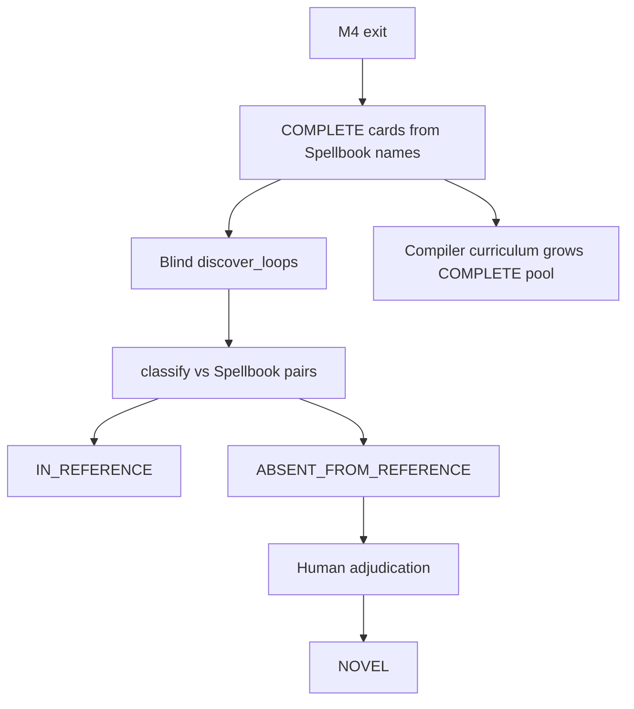

# Runbook: M5 novel / absent candidates

## Goal

Surface verified two-card discoveries among real **COMPLETE**-compiled Oracle cards, label Spellbook membership honestly, and reserve `NOVEL` for human adjudication.

Gates: [`../../ROADMAP.md`](../../ROADMAP.md). Denominators: [`../EVALUATION.md`](../EVALUATION.md). ADRs 0004 / 0005.

## Sequence



### 1. Absent-discovery labeling ✓ (path shipped)

- Library: `mtg_loop_engine.eval.reference_absent.classify_discovery_vs_reference`
- Operator: `uv run python scripts/spellbook_absent_discovery.py`
- Tests: `tests/eval/test_reference_absent.py`
- **Never** auto-set `NOVEL` from this path.

### 2. Grow COMPLETE coverage

Prefer highest-pressure unsupported fragments from:

```bash
uv run python scripts/spellbook_compiler_priority.py
```

Expand patterns deliberately with tests/docs (AGENTS.md deliberate coverage growth).

### 3. Adjudicate absences

Use the workbench / adjudication JSONL. Upgrade `ABSENT_FROM_REFERENCE` → `NOVEL` only with a human record. Keep `NOVEL` out of the precision denominator.

### 4. Optional metric freeze

Only when intentionally certifying absent-discovery counts: write a baseline under `eval/baseline/`, refresh STATUS, document the sample in the baseline README.

## Commands

| Step | Command |
| ---- | ------- |
| Absent discovery (local bulk) | `uv run python scripts/spellbook_absent_discovery.py` |
| Compiler priority | `uv run python scripts/spellbook_compiler_priority.py` |
| Adjudication UI | `uv run --group eval mtg-loop-engine adjudicate-workbench` |
| Status check | `uv run python scripts/render_status.py --check` |

## Do not

- Feed Spellbook pair labels into search.
- Treat absence as a false positive or auto-`NOVEL`.
- Tighten joins solely to hide absences.
- Scaffold deferred M6/M7/LLM/`VERIFIED`-path work.
