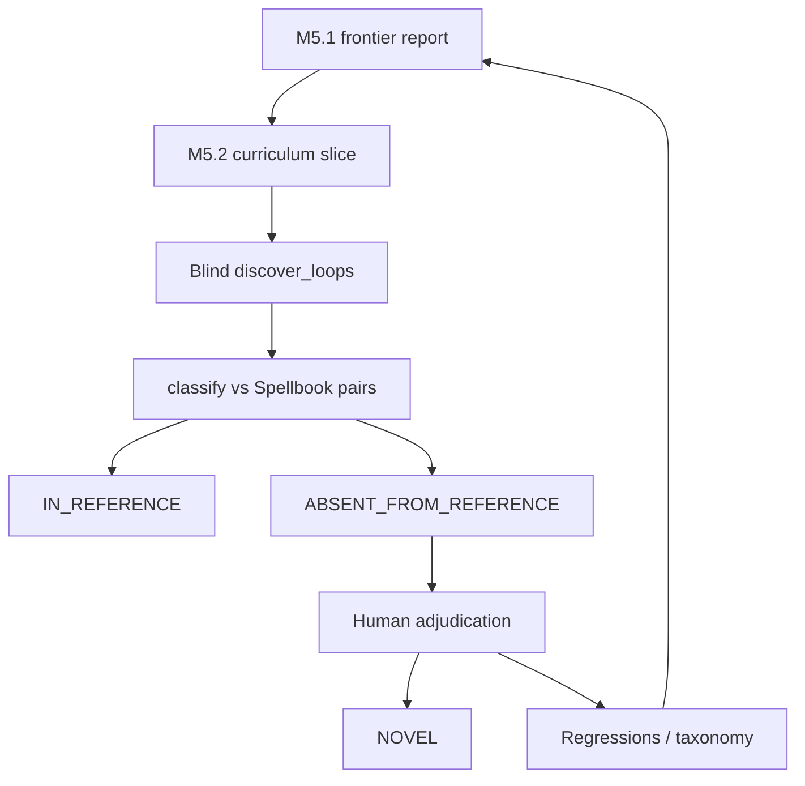

# Runbook: M5 novel / absent candidates

## Goal

Surface verified two-card discoveries among real **COMPLETE**-compiled Oracle cards, label Spellbook membership honestly, and reserve `NOVEL` for human adjudication.

Gates: [`../../ROADMAP.md`](../../ROADMAP.md). Denominators: [`../EVALUATION.md`](../EVALUATION.md). ADRs 0004 / 0005.

## Sequence



### 1. Absent-discovery labeling ✓ (path shipped)

- Library: `mtg_loop_engine.eval.reference_absent.classify_discovery_vs_reference`
- Operator: `uv run python scripts/spellbook_absent_discovery.py`
- Tests: `tests/eval/test_reference_absent.py`
- **Never** auto-set `NOVEL` from this path.

### 1b. Compiler frontier (M5.1) ✓ tool / ritual

Choose Slice 8+ from evidence, not intuition.

```bash
uv run python scripts/spellbook_compiler_priority.py
```

Live outputs (gitignored): `data/eval/compiler_priority_report.{json,md}`.

Library: `mtg_loop_engine.eval.compiler_frontier`. Ranking inputs:

| Field | Meaning |
| --- | --- |
| `distance_to_complete` | Unsupported proof-relevant fragment count |
| `gap_kind` | `pattern_existing_physics` / `reusable_new_primitive` / `substantial_rules` |
| `cards_unlocked` | Cards that become COMPLETE if that fragment closes |
| `pairs_unlocked_both_complete` | Conventional pairs that become **both-COMPLETE** (counterfactual eligibility — **not** rediscovery) |
| Tiers P0 / P1 / P2 | Coarse human decision aid; no weighted scalar score |

Staged `oracle_gaps` (Mikaeus / Saffi) appear in the report and **compete** with other gaps — no privileged sequencing.

**Curriculum PR evidence (durable trail):** paste the relevant P0/P1 rows, pair-unlock estimates, and why that gap beat nearby alternatives. Do **not** maintain a perpetually updated `frontier_latest.md`.

`--simulate-unlocks` is reserved for faithful rediscovery simulation (not implemented in M5.1).

### 2. Grow COMPLETE coverage (M5.2)

**Goal:** enlarge the pool of Spellbook-named cards that compile `COMPLETE`, so blind discovery can surface `ABSENT_FROM_REFERENCE` candidates. Do **not** optimize for Spellbook pair recall as the primary M5 metric.

#### Metrics (each curriculum PR)

1. `# COMPLETE` among Spellbook names (`spellbook_absent_discovery.py` / priority script)
2. `absent_from_reference` count from absent discovery
3. Pair `eligible` / `rediscovered` from `spellbook_compiler_priority.py` (secondary)
4. Frontier P0/P1 citation for the chosen gap

```bash
uv run python scripts/spellbook_compiler_priority.py
uv run python scripts/spellbook_absent_discovery.py
```

#### What scales

| Lever | Use when | Effect |
| ----- | -------- | ------ |
| Proof-irrelevant statics / riders | Clause does not drive modeled loop physics | Unlocks `COMPLETE` without new executor rules |
| Parameterized activated patterns | Same shape, many mana/effect variants | One pattern → many cards |

**Do not chase** the heuristic `other` family (majority of tags). Prefer frontier pair-unlock over raw fragment frequency.

**Defer early:** copy-on-ETB, extra combat, blink/exile-return, soulbond, imprint/copy — high rules cost, low reuse (usually frontier **P2**).

#### Curriculum order

1. **Aura channel** ✓ — `{C}: tap/untap enchanted creature` + irrelevant enchanted riders (Freed / Pemmin’s). Live delta: COMPLETE **17→19**.
2. **Generic activated artifacts** ✓ — Staff of Domination suite, `this artifact` untap, doesn't-untap statics, draw effect.
3. **Global ETB untap** ✓ — Intruder Alarm live wording (`untap all creatures`).
4. **Life-drain family** ✓ — Vito / Bond / Exquisite (+ Conqueror); `GAIN_LIFE` / `OPPONENT_LOSE_LIFE` triggers.
5. **Path a / slice 5 (self-starters)** ✓ — power-tap mana; ETB damage (Impact / Purphoros / Alliance); ETB untap-self; anthem/devotion/lifelink-reminder irrelevant.
6. **Path a / slice 6 (token auras)** ✓ — Presence of Gond host-tap; Enchant false-COMPLETE fix; Aphetto/Morph.
7. **Path a / slice 7 (life-untap / counter-mana)** ✓ — Famished Paladin; Village Bell-Ringer; Gyre Sage; Pestermite.
8. **Mill / graveyard feedback (slice 8)** ✓ — Mindcrank + Bloodchief Ascension; Path-b′ `seed_lose_life`; `core_bloodchief_mindcrank` gold witness. **Probe (2026-08-31):** 46 COMPLETE / 25 in_reference / 0 absent.
9. **Scaled tap-mana (slice 9)** ✓ — `ManaScaleKind` + scaled `pat_tap_add_mana`; explorer creature/elf/defender seeds; frontier P0 cluster (Bloom Tender, Sanctum Weaver, Circle of Dreams Druid, …). **Probe (post–slice 9):** 54 COMPLETE / 30 in_reference / 0 absent.
10. **Equipment {Q} (slice 10)** ✓ — Umbral Mantle `UntapSymbolCost` + `pat_equipped_untap_pump`; host-tapped target in explorer; frontier P1 (**8** pair unlocks vs Mana Reflection **4**).
11. **Tap-mana multiplier (slice 11)** ✓ — `ReplacementMultiplyTapMana` (2× / 3×); Mana Reflection + Nyxbloom Ancient; frontier P1 (**4** pair unlocks each).
12. **+1/+1 amplify (slice 12)** ✓ — Kami of Whispered Hopes `ReplacementAmplifyP1P1Counters` + power-scaled any-color mana; frontier P0 (**4** pair unlocks). Rejected Storm Herd (**5**, one-shot) and deferred Wirewood Channeler (**2**, elf any-color sibling).
13. **Life→counter auras (slice 13)** ✓ — Light of Promise / Sunbond; granted `GAIN_LIFE` → that-many p1p1 on enchanted host; frontier P0 (**2** / **3** unlocks). Ballista rediscovery uses physics lifelink seed when the pair is not both gold `ORACLE_EXACT`.
14. **Life→each-creature counters (slice 14)** ✓ — Archangel of Thune; `each_controlled_creature` p1p1 on `GAIN_LIFE`.
15. **ETB→each-creature counters (slice 15)** ✓ — Cathars' Crusade; controlled-creature ETB → each creature p1p1.
16. **Human ETB + power mana (slice 16)** ✓ — Heronblade Elite; `other_controlled_human` → self p1p1 + power tap. Deferred Ivy Lane (green color filter).
17. **Mana-activated token create (slice 17)** ✓ — Sliver Queen `{2}: create token`; Queen+Ashnod seed-token bootstrap. Deferred Wirewood (near-duplicate of slice 9).
18. **Dies→life=toughness (slice 18)** ✓ — South Wind Avatar; DIES amount from toughness + fixed drain on gain life.
19. **ETB bounce (slices 19–20)** ✓ — Shrieking Drake / Whitemane Lion; bounce to hand. Rediscovery via slices 24–25 cast-from-hand.
20. **Green ETB counters (slice 21)** ✓ — Ivy Lane Denizen; creature `colors` + `other_controlled_green`.
21. **Enchanted-artifact cost reduction (slice 22)** ✓ — Power Artifact −{2} activate (floor 1).
22. **Untap→mill (slice 23)** ✓ — Mesmeric Orb; permanent untap mills controller.
23. **Cast-from-hand + Instant grant bounce (slices 24–25)** ✓ — `cast_from_hand` + Aluren free cast MV≤3 (Drake/Lion rediscovery); Banishing Knack / Retraction Helix Instant grant `{T}`: bounce nonland (Alarm rediscovery with mana-dork seeds). Wirewood deferred.
24. **Bounce target variants (slices 26–28)** ✓ — Fleetfoot Panther (G/W), Dream Stalker (permanent), Ancestral Statue (controlled nonland).
25. **Activated / type-share bounce (slices 29–30)** ✓ — Temur Sabertooth paid bounce-other (indestructible rider proof-irrelevant) + Bell-Ringer; Cloudstone Curio nonartifact ETB → bounce sharing a permanent type + Aluren. **Tidespout Tyrant deferred** (needs `TriggerEvent.CAST` + non-creature cast/rock path).
26. **Mana Echoes (slice 32)** ✓ — creature ETB → `{C}` × controlled sharing creature type; Sliver Queen rediscovery (`{2}` mana seed).
27. **Earthcraft + Wirewood (slices 33–34)** ✓ — Earthcraft tap-creature → untap basic land (hold priority with Drake); Wirewood battlefield-Elf any-color (Staff rediscovery).
28. **Squirrel Nest (slice 35)** ✓ — enchanted-land `{T}`: create Squirrel (`TapCost.host="land"`); Earthcraft rediscovery. Deferred Patrol Signaler (`{Q}` create) / Quillspike (−1/−1 remove); Storm Herd rejected (one-shot).
29. **Patrol Signaler + Quillspike (slices 36–37)** ✓ — Signaler `{1}{W}{Q}` create + Earthcraft/Plains double-tap; Quillspike hybrid remove-m1m1 + Devoted Druid (0/2 printed P/T). Storm Herd still rejected.
30. **Shalai and Hallar (slice 38)** ✓ — COUNTER_ADDED → that-much damage; Heliod rediscovery. Archangel COMPLETE unlock without short explorer close.
31. **Squirrel Girl (slice 39)** ✓ — ETB create (attacks not modeled) + mana create X=Squirrels; Altar rediscovery. Ability-word split accepts Marvel-style names.
32. **Shard of the Nightbringer (slice 40)** ✓ — ETB intervening-if cast + half-life drain (`Permanent.was_cast`); Vito/Bond COMPLETE unlock. Two-card rediscovery deferred (needs bounce/recast).
33. **Tidespout Tyrant (slice 41)** ✓ — `TriggerEvent.CAST` bounce target permanent; artifact `cast_from_hand`; Sol Ring rediscovery (mana abilities while holding priority).
34. **Gap Inventory campaign (M5.2 Slice 42+):** durable backlog
    [`../decisions/reviews/m5-gap-inventory.md`](../decisions/reviews/m5-gap-inventory.md)
    (CLOSE_NOW / CLOSE_BUILD / REJECT / OOS; autonomous IR-family PRs; end cleanup).
    Path **a** preference remains; cite live P0/P1. Walk the inventory’s first undone
    epic — do not chase singleton curriculum rank (Storm Herd stays REJECT). Ritual below.
35. **E01 gated tap-mana** ✓ — metalcraft / ferocious gates; Metalworker hand-artifact scale;
    Omen Hawker spend-only activate pool; Supportive Parents tap-two; Staff/Freed rediscovery.
36. **E02–E03 reflect + token×2** ✓ — `TriggerEvent.DEALT_DAMAGE` reflect family; Parallel Lives /
    Anointed Procession `ReplacementDoubleTokens`.
37. **E04–E05 draw triggers + Curiosity** ✓ — `TriggerEvent.DRAW` effect family; Curiosity auras on
    `DAMAGE_OPPONENT`.
38. **E06–E07 grants + Krenko** ✓ — `GrantActivatedAbility` (Cryptolith/Basal/Mentor); Krenko
    `{T}` X=Goblins + Intruder Alarm rediscovery.
39. **E08 half-library mill** ✓ — `MillEffect.half_library` + synthetic `library_*` sizes;
    `TriggerEvent.ATTACKS`; Traumatize / Fleet Swallower class.
40. **E09 Aetherflux** ✓ — cast → life per `events.cast`; `PayLifeCost` → damage; compiler
    splits `Pay ` ability lines.
41. **E10 multi land untap** ✓ — `UntapEffect.controlled_lands` + quantity (Drake/Palinchron/
    Argothian); bounce-self; Cycling proof-irrelevant split.
42. **E11 scaled mana remainders** ✓ — swamp-count / greatest power-toughness / drawn /
    entered-this-turn mana scales; Partner irrelevant.
43. **E12 cast-trigger family** ✓ — CAST filters (creature/noncreature/colorless/red) →
    mana/life/p1p1/damage; Birgi/Animar/Steam-Kin/Vivi/Forsaken.
44. **E13a self-ETB scaled** ✓ — power damage, devotion damage/drain, artifact-count draw
    (Redcap / Fanatic / Gary / Edgar); Persist split.
45. **E14 dies-trigger payoffs** ✓ — Treasure / untap / Spirit / Blood Artist / Spawn.
46. **E16 sac-outlet payoffs** ✓ — Bombardment / Altar / Golem / Ayara; `last_sacrificed_power`.
47. **E17 scaled mill** ✓ — Keening GY-count; Mindcrank scaled; Bruvac `ReplacementDoubleMill`.
48. **E18 GY→hand** ✓ — Witness/Archaeomancer/Salvagers/Renewal; `ReturnFromGraveyardToHandEffect`.
49. **E19–E21 bounce/counters/proliferate** ✓ — bounce-as-cost (Quirion/Wirewood/Meloku),
    `ReplacementDoubleCounters` (Doubling Season / Primal Vigor), `ProliferateEffect` (Viral Drake).
50. **Path b (Bond/Blood)** ✓ — generic life-gain seed; disclosed on witness.
51. **Path b′ (Mindcrank / Bloodchief)** ✓ — generic opponent life-loss seed (drain-sized); disclosed on witness.

#### Per-slice ritual

1. Cite frontier P0/P1 rows + pair-unlock estimate + rejected alternatives.
2. Real Oracle text → RED curriculum fixture → narrow deterministic pattern.
3. Executor primitive **only** if required (rules-evidence first).
4. Positive verify + adversarial hard negative.
5. Discovery/seam regression when search behavior changes.
6. Remeasure frontier + absent discovery; seed workbench when absences appear.
7. **Sibling check (hygiene):** if the slice adds a compound subject filter, mana-scale
   arm, or color observation path that duplicates an existing sibling (e.g. Human vs
   green ETB filters), prefer a shared helper now; schedule a structured predicate /
   parameterized pattern family only when this is the **third** copy or the frontier
   needs token colors/subtypes. Do not open a wholesale de-hardcode PR without
   pair-unlock evidence (`ROADMAP.md` §2b).

#### Consistency hygiene (opportunistic)

Not an M5 Slice epic. Keeps witness construction, disclosure, and IR filters aligned
without scaffolding full Comprehensive Rules (ADR 0006).

| Follow-through | When | Owner packages |
| --- | --- | --- |
| Document three color models | Docs hygiene (shipped with this note) | `rules/`, `search/` READMEs |
| Shared subtype/color helpers | When next touching `_queue_triggers` / mana-scale filters | `rules/` |
| Merge Path-b `seed_*` into `analyze_prerequisites` disclosure | ✓ shipped | `eval/classify`, `search/explorer` |
| Structured `TriggeredAbility` subject predicates | Third sibling filter (Elf / white / …) | `semantics/ir`, patterns, executor |
| Token create carries colors + subtypes | Frontier pair needs colored/typed ETB filters | patterns → IR → executor → seeds |

**Three color models** (do not conflate):

1. **Payment** — `ManaAmount.any_color` may pay W/U/B/R/G; generic cannot pay colored.
2. **Permanent / card colors** — `Permanent.colors` / `CardSemantics.colors` (Ivy Lane).
3. **Vivid / devotion proxies** — inferred from activated-cost mana symbols today; not the same as (2).

**Intentional (not debt):** explorer category seeds (creature/elf/defender fodder, Path-b
life/token seeds, Queen+Altar bootstrap); `seed_grant_lifelink` quarantine; search-only
participant gate.

#### Life-drain bootstrap (policy)

| Path | Meaning | Status |
| ---- | ------- | ------ |
| **a** | Prefer cards/patterns that start their own loop from default BF setup | **Active** |
| **b** | Seed generic life-gain when a searched essential has `GAIN_LIFE` triggers | **Widened for Bond/Blood** — explicit seed, disclosed on witness |
| **b′** | Seed generic opponent life-loss when partner has `OPPONENT_LOSE_LIFE` → mill | **Widened for Mindcrank / Bloodchief** — `seed_lose_life`, drain-sized, disclosed |

Expand patterns deliberately with tests/docs (`AGENTS.md`).

#### Rules-evidence rails ✓

Authority and citation format: [`docs/RULES_EVIDENCE.md`](../RULES_EVIDENCE.md). Skill: [`.agents/skills/rules-evidence/`](../../.agents/skills/rules-evidence/). Use before curriculum slices that need **new modeled physics** (executor primitives, not just patterns).

### 3. Adjudicate absences (M5.3 — continuous)

Trigger after every meaningful curriculum/physics PR (COMPLETE growth, new verified discoveries, or proof-relevant executor/compiler changes):

1. `uv run python scripts/spellbook_absent_discovery.py --persist-workbench`
2. `uv run --group eval mtg-loop-engine adjudicate-workbench`
3. Sidebar corpus → `spellbook_absent`, review state → `unreviewed`.
4. Apply [`docs/ADJUDICATION.md`](../ADJUDICATION.md). Upgrade `ABSENT_FROM_REFERENCE` → `NOVEL` only with a human record. Keep `NOVEL` out of the precision denominator.

**DuckDB lock:** if Streamlit workbench is already running, stop it (Ctrl+C in that terminal — closing the browser tab is not enough) before `--persist-workbench`, or persist to a scratch `--db` path and re-run without `--db` after restart so the main store upserts.

#### Current queue (remeasured post–waves + M5.3 batch)

Probe: **88** COMPLETE · **95** verified · **73** in_reference · **22** absent (post–classify zone-assumption fix refresh). Workbench `spellbook_absent`: **22** unique pairs persisted.

| Adjudication | Count | Notes |
| --- | ---: | --- |
| `valid_generic_prerequisite` | 21 | Scaled mana / dork / grant / Temur / Wirewood / Alarm / Shalai life seeds |
| `valid_strict_two_card` | 1 | Aluren + Dream Stalker (no generics; `repeatable_event` self-bounce; keep `ABSENT_FROM_REFERENCE`) |
| `duplicate_or_equivalent_interaction` | 2 | Basalt/Impact + Gond bystanders (prior) |
| `needs_rules_research` | 1 | Warleader's Call + Gond (prior) |

Keep `ABSENT_FROM_REFERENCE` (not `NOVEL`). Run `--persist-workbench` after each curriculum PR.

**Wave 1 recovery note:** `join_reasons` for bounce/free-cast/grant existed, but `InteractionIndex._complement_ids` omitted those tags → Spellbook `join_miss`. Fix + Drake/Alarm mana-dork seeds + recovery `max_depth` 12.

Absences are curriculum: finite / bystander / illegal activation failures feed the next frontier pass and should become regressions at the lowest useful layer.

### 4. Optional metric freeze / M5.4 exit

Only when intentionally certifying absent-discovery counts: write a baseline under `eval/baseline/`, refresh STATUS, document the sample in the baseline README.

M5 exit also requires the checklist in [`ROADMAP.md`](../../ROADMAP.md) (reproducible pipeline, absences disposed, no known high-priority false `VERIFIED`). Novel combo is **not** required. Coverage floor stays **92%** until a classified miss inventory + contract tests support raising it.

## Commands

| Step | Command |
| ---- | ------- |
| Absent discovery (local bulk) | `uv run python scripts/spellbook_absent_discovery.py` |
| Seed absences into workbench | `uv run python scripts/spellbook_absent_discovery.py --persist-workbench` |
| Compiler priority | `uv run python scripts/spellbook_compiler_priority.py` |
| Adjudication UI | `uv run --group eval mtg-loop-engine adjudicate-workbench` |
| Status check | `uv run python scripts/render_status.py --check` |

## Do not

- Feed Spellbook pair labels into search.
- Treat absence as a false positive or auto-`NOVEL`.
- Tighten joins solely to hide absences.
- Scaffold deferred M6/M7/LLM/`VERIFIED`-path work.
- Open a wholesale “de-hardcode witness/oracle / full color-query” epic without frontier
  pair-unlock evidence (ADR 0006 / `ROADMAP.md` §2b).
