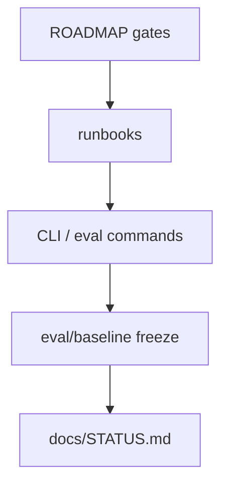

# runbooks

## Purpose

Ordered engineering playbooks for milestone follow-through. Narratives and gates live in `ROADMAP.md` and `docs/`; runbooks spell the next concrete sequence without dumping volatile metrics.

## What belongs here

- Milestone follow-through sequences (M4 historical; **M5** active — novel / absent candidates)
- Operator checklists that point at CLI commands and baseline refresh steps

## What does not belong here

- Frozen quantitative status (see [`../STATUS.md`](../STATUS.md))
- ADR-style durable decisions (see [`../decisions/`](../decisions/))

## Context

