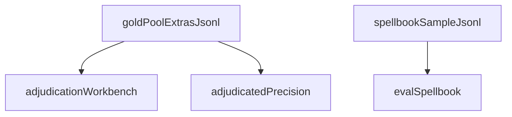

# eval

## Purpose

Committed M4 evaluation metadata: small Spellbook-shaped fixtures, gold-pool extra adjudications, and frozen baseline summaries. Working DuckDB files stay gitignored under `data/eval/`.

## Context

## What belongs here

- `adjudications/gold_pool_extras.jsonl`: persisted extras plus human adjudications
- `fixtures/spellbook_conventional_sample.jsonl`: tiny conventional two-card rows for tests/CI
- `baseline/m4_gold_pool_summary.json`: post-adjudication distribution of gold-pool extras
- `baseline/m4_spellbook_recovery_summary.json`: conventional two-card Spellbook recovery (eligible-only recall)

## What does not belong here

- Scryfall Oracle bulk JSON
- Full Spellbook snapshots (see gitignored `data/spellbook/`)
- The M7 explorer
