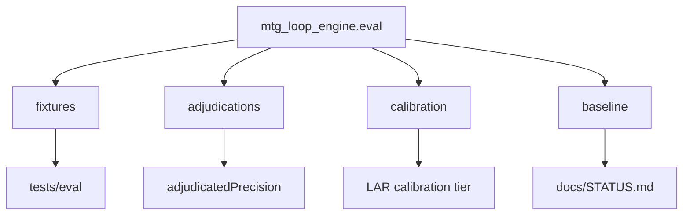

# eval

## Purpose

Committed M4 **evaluation knowledge**: fixtures, observed adjudications, taxonomy calibration, frozen baselines, and exceptional promoted review evidence.

Ordinary LAR execution stays under gitignored `data/eval/lar/runs/`. Working DuckDB files stay under `data/eval/`. Library code lives in `src/mtg_loop_engine/eval/`.

## Role in pipeline

Package `mtg_loop_engine.eval` writers/readers → **THIS (artifacts)** → CI tests, `docs/STATUS.md`, human review.

## Inputs

- Outputs of `eval-gold-extras`, `eval-spellbook`, and adjudication workbench persistence

## Outputs

| Path | Role |
| --- | --- |
| `fixtures/` | Tiny conventional Spellbook JSONL for CI |
| `adjudications/` | Observed extras + human labels (what engine produced) |
| `calibration/` | Curated taxonomy boundary cases (what classes mean) |
| `baseline/` | Certified M4 metric snapshots |
| `reviews/promoted/` | Exceptional LAR evidence packages only |

## Responsibilities

- Keep committed evaluation artifacts reviewable and CI-stable.
- Separate **reference recovery** baselines from **human-adjudicated precision** baselines.
- Separate **observed adjudications** from **calibration** cases.
- Keep ephemeral LAR runs under gitignored `data/eval/lar/runs/`.

### Measurement split

| Instrument | Question | Spellbook absence |
| --- | --- | --- |
| Reference recovery | Eligible/supported rediscovery | N/A (eligible denominator) |
| Adjudicated precision | Valid among `ORACLE_EXACT`×`ORACLE_EXACT` accepted discoveries | `ABSENT_FROM_REFERENCE` (label; adjudicate class separately) |

Prefer numbers in `baseline/*.json` over narrative elsewhere.

## Boundaries

| Concern | Owner |
| --- | --- |
| Scryfall Oracle bulk JSON | gitignored `data/` |
| Full Spellbook snapshots | `data/spellbook/` |
| Engine implementation | `src/mtg_loop_engine/` |
| M7 explorer | Deferred (`ROADMAP.md`) |

## Core invariants

- SYNTHETIC / divergent pairs are inventory (not product precision); denominator is `ORACLE_EXACT`×`ORACLE_EXACT` (ADR 0007).
- Baselines are distribution records for STATUS and regression, not join-tuning targets.
- CI uses fixtures with network-free runs.

## Main entry points

- Consumed by `tests/eval/`, `scripts/render_status.py`, and docs status checks
- Produced via CLI eval commands (see [`docs/CLI.md`](../docs/CLI.md))

## Data contracts

JSON/JSONL schemas aligned with `mtg_loop_engine.eval.schema` and metrics summary shapes.

## Failure behavior

Tests fail if sample recovery or extras↔adjudication coverage regresses. STATUS check fails if prose drifts from baselines.

## Testing

`tests/eval/test_spellbook_eval.py`, fixture-detection tests, gold-extra coverage.

## Extension guide

Regenerate baselines deliberately (see `baseline/README.md`). When re-reviewing extras, update adjudications with the new human judgment.

## Bigger-picture relationship

Artifact half of M4. Code half: [`../src/mtg_loop_engine/eval/README.md`](../src/mtg_loop_engine/eval/README.md). Architecture: [`docs/ARCHITECTURE.md`](../docs/ARCHITECTURE.md).
