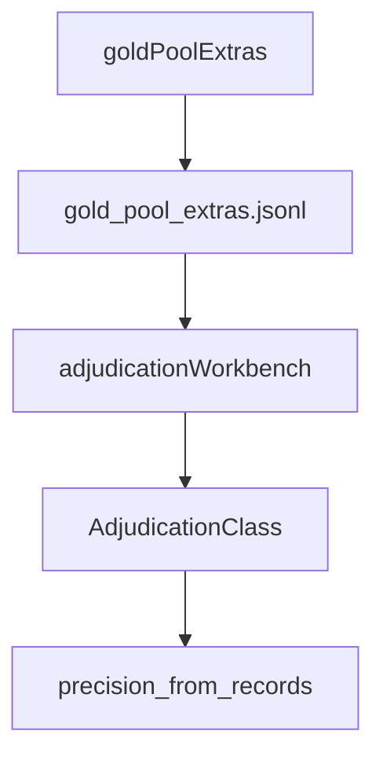

# adjudications

## Purpose

Committed gold-pool extra discovery records plus human adjudication labels. Feeds precision reporting and the workbench review trail.

## Role in pipeline

`gold_extras` persistence / workbench → **THIS JSONL** → precision metrics + baseline summary.

## Inputs

- Accepted discoveries outside gold pair keys (extras)
- Human `AdjudicationClass` values (`VALID_STRICT_TWO_CARD`, `DUPLICATE_OR_EQUIVALENT_INTERACTION`, `INVALID_CANDIDATE_DATA`, …)

## Outputs

- `gold_pool_extras.jsonl` (24 rows in the frozen pre-gate M4 set; live discovery extras are fewer after the participant gate — see `gold_extras.GOLD_EXTRA_ADJUDICATIONS`)

## Responsibilities

- Persist the labeled extras set that justifies baseline precision.
- Distinguish fixture pairs (`INVALID_CANDIDATE_DATA`) from real-card judgments.

## Non-responsibilities

- Frozen aggregate summaries (`../baseline/`)
- Live DuckDB scratch DB (`data/eval/`)
- Changing search joins to erase duplicates

## Core invariants

- Fixture pairs excluded from precision denominator.
- Historical duplicates in the frozen JSONL reflect pre-gate bystander acceptance; discovery now rejects those pairs (`search` participant gate). Re-freeze under ROADMAP M4 item 5 will drop them from live extras.
- Spellbook absence is **not** represented here as a false-positive class. Reference absence (`ABSENT_FROM_REFERENCE`) is an eval/reference concern; precision uses human `AdjudicationClass` values.
- Working DuckDB under `data/eval/` may diverge from this committed JSONL until operators re-persist.

## Main entry points

- `gold_pool_extras.jsonl`
- Package: `mtg_loop_engine.eval.gold_extras`, `store`, workbench

## Data contracts

Aligned with `eval.schema` record fields (ids, names, adjudication class, fixture flags, …).

## Failure behavior

Tests require adjudications to cover discovered extras (`test_gold_extra_adjudications_cover_discovered_extras`).

## Testing

`tests/eval/` fixture-detection and gold-extra coverage tests.

## Extension guide

When re-adjudicating, update JSONL and regenerate `../baseline/m4_gold_pool_summary.json` together. Document class changes in [`docs/ADJUDICATION.md`](../../docs/ADJUDICATION.md).

## Bigger-picture relationship

Parent: [`../README.md`](../README.md). Label guide: [`docs/ADJUDICATION.md`](../../docs/ADJUDICATION.md).
