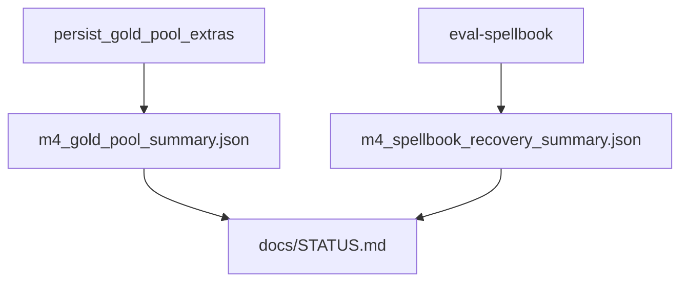

# baseline

## Purpose

Frozen M4 metric snapshots. These files are the quantitative source of truth for reported recovery and gold-pool precision (certified STATUS inputs).

## Role in pipeline

Eval runs / adjudication → **THIS (committed summaries)** → `docs/STATUS.md` via `scripts/render_status.py` and CI `--check`.

## Inputs

- Gold-pool extras persistence (`gold_extras.persist_gold_pool_extras` → summary path)
- Spellbook recovery runs (summary committed after a deliberate reference evaluation)

## Outputs

| File | Frozen meaning (current) |
| --- | --- |
| `m4_gold_pool_summary.json` | **Pre-gate freeze:** 24 extras; 8 real / 16 fixture; precision **0.375** (3 valid / 8 real); 5 duplicates. Live discovery after participant enforcement yields fewer extras (see `GOLD_EXTRA_ADJUDICATIONS`); treat as historical until ROADMAP item 5 re-freeze. |
| `m4_spellbook_recovery_summary.json` | 99 selected; **0 eligible**; all `compiler_unsupported`; recall null |

## Responsibilities

- Record post-adjudication / post-recovery distributions for regression and status rendering.
- Make denominator choices explicit in `notes` fields.

## Boundaries

| Concern | Owner |
| --- | --- |
| Raw discovery payloads | `../adjudications/` |
| Live DuckDB working sets | `data/eval/` |
| STATUS regeneration | `scripts/render_status.py` (CI only **checks**) |

## Core invariants

- Precision is over real-card pairs only; fixtures excluded.
- Spellbook recall is only over eligible/supported entries; absence → `ABSENT_FROM_REFERENCE`.
- Joins were left open relative to the gold-pool distribution (see summary notes).

## When regenerated

| Trigger | Action |
| --- | --- |
| Re-run gold-pool extras + adjudications | Rewrite `m4_gold_pool_summary.json` (and usually adjudications JSONL) intentionally |
| New Spellbook reference recovery after compiler/search changes | Rewrite `m4_spellbook_recovery_summary.json` with updated counts/examples |
| CI | Does **not** regenerate; runs `render_status.py --check` |

Regenerate when metrics intentionally change; update docs in the same review.

## Main entry points

- Files in this directory
- `scripts/render_status.py` reader
- Package writers under `mtg_loop_engine.eval`

## Data contracts

JSON objects with stable keys consumed by status rendering and human review. Prefer editing via eval tooling over hand-editing counts.

## Failure behavior

STATUS freshness check fails when `docs/STATUS.md` disagrees with these files.

## Testing

Indirect via eval tests and `render_status.py --check` in CI.

## Extension guide

When metrics definitions change, update [`docs/EVALUATION.md`](../../docs/EVALUATION.md) in the same change as new baselines.

## Bigger-picture relationship

Parent: [`../README.md`](../README.md). Architecture: [`docs/ARCHITECTURE.md`](../../docs/ARCHITECTURE.md).
