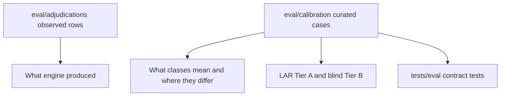

# calibration

## Purpose

Curated **taxonomy calibration** cases: deliberate exercises of adjudication class meaning and boundaries. These records answer whether reviewers (human or agent) can consistently apply the taxonomy — not what the engine happened to discover.

## Context

## Difference from adjudications

| Store | Question |
|-------|----------|
| `../adjudications/` | What did search accept, and how did we label it? |
| **calibration/** | What cases deliberately test class definitions and nearby boundaries? |

## What belongs here

- `adjudication_cases.jsonl` — reviewed calibration rows with stable `case_id`
- This README

## What does not belong here

- Observed gold-pool extras (see `../adjudications/`)
- Ephemeral LAR run output (`data/eval/lar/runs/`)
- Certified measurements (`../baseline/`)

## Case design (aspiration)

Per class, eventually:

1. one **canonical** case;
2. one **boundary** case vs a neighboring class;
3. optional **counterfactual** negative.

Uncovered classes remain visibly uncovered until responsible cases exist — do not manufacture weak fillers for nominal 8/8 coverage.

## Change policy

Promoted calibration cases are **CI-enforced expectations** for the current project definition. Changing `expected_class` requires a reviewed PR explaining:

- why the old expectation was wrong or obsolete;
- whether taxonomy, product scope, or Oracle snapshot changed;
- which case supersedes the old one.

LAR execution must **not** silently rewrite this file.

## Schema

Authoritative models: `mtg_loop_engine.eval.lar_contracts.CalibrationCase`.

## Testing

`tests/eval/test_lar_calibration.py` validates JSONL rows and unique `case_id` values.

## Related

- Taxonomy: [`docs/ADJUDICATION.md`](../../docs/ADJUDICATION.md)
- LAR process: [`docs/runbooks/LOOP_ADJUDICATION_REVIEW.md`](../../docs/runbooks/LOOP_ADJUDICATION_REVIEW.md)
