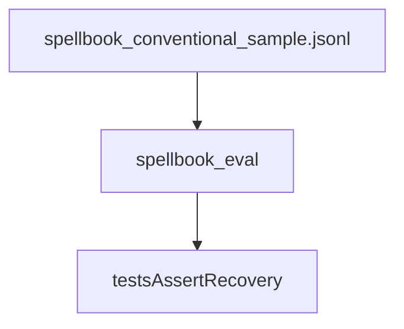

# fixtures

## Purpose

Tiny committed Spellbook-shaped JSONL rows for CI and unit recovery tests. Not a full reference corpus.

## Role in pipeline

Hand-maintained sample rows → **THIS** → `eval-spellbook --variants …` / `tests/eval/test_spellbook_eval.py`.

## Inputs

- Curated conventional two-card variant rows (including gold-recoverable and unsupported examples)

## Outputs

- Stable on-disk JSONL consumed without network access

## Responsibilities

- Keep a minimal eligible sample so recovery logic stays tested when real Spellbook eligible count is **0** in the frozen baseline (`eval/baseline/m4_spellbook_recovery_summary.json`).
- Stay small enough for CI.
- Teach stage outcomes (recover vs `compiler_unsupported`), not broad recall.

## Non-responsibilities

- Full Spellbook snapshots
- Precision adjudications (see `../adjudications/`)
- Oracle bulk data
- Defining production denominators (see [`docs/EVALUATION.md`](../../docs/EVALUATION.md))

## Core invariants

- Sample recovery expectation: eligible gold-like rows recover (suite asserts **2/2** on the committed sample).
- Unsupported rows fail closed at compile stage.
- Fixture pairs are not precision positives (`INVALID_CANDIDATE_DATA` when used in gold-pool extras).

## Main entry points

- `spellbook_conventional_sample.jsonl`
- CLI example: `uv run mtg-loop-engine eval-spellbook --variants eval/fixtures/spellbook_conventional_sample.jsonl`

## Data contracts

Row shape matches Spellbook conventional extract fields expected by `spellbook_eval`.

## Failure behavior

Tests fail if sample recovery regresses.

## Testing

`tests/eval/test_spellbook_eval.py::test_sample_recovers_gold_pairs_and_fails_unsupported`

## Extension guide

Add rows sparingly; each row should teach a stage (recover vs compiler_unsupported). Prefer real snapshot runs for broad measurement.

## Bigger-picture relationship

Parent: [`../README.md`](../README.md).
