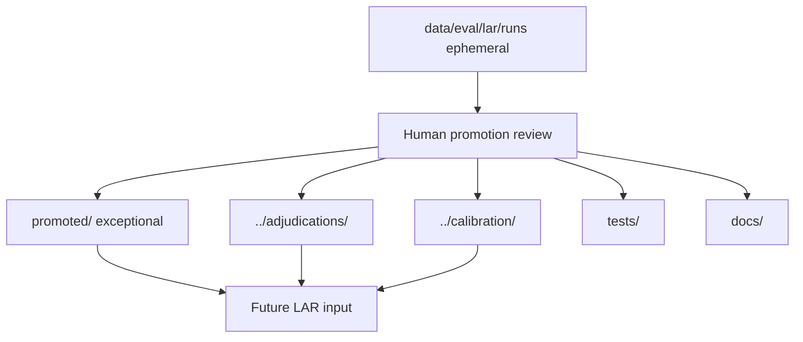

# reviews

## Purpose

LAR **process contract** and **exceptional promoted evidence** — not a graveyard of every run.

Normal Loop Adjudication Review (LAR) execution is **ephemeral** under gitignored `data/eval/lar/runs/`. Only findings that earn durable epistemic status through review are committed here (`promoted/`) or routed to sibling `eval/` trees.

## Two planes



## What belongs here

| Path | Role |
|------|------|
| `_template/` | Version-controlled run contract (manifest v2 example, schemas) |
| `promoted/<evidence_id>/` | Compact exceptional evidence packages only |
| This README | Lifecycle + promotion contract |

## What does not belong here

- Routine run directories (`eval/reviews/<timestamp>/` is **deprecated**)
- Raw subagent transcripts or phase JSON dumps from ordinary runs
- Frozen baselines (`../baseline/`) or observed adjudications (`../adjudications/`)

## Normal run location

```text
data/eval/lar/runs/<run_id>/
  manifest.json
  phase-a/
  phase-b/
  phase-c/
  challenge/
  comparison.json
  synthesis.md
  promotion_candidates.json
  raw/
```

Safe to delete locally; recreated by evaluation. **Never authoritative.**

## Exceptional promotion

Promote to `promoted/<evidence_id>/` only when a run:

- supports a milestone exit or materially changes product confidence;
- motivates an ADR;
- reveals systemic architecture defects or validates serious defect closure;
- establishes a materially new evaluation methodology.

Minimum package: `summary.md`, `manifest.json`, `comparison.json`.

See [`promoted/README.md`](promoted/README.md) and [`promoted/0001-m4-lar-v1/`](promoted/0001-m4-lar-v1/) for the first promoted package (M4 LAR v1).

## Process

Runbook: [`docs/runbooks/LOOP_ADJUDICATION_REVIEW.md`](../../docs/runbooks/LOOP_ADJUDICATION_REVIEW.md)  
Skill: [`.cursor/skills/loop-adjudication-review/SKILL.md`](../../.cursor/skills/loop-adjudication-review/SKILL.md)

## Promotion discipline

LAR agents may emit `promotion_candidates[]` but **must not** mutate committed adjudications, calibration cases, engine code, or baselines during the review. Promotion is a follow-up PR governed by humans.

## Schemas

Authoritative models: `mtg_loop_engine.eval.lar_contracts`. Examples in `_template/`.

## Notes

- Use `suspected_layer` / `diagnostic_layer` in synthesis — not definitive architecture ownership from disagreement alone.
- Report **information gain**, not a composite LAR score.
- Parallel same-model reviewers are throughput, not statistical independence.
