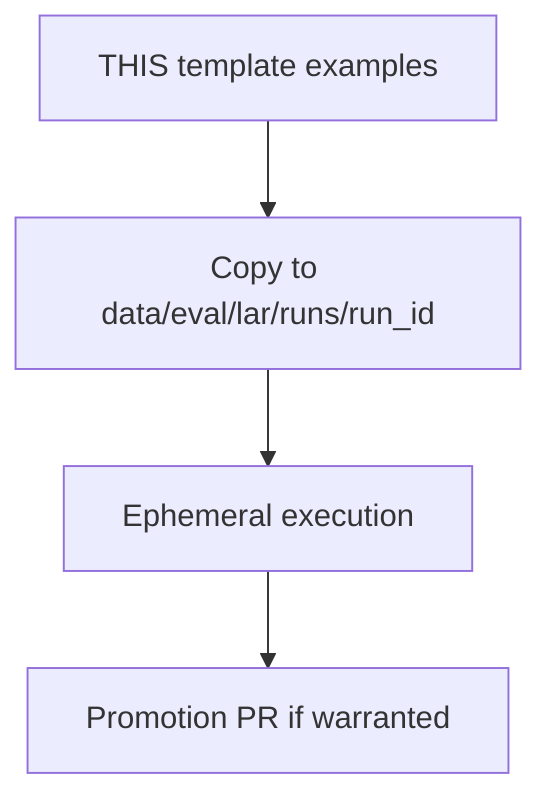

# LAR run template

## Purpose

Version-controlled **run contract** for Loop Adjudication Review (LAR) v2 — schemas and examples agents copy into gitignored execution directories.

## Context



## What belongs here

- `manifest.example.json` — LAR manifest v2 semantic provenance stub
- `promotion_candidates.example.json` — synthesis promotion routing stub
- `record.schema.json` — JSON Schema for tier review records (legacy v1 shape; v2 adds blind/challenge fields in runbook)
- `comparison.json` — Tier D synthesis stub

## What does not belong here

- Completed run instances (use `data/eval/lar/runs/<run_id>/`)
- Promoted evidence packages (`../promoted/`)

## Usage

```bash
RUN_ID="2026-08-23_$(git rev-parse --short HEAD)"
mkdir -p "data/eval/lar/runs/${RUN_ID}"
cp eval/reviews/_template/manifest.example.json "data/eval/lar/runs/${RUN_ID}/manifest.json"
# Fill manifest, then run tiers per docs/runbooks/LOOP_ADJUDICATION_REVIEW.md
```

Authoritative Pydantic models: `mtg_loop_engine.eval.lar_contracts`.

Process: [`docs/runbooks/LOOP_ADJUDICATION_REVIEW.md`](../../../docs/runbooks/LOOP_ADJUDICATION_REVIEW.md)
