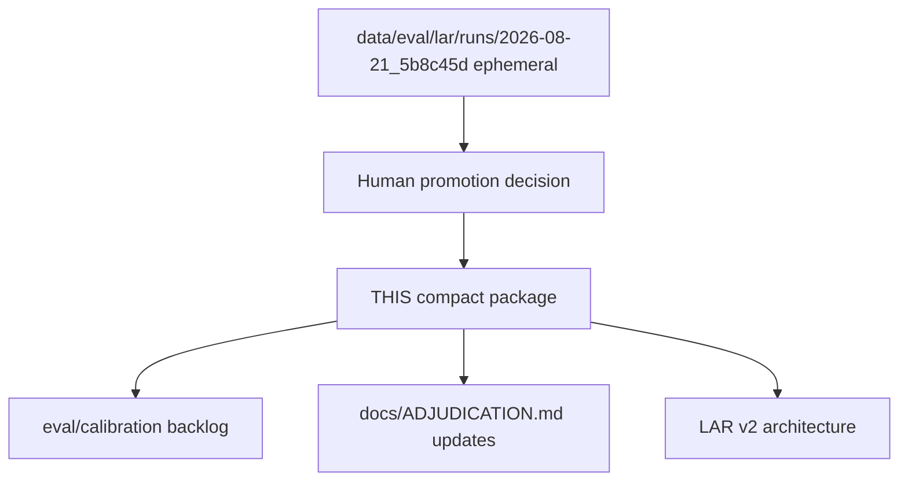

# 0001-m4-lar-v1

## Purpose

Compact promoted evidence from the first full Loop Adjudication Review (LAR v1 protocol, run `2026-08-21_5b8c45d`).

## Context

## What belongs here

- `summary.md` — tempered executive conclusions
- `manifest.json` — semantic provenance (v1 protocol flags)
- `comparison.json` — structured cross-tier signals

## What does not belong here

Full phase-a/b/c JSONL, raw subagent transcripts, or routine re-runs.

## Notes

Full execution tree is retained locally under `data/eval/lar/runs/2026-08-21_5b8c45d/` (gitignored).
