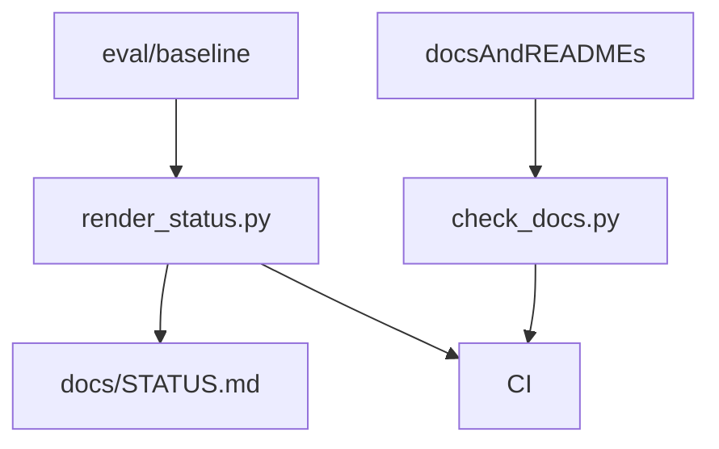

# scripts

## Purpose

Optional operator helpers for documentation and evaluation hygiene. Primary product CLI remains `uv run mtg-loop-engine` (`mtg_loop_engine.cli`). Criteria for selectively promoting a helper into that CLI (vs keeping it here) live in [`docs/CLI.md`](../docs/CLI.md) under **Scripts vs product CLI**.

## Role in pipeline

Frozen `eval/baseline/*.json` + docs tree → **THIS** → STATUS freshness / docs hygiene checks in CI.

## Inputs

- `eval/baseline/*.json`
- Docs / README tree
- Optional `--check` / `--skip-status` flags

## Outputs

- Updated or verified `docs/STATUS.md`
- Non-zero exit on hygiene / freshness failures

## Responsibilities

| Script | Usage | Purpose |
| --- | --- | --- |
| `render_status.py` | `uv run python scripts/render_status.py` | Rewrite the delimited quantitative section of `docs/STATUS.md` from baselines |
| `render_status.py --check` | same with `--check` | Exit non-zero if STATUS drifts from baselines |
| `check_docs.py` | `uv run python scripts/check_docs.py` | Required files, README presence, important links; optional STATUS freshness |
| `spellbook_compiler_priority.py` | `uv run python scripts/spellbook_compiler_priority.py` | Live diagnostic: rank Spellbook compiler gaps from local snapshot + Scryfall bulk |
| `spellbook_absent_discovery.py` | `uv run python scripts/spellbook_absent_discovery.py` | M5: blind-discover among COMPLETE Spellbook cards; label `ABSENT_FROM_REFERENCE` |

CI currently runs `check_docs.py` (includes STATUS freshness unless `--skip-status`) and then `render_status.py --check` again as a named step after pytest. Prefer `--skip-status` on the docs step if STATUS should be checked only once.

## Non-responsibilities

- Engine behavior or adjudication logic
- Package modules under `src/mtg_loop_engine/`
- Regenerating `eval/baseline` itself

## Core invariants

- Scripts must not require Scryfall/Spellbook network access.
- STATUS quantitative section is derived from baselines, not hand-waved.

## Main entry points

- `scripts/render_status.py`
- `scripts/check_docs.py`
- `scripts/spellbook_compiler_priority.py`
- `scripts/spellbook_absent_discovery.py`

## Data contracts

Baseline JSON keys expected by `render_status.py`; docs paths expected by `check_docs.py`.

## Failure behavior

Non-zero exit codes fail CI.

## Testing

Exercised in `.github/workflows/ci.yml` documentation steps.

## Extension guide

Add maintenance scripts here only when they should not be library imports. Keep engine changes in the package + CLI.

## Bigger-picture relationship

Docs map: [`docs/README.md`](../docs/README.md). Baselines: [`eval/baseline/README.md`](../eval/baseline/README.md). Product CLI architecture and promotion criteria: [`docs/CLI.md`](../docs/CLI.md).
