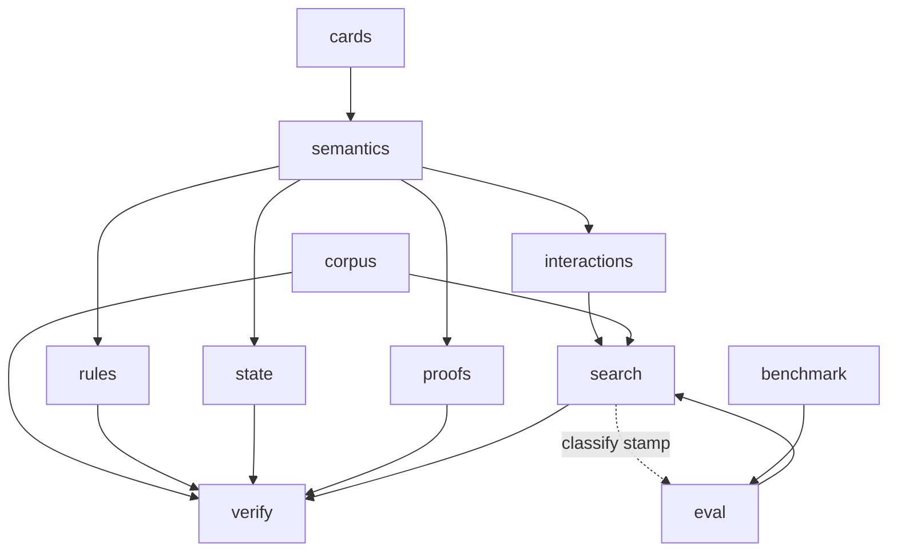

# mtg_loop_engine

## Purpose

Core library for explainable two-card loop discovery: Oracle ingest, deterministic semantics, capability joins, bounded search, rules-aware verification, curated corpora, and M4 evaluation instrumentation.

## Role in pipeline

Operators / CLI / tests → **THIS package** → `LoopWitness` / `LoopProof` / eval artifacts.

## Inputs

- Scryfall Oracle snapshots (`cards`)
- Authored gold IR / witnesses (`corpus`)
- Spellbook reference extracts (`benchmark`, gitignored under `data/`)
- Operator commands via `cli/` (Click)

## Outputs

- Compiled `CardSemantics`, discovered `LoopWitness`, verified `LoopProof`
- Eval records, recovery/precision reports, Streamlit workbench

## Responsibilities

- Own the M0–M4 engine surface as importable modules.
- Keep discovery speculative and verification conservative.
- Expose CLI orchestration without embedding business logic in `cli/` beyond wiring.

## Boundaries

| Concern | Owner |
| --- | --- |
| FastAPI / Postgres / public explorer | M7 (`ROADMAP.md`) |
| Semantics on the `VERIFIED` path | Deterministic compiler / modeled executor |
| Oracle bulk JSON | gitignored `data/` |

## Core invariants

- **`search → verify` allowed; `verify → search` forbidden.**
- Fail-closed: `PARTIAL_RELEVANT_TO_PROOF` → typed rejection.
- Blind discovery uses compiled capabilities and joins only.
- Discovery acceptance requires `strict_two_card` (search participant gate). See `search/README.md` and [`docs/ARCHITECTURE.md`](../../docs/ARCHITECTURE.md).

## Main entry points

| Module | Role |
| --- | --- |
| `__init__.py` | Package version |
| `cli/` | Operator commands (`verify-gold`, `discover-gold`, `eval-*`, `fetch-*`, …) — Click wiring |
| `config.py` | `EngineConfig` knobs |

Subpackages: `cards`, `semantics`, `interactions`, `search`, `verify`, `rules`, `state`, `proofs`, `corpus`, `benchmark`, `eval`.

## Data contracts

Shared schemas live in `proofs.models` (`LoopWitness`, `LoopProof`, `Classification`, …). Semantic coverage enum in `semantics.enums.SemanticCoverage`.

## Failure behavior

CLI exits non-zero on gold verification mismatches, missing Spellbook paths, or eval persistence errors. Library APIs return typed rejection proofs rather than raising for ordinary loop failures.

## Testing

Full suite under `tests/` — gold positives, hard negatives, compiled seam, discovery recall, eval instruments, and `test_search_boundary` (verify ↛ search).

## Extension guide

1. Add deterministic patterns before expanding search heuristics.
2. Keep new acceptance gates in `verify` or as explicit search pre-filters; joins propose, they do not accept.
3. Update the package README here and the touched subpackage README in the same change.

## Bigger-picture relationship

North star: Oracle → semantics → blind discovery → rules proof. Detail: [`docs/ARCHITECTURE.md`](../../docs/ARCHITECTURE.md), [`ROADMAP.md`](../../ROADMAP.md).
