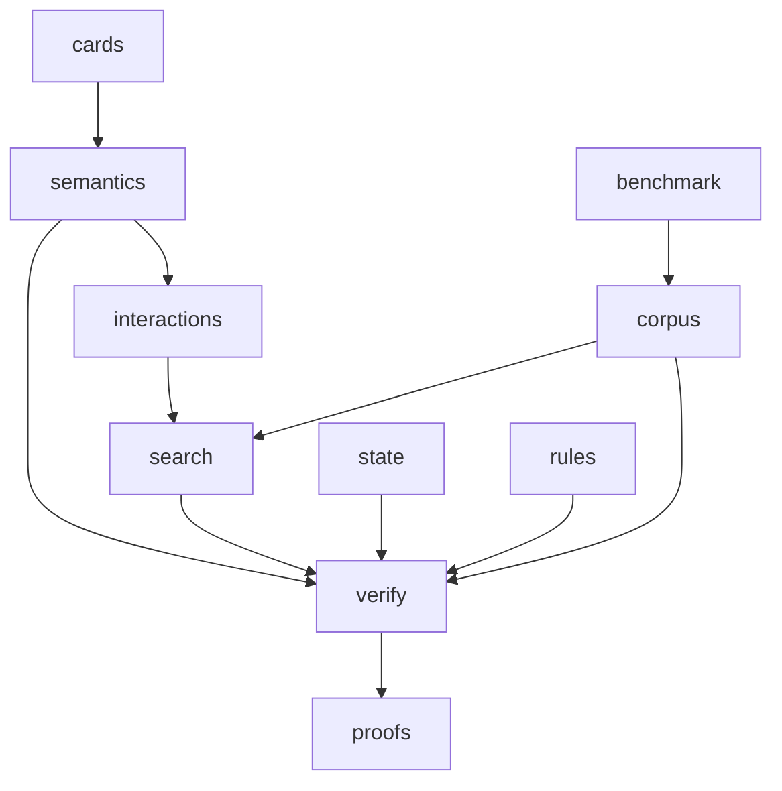

# mtg_loop_engine

## Purpose

Core library: card ingest, semantic IR, capability joins, bounded discovery, game state, rules surface, witness verification, proofs, benchmarks, and curated gold corpora.

## Context

## What belongs here

- Library modules imported as `mtg_loop_engine.*`
- Manual gold fixtures under `corpus/`

## What does not belong here

- CLI-only scripts that belong in `scripts/`
- UI / API apps
