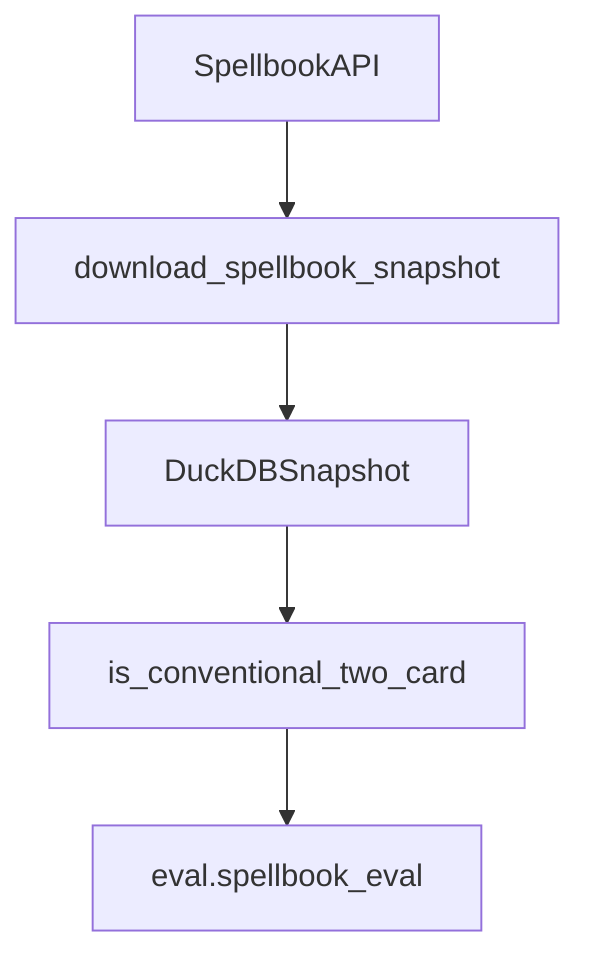

# benchmark

## Purpose

Commander Spellbook reference extract and conventional two-card filter. Reference corpus for recovery metrics — not gold authorship.

## Role in pipeline

Spellbook HTTP API → **THIS** → gitignored `data/spellbook/` snapshot → `eval.spellbook_eval` / CLI `fetch-spellbook` / `eval-spellbook`.

## Inputs

- Spellbook variant pages / local snapshot paths
- Filter knobs (two cards, zero templates, repeatable feature, distinct names)

## Outputs

- Local snapshot + DuckDB helpers
- Boolean predicate `is_conventional_two_card`

## Responsibilities

- Download/filter Spellbook variants for evaluation.
- Define “conventional two-card” consistently for recovery denominators.

## Non-responsibilities

- Authoring gold_core
- Declaring Spellbook absence a false positive (it is not)
- Declaring absence `NOVEL` without human adjudication

## Core invariants

- Conventional defaults: exactly two cards, no templates, repeatable needle, distinct names.
- Snapshot data stays gitignored.

## Main entry points

- `spellbook.py`: `is_conventional_two_card`, `download_spellbook_snapshot`, DuckDB helpers, `REPEATABLE_NEEDLES`
- CLI: `mtg-loop-engine fetch-spellbook`

## Data contracts

Variant rows consumed by `eval.spellbook_eval` and fixtures under repo-root `eval/fixtures/`.

## Failure behavior

Network/API errors on fetch. Filter simply excludes non-conventional rows.

## Testing

`tests/unit/test_spellbook_filter.py`; sample recovery in `tests/eval/test_spellbook_eval.py`.

## Extension guide

Tighten filters only with an explicit denominator change in [`docs/EVALUATION.md`](../../../docs/EVALUATION.md) and baseline regeneration.

## Bigger-picture relationship

Benchmark feeds reference recovery only. Architecture: [`docs/ARCHITECTURE.md`](../../../docs/ARCHITECTURE.md).
